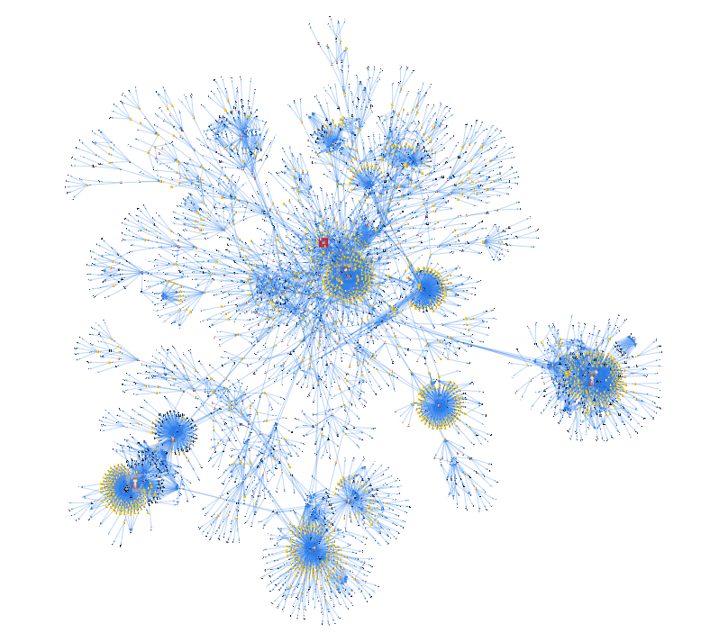

<!---->
<!-- Fonte: https://github.com/antonkomarev/github-profile-views-counter-->

<!---->

  

## Sumário

* [O que é o SINARC?](#o-que-é-o-sinarc)
* [Como criar o Pen Drive SINARC](#como-criar-o-pen-drive-sinarc)
* [SINARC-Client](#sinarc-client)
* [O que é uma rede complexa?](#o-que-é-uma-rede-complexa)
* [Qual o objetivo do SINARC?](#qual-o-objetivo-do-sinarc)
* [O SINARC utiliza dados sigilosos?](#o-sinarc-utiliza-dados-sigilosos)
* [Para que serve o SINARC?](#para-que-serve-o-sinarc)
* [Playground SINARC](#playground-sinarc)
* [Tutorial interativo do SINARC](#tutorial-interativo-do-sinarc)
* [Alfabeto de comandos do SINARC](#alfabeto-de-comandos-do-sinarc)
* [Como criar uma nova instalação do SINARC?](#como-criar-uma-nova-instalação-do-sinarc)
* [A quem se destina o SINARC?](#a-quem-se-destina-o-sinarc)
* [Exemplos de utilização do SINARC](#exemplos-de-utilização-do-sinarc)
* [Possibilidades de uso do SINARC](#possibilidades-de-uso-do-sinarc)
* [Explorando conexões com o SINARC](#explorando-conexões-com-o-sinarc)
* [Histórico de versões](#histórico-de-versões)

  

## O que é o SINARC?

  <a href="#sumário">Sumário</a>

 

O **SINARC – Sistema Integrado de Análise de Redes Complexas** consiste em um programa experimental de análise de dados de fontes abertas desenvolvido pelo Ministério Público de Contas do Estado do Espírito Santo ([MPC-ES](https://www.mpc.es.gov.br/)) sob os princípios da [Ciência Aberta](https://www.unesco.org/en/open-science) (metodologia aberta, código aberto, dados abertos, acesso aberto, revisão por pares aberta e recursos educacionais abertos) e [Licença MIT](https://opensource.org/licenses/MIT) (software livre e gratuito), para uso em computadores com sistema operacional Windows. O sistema foi concebido a partir do inspirador projeto [Rede CNPJ](https://github.com/rictom/rede-cnpj) - do qual extrai não apenas as premissas metodológicas, mas também a filosofia colaborativa que impulsiona o aprimoramento do controle social da Administração Pública -, porém utilizando técnicas e ferramentas de programação distintas, o que lhe confere funcionalidades singulares e complementares.

Como sistema de inteligência para fontes abertas (_Open Source Intelligence - [OSINT](https://www.cia.gov/stories/story/ic-osint-strategy-rollout/))_ em permanente evolução, o SINARC se propõe a ampliar as perspectivas de análise das conexões existentes entre **pessoas físicas**, **pessoas jurídicas**, **endereços**, **telefones** e **e-mails** constantes na [base de dados pública de CNPJ](https://dados.gov.br/dados/conjuntos-dados/cadastro-nacional-da-pessoa-juridica---cnpj) da Receita Federal, formada por **60 milhões de CNPJs**, por meio dos seguintes recursos:

1. Criação de uma interface gráfica concebida a partir da aplicação dos princípios da percepção visual extraídos da **Psicologia** da [Gestalt](https://medium.com/aela/os-7-princ%C3%ADpios-de-gestalt-e-como-utiliz%C3%A1-los-em-projetos-de-ui-design-46d6d832abf6) ([artigo](https://jamieesterman.com/work/posts/gestalt-principles-and-the-laws-of-ux-a-guide-to-usable-interface-design)), bem como dos princípios da gravitação universal da **Física**, aplicados de forma inversa (repulsão ao invés de atração), facilitando a identificação visual das estruturas pelo analista, sem gerar sobrecarga cognitiva (excesso de estímulos visuais); e

2. Conjunto de ferramentas computacionais que utilizam a [Teoria dos Grafos](https://pt.wikipedia.org/wiki/Teoria_dos_grafos) para analisar a rede de conexões sob a perspectiva de um [Sistema Complexo](https://pt.wikipedia.org/wiki/Sistemas_complexos) e aplicar algoritmos matemáticos para auxiliar na identificação de **informações**, **padrões** ocultos e **anomalias** relevantes para a produção de conhecimento.

<!-- > _O **Projeto SINARC** integra o Plano de Metas 2025 da Rede de Informações Estratégicas dos Ministérios Públicos de Contas ([Rede MPContas](https://mp.tcu.gov.br/rede-mpcontas/)) e encontra-se em processo de revisão por parte do [Science Data Bank](https://www.scidb.cn/en) para fins de disponibilização (DOI/CSTR) em seu repositório de bases de dados._ -->

Os **exemplos ilustrativos** do uso do SINARC, todos extraídos de **informações públicas**, foram selecionados com base na singularidade de seus padrões de conexão, possuindo caráter meramente demonstrativo e servindo tão somente como referência no contexto educacional da produção de conhecimento a partir de fontes abertas.

**QR Codes** permitem a abertura e exploração dos grafos online em aparelhos celulares. Para abrir o teclado do celular e digitar os comandos do SINARC, clique no [botão central](https://controlecidadao.github.io/sinarc/images/botao_central.png) localizado na parte inferior da tela do celular.

  

<a href="https://controlecidadao.github.io/sinarc/exemplo1.html">Exemplo 1</a>: Grafo interativo exibindo vínculos entre duas empresas, identificados pelo SINARC na 1ª camada. <b>Clique na imagem e interaja com o grafo</b>, arrastando os nós com o mouse. 

 

  

Para aprofundar a experiência, sugere-se explorar o [Notebook do SINARC](https://notebooklm.google.com/notebook/57975d7c-3dae-43a6-816c-0ff391426cf4) na plataforma **NotebookLM**, utilizando sua conta no Google. Esta ferramenta, baseada em **Inteligência Artificial**, examina simultaneamente os documentos do SINARC (README, Manual do SINARC e seu código fonte), permitindo a obtenção de respostas detalhadas sobre as funcionalidades do sistema.

  

## Como criar o Pen Drive SINARC

  <a href="#sumário">Sumário</a>

### Baixe o SINARC para um pen drive. Sua utilização não requer instalação (plug and play).

<!--  
### 🚧 Atualizando a Base de Dados 🚧-->
 

<!--#### 💽 Data de Extração da Base de Dados de CNPJ: &emsp; [15/06/2025](https://arquivos.receitafederal.gov.br/dados/cnpj/dados_abertos_cnpj/2025-06/)-->

Data de extração da base de dados contida no Pen Drive SINARC: [15/06/2025](https://arquivos.receitafederal.gov.br/dados/cnpj/dados_abertos_cnpj/2025-06/)

 

Devido à sua portabilidade, a **pasta SINARC** contendo os programas SINARC e Rede CNPJ para análise de grafos, e [DB Browser](https://sqlitebrowser.org/) para consulta direta aos bancos de dados, pode ser baixada e descompactada para um pen drive ou HD externo, facilitando sua utilização em diferentes computadores.

 

**👉 [Clique aqui e baixe a versão compactada da pasta SINARC](https://drive.usercontent.google.com/download?id=13bMZyf0dzefvzqV79oV1c95IWiy_ZAoR)**

 

O arquivo _SINARC.zip_ possui 20 GB (SHA-256: _c482345d00efd048ad8139d29c3156121d4e866ff37b5a398e757fd5736674fc_).

<!--Valide a integridade do arquivo baixado submetendo-o a este [site de verificação](https://emn178.github.io/online-tools/sha256_checksum.html) e comparando a saída (Output) com o código SHA-256 fornecido.-->

**São necessários 90 GB de espaço livre: 20 GB para o arquivo compactado (zip) e 70 GB para o arquivo descompactado (pasta SINARC)**. Caso não disponha de espaço suficiente no computador, é possível configurar o navegador para que o download seja realizado diretamente para um pen drive ou HD externo (Procurar no navegador por _Configurações_ -> _Downloads_ -> _Local_).

<!--Durante os testes de download, os navegadores Google Chrome e Microsoft Edge armazenaram uma segunda cópia do arquivo zip (20 GB), com nomes formados por uma sequência de carecteres 0, tendo sido necessário apagá-las manualmente para não ocupar espaço no computador (a parte final, após _File System_, pode variar dependendo da versão do navegador):

* **Google Chrome:**  _C:\Users\nome_do_usuário\AppData(pasta oculta)\Local\Google\Chrome\User Data\Default\File System\095\p\00_ 
  
* **Microsoft Edge:** _C:\Users\nome_do_usuário\AppData(pasta oculta)\Local\Microsoft\Edge\User Data\Default\File System\007\p\00_

O arquivo _SINARC.zip_ desta versão do Pen Drive SINARC contém os programas e a base de dados de CNPJ disponibilizada pela Receita Federal, **prontos para utilização**. A pasta pode ser descompactada e salva em um pen drive, HD externo ou mesmo no computador, **prescindindo de instalação**.-->

 

### Abrindo o SINARC

Para usar o Pen Drive SINARC, siga estes passos:

1) Conecte o pen drive ao computador. A pasta SINARC descompactada deve estar salva no diretório raiz do pen drive, normalmente reconhecido como Drive D, E ou F; 
  
2) Na pasta SINARC, clique 2 vezes no arquivo **_abre_rede_cnpj.bat_** (o Windows solicitará sua confirmação por se tratar de um arquivo executável _.bat_). Uma instância do Terminal do Rede CNPJ será aberta, exibindo a inicialização do programa. Aguarde alguns segundos até que a interface gráfica do Rede CNPJ seja exibida em uma nova aba do navegador;
  
3) Na sequência, também na pasta SINARC, clique 2 vezes no arquivo **_abre_sinarc.bat_** (o Windows solciitará sua confirmação). Uma instância do Terminal do SINARC será aberta, exibindo a inicialização do programa. Aguarde alguns segundos até que a interface gráfica do SINARC seja exibida em numa nova aba do navegador.

Pronto! Os programas SINARC, Rede CNPJ e DB Browser já podem ser utilizados.

**ATENÇÃO:** Para ativar/desativar o **modo de captura do SINARC**, pressione a **tecla |** enquanto visualiza um grafo. Uma mensagem será exibida no canto superior esquerdo da tela. Quando ativado, o modo de captura impede o uso da função de cópia (CTRL + c) do Windows.

Conquanto o SINARC utilize apenas a modelagem de criação e de consulta aos bancos de dados desenvolvida pelo projeto Rede CNPJ, optou-se por disponibilizar também a íntegra deste formidável programa como etapa prévia à abertura do SINARC, permitindo ao cidadão explorar simultaneamente os recursos das duas ferramentas e, quem sabe, desenvolver seu próprio sistema de análise de grafos, com funcionalidades ainda mais interessantes, disponibilizando-o igualmente como software livre para inspirar outras pessoas a se engajarem em iniciativas que promovam a transparência e a cidadania a partir de dados abertos.

<!--**ATENÇÃO:** O uso do SINARC com pen drive reduz o desempenho do sistema, em especial com grafos muito grandes. Para desempenho máximo, salve a pasta SINARC diretamente no computador.-->

Os testes de portabilidade foram realizados usando pen drive de 128 GB, USB 3.2.

  

## SINARC-Client

  <a href="#sumário">Sumário</a>

É possível **acessar remotamente o SINARC** instalado em um computador (C1) a partir de outro computador (C2) conectado à mesma rede. Para tanto, basta baixar para C2 o arquivo [**SINARC-Client.zip**](https://drive.usercontent.google.com/download?id=1Vs4AUARTJ8-uG-8pMtINuRUmgFPOa_k0) (SHA-256 _f2ebecb43742365c6b6c955dce1785b1b985f2043f85695813faf740ef66f4b5_), uma versão reduzida do SINARC (460 MB), sem os bancos de dados, que permite utilizar todas as funcionalidades da ferramenta.

<!--

<a href="https://mayank-blogs.hashnode.dev/web-sockets-part-1">mayank-blogs.hashnode.dev</a>

-->

Após baixar e descompactar a **pasta SINARC-Client** para o segundo computador (C2), abra o arquivo _**endereco_ip.txt**_ e inclua em uma nova linha o endereço IPv4 do computador onde se encontra a versão completa do SINARC (C1). As instruções de como obter o endereço IPv4 encontram-se no próprio arquivo TXT.

Por fim, salve (CTRL + s) e feche o arquivo _endereco_ip.txt_.

Para abrir o SINARC no segundo computador (C2), clique duas vezes sobre o arquivo _**abre_sinarc.bat**_ na pasta SINARC-Client. Assim como a versão completa do SINARC, esta pasta também pode ser salva em um pen drive para permitir seu uso em outros computadores.

É necessário que a versão completa do SINARC esteja em execução no computador que está funcionando como servidor (C1), se possível usando **IP fixo (estático)** para evitar sua mudança após reinicialização.

<!--Para mais informações sobre a criação do Pen Drive SINARC, consulte [INSTRUÇÕES_PEN_DRIVE_SINARC.txt](https://github.com/controlecidadao/sinarc/blob/main/INSTRU%C3%87%C3%95ES_PEN_DRIVE_SINARC.txt).-->

  

## O que é uma rede complexa?

  <a href="#sumário">Sumário</a>

 

Exemplo de rede complexa de CNPJ sendo explorada pelo SINARC

 

Uma **Rede Complexa** é um sistema dinâmico formado pelo conjunto de elementos (nós) e das relações existentes entre eles (arestas), cuja complexidade de suas conexões requer para sua compreensão a utilização de ferramentas para modelagem matemática, análise computacional e representação gráfica. O objeto de estudo dos grafos são as conexões entre seus elementos. 

A complexidade de uma rede está relacionada ao grau de aleatoriedade e ao número de suas conexões. Nesse contexto, o SINARC analisa as conexões existentes em determinado momento entre pessoas físicas (PF), pessoas jurídicas (PJ), endereços (EN), telefones (TE) e e-mails (EM) cadastrados na base de dados pública de CNPJ da Receita Federal. Em termos mais técnicos, pode-se afirmar que **o SINARC consiste em uma implementação computacional** (software) **de um modelo matemático** (Teoria dos Grafos) **que realiza análise estática** (base de dados de CNPJ) **de um sistema complexo e dinâmico** (registros, baixas e atualizações diárias de pessoas jurídicas).

O SINARC captura um instante no tempo (data da disponibilização da base de dados pela Receita Federal), uma fotografia do processo contínuo de evolução de um sistema complexo, dinâmico e real, representado pelos registros, baixas e atualizações diárias de mais de 60 milhões de CNPJs. A expansão controlada do grafo a partir da adição de camadas sucessivas a um ou mais nós iniciais também reproduz o comportamento dinâmico de um sistema complexo.

Características de um sistema complexo, representado pela base de dados de CNPJ da Receita Federal:

* **Diversidade:** Os nós do sistema representam diferentes tipos de entidades (PJ, PF, EN, TE e EM) e de relacionamentos existentes entre eles (sócio, representante, filial etc.);

* **Conectividade:** O sistema complexo possui uma grande quantidade de nós interconectados por arestas, formando uma rede densa e interligada;

* **Escalabilidade:** O sistema aumenta em escala, adicionando novos componentes e aumentando as interconexões entre eles, resultando em uma estrutura de conectividade complexa;

* **Não linearidade:** O crescimento do sistema exibe comportamento não linear e imprevisível;

* **Atualização contínua:** O sistema está em constante atualização, o que implica que novos nós e arestas são adicionados e os existentes podem ser modificados ou removidos ao longo do tempo;

* **Centralidade:** Alguns nós podem desempenhar um papel central na rede, atuando como pontos de ligação entre várias entidades no sistema;

* **Comunidades:** O sistema pode ter agrupamentos de nós que estão mais densamente conectados entre si do que com o restante da rede, formando comunidades ou clusters;

* **Dinâmica temporal:** As conexões entre os nós podem variar ao longo do tempo, refletindo mudanças nas relações entre as entidades representadas;

* **Propriedades emergentes:** O sistema complexo exibe propriedades emergentes onde o comportamento global da rede não pode ser previsto apenas olhando para o comportamento individual dos nós (o todo é diferente da soma das partes). Essas propriedades podem surgir de interações complexas e não lineares entre os elementos da rede.

  

## Qual o objetivo do SINARC?

  <a href="#sumário">Sumário</a>

 

Assim como o projeto Rede CNPJ, o objetivo do SINARC é demonstrar a possibilidade de criação de ferramentas tecnológicas para exploração de dados abertos e incentivar o desenvolvimento de projetos semelhantes pela sociedade, considerando que **"_o verdadeiro progresso é o que põe a tecnologia ao alcance de todos!_"** (Henry Ford), sem exceção.

  

## O SINARC utiliza dados sigilosos?

  <a href="#sumário">Sumário</a>

 

Por se tratar de ferramenta de OSINT desenvolvida para assegurar ao cidadão o direito fundamental de acesso à informação, **todas as informações reveladas pelo SINARC são públicas e de interesse público**, motivo pelo qual são divulgadas mensalmente pela Receita Federal independentemente de solicitação, observando a publicidade como preceito geral e o sigilo como exceção, conforme diretrizes contidas no [art. 3º da Lei Federal 12.527/2011](https://www.planalto.gov.br/ccivil_03/_ato2011-2014/2011/lei/l12527.htm#art3), Lei de Acesso a Informação, de modo a viabilizar o controle social da Administração Pública e a coibir condutas ilícitas no exercício da atividade empresarial.

[Nota Técnica RFB/Cocad 47/2024](https://www.gov.br/receitafederal/dados/nota-cocad-rfb-86-2024.pdf/), emitida pela Receita Federal, especifica quais informações da base de dados de CNPJ não estão protegidas por sigilo fiscal, em consonância com o [Decreto 8.777/2016](https://www.planalto.gov.br/ccivil_03/_ato2015-2018/2016/decreto/d8777.htm#), que instituiu a Política de Dados Abertos do Poder Executivo federal.

A [Instrução Normativa RFB 2.119/2022](https://normasinternet2.receita.fazenda.gov.br/#/consulta/externa/127567) dispõe sobre o Cadastro Nacional da Pessoa Jurídica (CNPJ).

Para acessar a fonte primária dos dados usados pelo SINARC, clique [aqui](https://arquivos.receitafederal.gov.br/dados/cnpj/dados_abertos_cnpj/). 
Conheça também o [Dicionário de Dados](https://www.gov.br/receitafederal/dados/cnpj-metadados.pdf) de CNPJ da Receita Federal.

  

## Para que serve o SINARC?

  <a href="#sumário">Sumário</a>

 

O vídeo a seguir demonstra a aplicação do SINARC no controle da Administração Pública. A partir de [notícia](https://www.radiocacula.com.br/detran-ms-e-investigado-por-suspeita-de-fraude-em-licitacao-de-r-39-milhoes/) publicada na internet sobre supostas irregularidades em licitação promovida pelo Estado do Mato Grosso do Sul (MS) para contratação de serviço de sinalização semafórica, o sistema analisa a existência de vínculos entre as empresas citadas na notícia, cruzando os resultados com os participantes de outra [licitação](https://transparencia.vilavelha.es.gov.br/MostraArquivo.ashx?AnexoLicitacaoId=10676) de mesmo objeto, realizada pelo Município de Vila Velha (ES), para verificar a existência de conexões entre grupos econômicos que atuam em regiões distintas do país:

 

<a href="https://www.youtube.com/watch?v=R73ixbeP0II" target="_blank">
   Vídeo Demonstrativo do SINARC
</a>

 

<a href="https://www.youtube.com/watch?v=R4IMKdKB2pg" target="_blank">
   Vídeo Demonstrativo do SINARC
</a>

 

Confira exemplo de uso do SINARC em [Parecer](https://www.mpc.es.gov.br/wp-content/uploads/2024/10/Processo-784-2020-Parecer-MPC-ES-em-Denuncia-transacao-tributaria-Anchieta-e-Samarco.pdf#page=110) emitido pelo Ministério Público de Contas do Estado do Espírito Santo (MPC-ES) no Processo TC 784/2020 (pág. 110). Para saber mais sobre esta ação do MPC-ES em defesa do meio ambiente, vide a respectiva [notícia](https://www.mpc.es.gov.br/2024/11/lagoa-de-mae-ba-mpc-es-aponta-danos-ambientais-irreversiveis-e-pede-inclusao-da-samarco-vale-e-bhp-em-denuncia/).

Para permitir seu compartilhamento, os grafos interativos gerados pelo SINARC são salvos no **_arquivo_sinarc.zip_**, preservando todas as funcionalidades de exploração que não dependem de consulta em tempo real ao banco de dados.

<!--  

<a href="https://controlecidadao.github.io/sinarc/exemplo1.html">Exemplo 1</a>: Grafo interativo exibindo vínculos entre duas empresas, identificados pelo SINARC na 1ª camada. <b>Clique na imagem e interaja com o grafo</b>, arrastando os nós com o mouse. 

 -->

  

<a href="https://controlecidadao.github.io/sinarc/exemplo2.html">Exemplo 2</a>: Grafo interativo de grupo econômico aberto em 3 camadas, com 223 nós e 632 arestas. <b>Clique na imagem e interaja com o grafo</b>, pressionando a tecla "n" várias vezes.

 
 

<a href="https://controlecidadao.github.io/sinarc/exemplo3.html">Exemplo 3</a>: Grafo interativo de grupo econômico aberto em 4 camadas, exibindo 45 nós em layout circular. <b>Clique na imagem e interaja com o grafo</b>, pressionando as teclas "ç", "Delete" e "K" (maiúscula).

 
 

<a href="https://www.youtube.com/watch?v=aP3bkhZEUgY" target="_blank">Vídeo</a>: Identificando cadeia hierárquica de comando com o SINARC

 
 

<a href="https://controlecidadao.github.io/sinarc/exemplo7.html">Exemplo 7</a>: Grafo interativo de grupo econômico aberto em 3 camadas, exibindo 2088 nós e 3964 arestas. <b>Clique na imagem e interaja com o grafo</b>, posicionando o ponteiro do mouse sobre os nós para ver seus detalhes.

  

<a href="https://controlecidadao.github.io/sinarc/exemplo8.html">Exemplo 8</a>: Grafo interativo de grupos econômicos aberto em 4 camadas, exibindo 3192 nós e 7517 arestas. <b>Clique na imagem e interaja com o grafo</b>, pressionando a tecla "p" para parar os movimentos e posicionando o ponteiro do mouse sobre os nós para ver seus detalhes.

  

## Playground SINARC

  <a href="#sumário">Sumário</a>

 

Para testar algumas das funcionalidades dos grafos interativos gerados pelo SINARC:
1) Abra o link a seguir ([Exemplo 5](https://controlecidadao.github.io/sinarc/exemplo5.html)) em uma nova aba do navegador e aguarde o grafo ser exibido (o tamanho dos nós é proporcional ao número de conexões com nós adjacentes). Outros exemplos de grafos disponíveis online para testes: [Exemplo 1](https://controlecidadao.github.io/sinarc/exemplo1.html), [Exemplo 2](https://controlecidadao.github.io/sinarc/exemplo2.html), [Exemplo 3](https://controlecidadao.github.io/sinarc/exemplo3.html), [Exemplo 4](https://controlecidadao.github.io/sinarc/exemplo4.html), [Exemplo 6](https://controlecidadao.github.io/sinarc/exemplo6.html), [Exemplo 7](https://controlecidadao.github.io/sinarc/exemplo7.html), [Exemplo 8](https://controlecidadao.github.io/sinarc/exemplo8.html). Obs: Caso algum comando não funcione corretamente com os exemplos online, tente abrir o endereço do grafo usando uma aba anônima do navegador;
   
2) Clique na janela do grafo para ativá-la e pressione a **tecla U** (maiúscula, shift + u) para abrir uma janela popup com a distribuição de nós por faixa de tamanho (17 faixas). Observe que o tamnho dos nós varia de 20 a 100 e que cada faixa intermediária possui intervalo de 5 unidades. Feche a janela popup;
   
3) Pressione a **tecla Espaço** 16 vezes, espaçadamente, até que o parâmetro "tamanho", exibido no canto superior direito da tela, reduza de 100 para 25 em intervalos de 5 unidades. Esta função aumenta a massa dos nós situados em cada faixa, de forma proporcional ao tamanho de cada nó (do maior para o menor), melhorando progressivamente a visualização do grafo no layout gravitacional. Ao aumentar a massa dos nós, a força (anti)gravitacional de repulsão mútua existente entre eles também aumenta, reposicionando-os na tela para facilitar a identificação de suas conexões. As arestas atuam como molas que impedem o distanciamento entre os nós localizados em suas extremidades;
   
4) Pressione a **tecla Escape** para encaixar o grafo na janela de visualização;

5) Pressione a **tecla z** (minúscula) para ativar/desativar o modo automático de visualização. Este recurso simula os movimentos de uma câmera percorrendo os nós do grafo em ordem decrescente de grau (tamanho), seguido pela aproximação de cada um de seus nós adjacentes. Pressione a **tecla z** novamente a qualquer momento para sair da função;

6) Após desativar o modo automático de visualização, use o **botão de rolagem do mouse** para aproximar e afastar o grafo. Posicione o mouse sobre o ponto que deseja aproximar ou afastar e gire o botão de rolagem para frente e para trás;

7) **Posicione o ponteiro do mouse por 1,5s sobre qualquer nó** para exibir seus detalhes na tela;

8) Clique sobre um nó de pessoa jurídica (ícone de prédio ou de globo) para selecioná-lo e pressione a **tecla d** (minúscula) para abrir uma janela com mais detalhes sobre a empresa (site externo);

9) Para recarregar a página e retornar o grafo ao seu estado inicial, pressione a **tecla F5**. Em seu estado inicial, os grafos podem apresentar aparente sobreposição de nós em razão da definição do tamanho dos elementos com base em seu número de conexões (quanto maior o número de conexões, maior o nó). Nesses casos, pressione a **tecla e** 2 vezes para uniformizar o tamanho dos nós. Aproxime o grafo para visualizar melhor;

10) Pressione a **tecla e** 1 vez para ocultar os rótulos dos nós e a **tecla l** (ele minúsculo) 1 vez para ocultar os rótulos das arestas;

11) Para a relação completa de comandos e funcionalidades, consulte o item [8 - Uso do Mouse e do Teclado](https://controlecidadao.github.io/sinarc/help.html#uso_do_mouse) do [Manual do SINARC](https://controlecidadao.github.io/sinarc/help.html). Para abrir o manual estando na janela do grafo, pressione a **tecla h** (minúscula).

  

<a href="https://www.youtube.com/watch?v=spIwxVx6AnI" target="_blank">
   <!---->
   
</a>

<a href="https://www.youtube.com/watch?v=spIwxVx6AnI" target="_blank">Vídeo 1</a>: Modo Automático de Visualização do SINARC

  

<a href="https://www.youtube.com/watch?v=7kFEYaev6Lg" target="_blank">
   <!---->
   
</a>

<a href="https://www.youtube.com/watch?v=7kFEYaev6Lg" target="_blank">Vídeo 2</a>: Modo Automático de Visualização do SINARC

  
## Tutorial interativo do SINARC

  <a href="#sumário">Sumário</a>

  

👉 Clique para expandir o tutorial

 

<!--### 🚧 Tutorial em Construção 🚧-->

O objetivo deste tutorial é demonstrar, de forma prática, passo a passo, o uso dos comandos do SINARC que não dependem de consulta em tempo real ao banco de dados, utilizando grafos disponíveis online. O SINARC possui aproximadamente **80 comandos básicos** acionados pelo mouse e pelo teclado, cuja combinação permite a visualização dos grafos sob **múltiplas perspectivas**, ampliando as possibilidades de análise e enriquecendo a interpretação dos dados.

Certifique-se de que o teclado esteja no padrão de letras minúsculas (tecla CapsLock desativada). Para executar comandos com letras maiúsculas, pressione Shift + tecla desejada. 

Os **nós** do grafo possuem as seguintes propriedades:

* **Massa:** propriedade que define a posição dos nós na tela, no layout gravitacional. Inicia com valor 1 (mínimo), sendo ajustável pelo usuário para controlar a intensidade da força de repulsão (afastamento).
* **Tamanho:** propriedade dos nós definida automaticamente pelo sistema entre 20 (mínimo) e 100 (máximo), com base no número de conexões (arestas).
* **Grupo:** propriedade definida automaticamente pelo sistema que indica o número da comunidade a que pertence o nó no grafo. Os nós pertencentes a uma mesma comunidade são mais densamente conectados entre si do que com nós de outras comunidades.

Para evidenciar **padrões** e **anomalias** nas conexões do grafo, aumenta-se a massa dos nós de maior tamanho, isto é, dos nós que possuem o maior número de conexões (maior centralidade de grau). Este procedimento fará surgir agrupamentos de nós que exibem o mesmo padrão de conexões, bem como nós isolados que divergem dos padrões de agrupamento.

Por sua vez, as propriedades das **arestas** são as seguintes:

* **Elasticidade:** propriedade que faz com que as arestas se comportem como **molas de retenção**, limitando o afastamento dos nós ligados a suas extremidades.
* **Comprimento:** propriedade que define o tamanho das arestas.

A descrição dos comandos acionados com o mouse e com o teclado, bem como a massa, o tamanho e o grupo de cada nó, são exibidos no canto superior direito da tela durante 3s.

Os comandos listados a seguir estão agrupados em <b>blocos temáticos</b> de acordo com suas funcionalidades. Execute-os na sequência indicada. 

 
 

### 👉 Primeira sequência de comandos
 
Abra o link a seguir ([Exemplo 4](https://controlecidadao.github.io/sinarc/exemplo4.html)) em uma nova aba do navegador e aguarde o grafo ser exibido. Caso disponha de um segundo monitor, mova para ele a nova aba e pressione a **tecla b** para ajustar a altura da janela de visualização do grafo à altura da tela do monitor.

 

### Ajuste de Tela

* **Tecla F5** --> Recarrega a página, exibindo o grafo em uma posição aleatória, diferente da posição anterior (pressione algumas vezes para visualizar seu funcionamento).
* **Tecla F11** --> Ativa/desativa a exibição do grafo em tela cheia (pressione 2 vezes e observe o aparecimento da barra de rolagem vertical).
* **Tecla b** --> Ajusta a altura da janela de visualização do grafo à altura da janela do navegador, eliminando a barra de rolagem vertical.
* **Tecla Escape** --> Enquadra o grafo no centro da tela.

 

### Ajuste de Layout
  
* **Tecla k** --> Alterna de forma cíclica entre os layouts gravitacional (padrão), hieráquico a partir das folhas e hierárquico a partir das raízes.  Vide detalhes no canto superior direito da tela.
* **Tecla Escape** --> Enquadra o grafo no centro da tela.
* **Tecla k** --> Alterna entre os layouts gravitacional (padrão), hieráquico a partir das folhas e hierárquico a partir das raízes (pressione 2 vezes).
* **Tecla K** --> Ativa/desativa o layout circular (pressione 2 vezes).

 

### Exibição de informações no grafo sobre nós e arestas

* **Mouse** --> Passe o ponteiro do mouse sobre os nós para destacar em vermelho suas arestas adjacentes.
* **Mouse** --> Permaneça com o ponteiro do mouse sobre um nó ou aresta por 1,5s para exibir suas informações em um popup.

 

### Seleção de nós com o mouse

* **Mouse** --> Clique com o mouse sobre um nó para selecioná-lo e exibir suas propriedades no canto superior direito da tela.
* **Mouse** --> Clique com o mouse sobre o fundo branco para desselecionar o nó selecionado e exibir o número total de nós.
* **Tecla Ctrl + Mouse** --> Mantenha a tecla Ctrl pressionada e clique sobre alguns nós para selecioná-los simultaneamente.
* **Tecla Shift + Tecla Ctrl + Mouse** --> Mantenha pressionadas as teclas Shift + Ctrl. Pressione também o botão esquerdo do mouse e selecione uma região retangular no grafo que contenha nós para selecioná-los.
* **Mouse** --> Clique com o mouse sobre o fundo branco para desselecionar todos os nós selecionados.
* **Mouse** --> Posicione o ponteiro do mouse sobre uma região do grafo e gire o botão de rolagem para frente e para trás para afastar e aproximar as estruturas.
* **Tecla Escape** --> Enquadra o grafo no centro da tela.
* **Mouse** --> Posicione o ponteiro do mouse sobre o fundo branco, mantenha pressionado o botão esquerdo e arraste o grafo para o lado. Solte o botão ao final do movimento.
* **Tecla Escape** --> Enquadra o grafo no centro da tela.

 

### Ajuste da exibição de nós e arestas

* **Tecla e** --> Alterna de forma cíclica entre os 7 tipos de visualização de cada nó (pressione 7 vezes). Vide detalhes no canto superior direito da tela.
* **Tecla l (ele minúsculo)** --> Alterna de forma cíclica entre os 3 tipos de visualização das arestas (pressione 3 vezes).
* **Tecla Shift + Tecla Seta p/ Direita** --> Aumenta o tamanho das arestas em 30 unidades (pressione algumas vezes). Tamanho padrão das arestas: 300.
* **Tecla Shift + Tecla Seta p/ Esquerda** --> Diminui o tamanho das arestas em 30 unidades (pressione algumas vezes).

  

### 👉 Segunda sequência de comandos

Abra o link a seguir ([Exemplo 5](https://controlecidadao.github.io/sinarc/exemplo5.html)) em uma nova aba do navegador e aguarde o grafo ser exibido. Caso disponha de um segundo monitor, mova para ele a nova aba e pressione a **tecla b** para ajustar a altura da janela de visualização do grafo à altura da tela do monitor. 

 

### Fixação de nós

* **Mouse** --> Mantenha pressionado o botão esquerdo do mouse sobre o nó de maior tamanho e arraste-o até um dos cantos da tela. Ao soltar o botão, observe o retorno do grafo ao centro da tela.
* **Tecla p** --> Ativa/desativa os movimentos do grafo, permitindo o reposicionamento manual dos nós. Repita o comando anterior e pressione a tecla p durante o retorno do grafo ao centro da tela. Quando o grafo parar, clique sobre um nó e arraste-o para outra posição (repita esse procedimento com outros nós). Ao final, pressione a tecla p novamente para liberar os movimentos do grafo.
* **Tecla f** --> Ativa/desativa os movimentos apenas dos nós selecionados. Selecione um nó, pressione a tecla f e arraste-o para fixá-lo em um canto da tela. Selecione outro nó, pressione a tecla f novamente e arraste-o para o outro canto da tela. Ao final, selecione os nós fixados e pressione a tecla f para liberá-los.

 

### Ajuste da massa dos nós

* **Tecla F5** --> Recarrega a página, exibindo o grafo em uma posição diferente da anterior.
* **Tecla m** --> Aumenta a massa de todos os nós do grafo em 0,5 unidade, ampliando a força gravitacional de repulsão entre eles (pressione 10 vezes). Massa padrão dos nós: 1.
* **Tecla M** --> Diminui a massa de todos os nós do grafo em 0,5 unidade, reduzindo a força gravitacional de repulsão entre eles (pressione 10 vezes).
* **Tecla U** --> Exibe número de nós para cada faixa de tamanho (faixas 20 a 25, 25 a 29 ... 95 a 99, 100).
* **Tecla n** --> Aumenta a massa dos nós com tamanho maior ou igual ao tamanho de referência (tamanho de referência padrão = 40) (pressione 5 vezes).
* **Tecla N** --> Diminui a massa dos nós com tamanho maior ou igual ao tamanho de referência (tamanho de referência padrão = 40) (pressione 5 vezes).
* **Tecla Shift + Tecla Seta p/ Cima** --> Aumenta valor do tamanho de referência em 5 unidades.
* **Tecla Shift + Tecla Seta p/ Baixo** --> Diminui valor do tamanho de referência em 5 unidades.
* **Tecla ]** --> Aumenta valor do tamanho dos nós selecionados em 5 unidades. Selecione um nó com apenas uma aresta e pressione a tecla ] 2 vezes.
* **Tecla [** --> Diminui valor do tamanho dos nós selecionados em 5 unidades (pressione 2 vezes).
* **Tecla Espaço** --> Aumenta a massa dos nós de forma proporcional ao seu tamanho, iniciando pelo maior (tamanho 100) e indo até o menor (tamanho 20) (pressione 16 vezes).

 

### Seleção de nós com o teclado

* **Tecla A** --> Seleciona todos os nós do grafo simultaneamente.
* **Tecla ,** --> Abre janela contendo os rótulos de todos os nós selecionados, segregados por tipo de nó. Experimente usar Ctrl + f para pesquisar na janela.
* **Tecla a** --> Seleciona os nós adjacentes ao nó que se encontra selecionado. Selecione um nó com apenas uma aresta e pressione a tecla "a" até que todos os nós do grafo sejam selecionados. Ao final, todos os nós são desselecionados.
* **Tecla c** --> Alterna entre a aproximação do nó selecionado e o enquadramento na tela de seus nós adjacentes. Selecione um nó do grafo e pressione a tecla c por 2 vezes. Quando dois ou mais nós são selecionados, enquadra na tela seus nós adjacentes. Quando não há nó selecionado, enquadra o grafo no centro da tela (mesma função da tecla Escape).
* **Tecla i** --> Alterna entre os nós selecionados, aproximando de cada um deles na sequência em que foram selecionados. Selecione 3 nós no grafo (Ctrl + clique) e pressione a tecla i por 3 vezes.
* **Tecla I (i maiúsculo)** --> Inverte seleção dos nós do grafo. Selecione alguns nós e aperte a tecla I.
* **Tecla ç** --> Alterna entre seleção dos nós de Endereços (EN), Telefones (TE) e E-mails (EM) com apenas 1 conexão, seguida por estes mesmo nós com mais de 1 conexão, e por fim desseleciona todos os nós (pressione 3 vezes).
* **Tecla Ç** --> Alterna entre seleção dos nós com número crescente de conexões (1, 2, 3 etc.). Pressione até que todos os nós sejam desselecionados.
* **Tecla Q** --> Seleciona nós-alvos (com borda vermelha).
* **Tecla .** --> Alterna seleção entre os 15 tipos de imagens de nós do grafo (pressione 16 vezes).
* **Tecla ;** --> Alterna seleção entre os nós de origem e de destino das arestas do nó selecionado. Selecione o maior nó do grafo e pressione a tecla ";" 3 vezes.
* **Tecla /** --> Seleciona nós acrescidos ao grafo na última consulta ao banco de dados. Necessário ter havido uma consulta anterior ao banco de dados.
* **Tecla j** --> Seleciona nós adjacentes comuns aos nós selecionados. Selecione dois nós e pressione a tecla j, seguido da tecla "," para ver os rótulos dos nós comuns.
* **Tecla J** --> Seleciona nós adjacentes não comuns aos nós selecionados. Selecione dois nós e pressione a tecla J, seguido da tecla "," para ver os rótulos dos nós não comuns.

 

### Pesquisa por nós e arestas no grafo

* **Tecla q** --> Abre popup para pesquisar por rótulos dos nós no grafo. Digite um parâmetro de pesquisa (sem acento) ou pressione a tecla Enter para alternar para a pesquisa por rótulos das arestas.

 

### Ativação dos modos de transparência

* **Tecla t** --> Ativa o modo transparência por tipos de nós, permitindo a visualização alternada dos 15 tipos de imagens de nós do grafo (pressione 17 vezes).
* **Tecla F5** --> Recarrega a página, exibindo o grafo em uma posição diferente da anterior.
* **Tecla T** --> Ativa o modo transparência por conexões. Posicione o ponteiro do mouse sobre os nós para visualizar suas conexões e nós adjacentes.
* **Tecla F5** --> Recarrega a página, exibindo o grafo em uma posição diferente da anterior.

  

### 👉 Terceira sequência de comandos

Abra o link a seguir ([Exemplo 2](https://controlecidadao.github.io/sinarc/exemplo2.html)) em uma nova aba do navegador e aguarde o grafo ser exibido. Caso disponha de um segundo monitor, mova para ele a nova aba e pressione a **tecla b** para ajustar a altura da janela de visualização do grafo à altura da tela do monitor. 

 

### Detecção de comunidades

* **Tecla n** --> Aumenta a massa dos nós com tamanho de referência maior ou igual a 40. Pressione e segure a tecla n até que o "Fator", exibido no canto superior direito da tela, alcance 301.
* **Tecla v** --> Ativa/deastiva destaque de comunidades de nós.
* **Tecla V** --> Alterna exibição de nós por comunidades (grupos).

 

### Adição de cores aos nós

* **Tecla x** --> Adiciona cores alternadas aos nós selecionados em sequência (verde, amerelo, azul e lilás).
* **Tecla X** --> Remove cores adicionadas aos nós.

 

### Deleção de nós

* **Tecla Delete** --> Deleta do grafo os nós selecionados. Selecione nós no grafo e pressione a tecla Delete. O número acumulado de nós deletados é exibido no canto superior direito da tela.
* **Tecla Backspace** --> Possui funcionalidade idêntica à da tecla Delete. Útil para explorar os grafos usando o teclado dos aparelhos celulares.
* **Tecla r** --> Exclui todos os nós que não se encontram selecionados.
* **Tecla R** --> Exclui todos os nós que não se encontram interligados por arestas coloridas (use o [Exemplo 1](https://controlecidadao.github.io/sinarc/exemplo1.html)).

 

### Identificação da cadeia hierárquica de comando do nó-alvo

* **Tecla w** --> Adiciona/remove cor para destacar todos os nós que integram a cadeia hierárquica de comando do nó-alvo.
* **Tecla W** --> Exclui nós que não pertencem à cadeia hierárquica de comando do nó-alvo.

 

### Consulta a sites externos e outros recursos
   
* **Tecla d** --> Exibe informações sobre o nó selecionado, extraídas de sites externos (exceto TE).
* **Tecla D** --> Realiza pesquisa simultânea pelo nó selecionado no DOU, DIO-ES, DOM-ES, Querido Diário OKF, Portal da Transparência CGU e Jusbrasil. Nessário habilitar popups múltiplos (exceto EN, TE e EM).
* **Tecla g** --> Realiza pesquisa pelo nó selecionado no Google (exceto TE).
* **Tecla G** --> Realiza pesquisa avançada do nó selecionado nos domínios tc.br, mp.br, jus.br, gov.br, es.gov.br (exceto EN, TE e EM).    
* **Tecla 1** --> Exibe Comprovante de Inscrição e de Situação Cadastral da pessoa jurídica selecionada, extraído do site da Receita Federal.
* **Tecla 2** --> Realiza pesquisa pela pessoa jurídica selecionada na base de dados da CGU sobre sanções (CEIS, CNEP, CEPIM e CEAF) e acordo de leniência.
* **Tecla 3** --> Tecla não usada.
* **Tecla 4** --> Abre arquivo Excel contendo as tabelas de nós e de conexões retornadas da consulta ao banco de dados (depende de consulta em tempo real ao banco de dados).
* **Tecla 5** --> Abre site Rede CNPJ.
* **Tecla 6** --> Abre sites contendo bases de dados primárias da CGU (Dívida Ativa Geral, Dívia FGTS, Dívida Previdenciária, Sanções, Acordos de Leniência e Pessoas Expostas Politicamente) e da Receita Federal (CNPJ).
* **Tecla 7** --> Exibe dados da pessoa jurídica em formato JSON.
* **Tecla 8** --> Realiza consulta à API de Compras Governamentais do Governo Federal (apenas pessoa jurídica).
* **Tecla 9** --> Tecla não usada.

 

### Medidas de centralidade e distribuição de nós e arestas
    
* **Tecla L** --> Exibe na tela a distribuição de arestas por tipo.
* **Tecla u** --> Exibe na tela as 5 medidas de centralidade do grafo.
* **Tecla U** --> Exibe na tela a distribuição de nós por tamanho.

 

### Consulta ao banco de dados (indisponível com grafos online)

* **Tecla o** --> Abre nós selecionados como alvos em nova aba do navegador.
* **Tecla O** --> Abre filiais da pessoa jurídica selecionada em nova aba do navegador.
* **Tecla s** --> Pesquisa livre por parâmetro (CNPJ, radical do CNPJ, razão social, nome de fantasia, nome da pessoa física, CPF parcial) no banco de dados. Use "@NNN" depois do parâmetro para retornar até NNN ocorrências.
* **Tecla +** --> Inclui nó selecionado na lista de nós-alvos.
* **Tecla -** --> Exclui nó selecionado da lista de nós-alvos.
* **Tecla y** --> Abre nós da lista de nós-alvos em uma nova aba do navegador.

 

### Manual e dicas na tela

* **Tecla ?** --> Exibe/oculta na tela as teclas de atalho do SINARC.
* **Tecla h** --> Abre manual do SINARC em uma janela flututante.

 

### Modo automático de visualização

* **Tecla z** --> Ativa/desativa o modo automático de visualização.

 

### Modo de captura (CTRL + c)

* **Tecla |** --> Ativa/desativa a função de captura/cópia (Ctrl + c) do SINARC. Quando ativada, a função Ctrl + c do sistema operacional fica vinculada exclusivamente ao funcionamento do SINARC, tornando-se indisponível para uso com outros programas; quando desativada, copia o id do nó selecionado, permitindo sua tranferência para o programa Rede CNPJ (Ctrl + v).
 

Comandos que dependem de consulta em tempo real ao banco de dados, necessitando que o SINARC e o Rede CNPJ estejam em execução: **Teclas o O s y 4** 

Os camandos que não dependem de nova consulta aos bancos de dados podem ser executados nos arquivos gerados pelo SINARC para compartilhamento (_arquivo_sinarc.zip_).

Para mais detalhes sobre o funcionamento de cada comando, consulte o item [8 - Uso do Mouse e do Teclado](https://controlecidadao.github.io/sinarc/help.html#uso_do_mouse), do Manual do SINARC.

  

## Alfabeto de comandos do SINARC

  <a href="#sumário">Sumário</a>

  

👉 Clique para expandir o alfabeto

 

### Comandos básicos da interface SINARC:

 

Abra o link a seguir ([Exemplo 4](https://controlecidadao.github.io/sinarc/exemplo4.html)) em uma nova aba do navegador e aguarde o grafo ser exibido. Caso disponha de um segundo monitor, mova para ele a nova aba e pressione a **tecla b** para ajustar a altura da janela de visualização do grafo à altura da tela do monitor.

* **Tecla F5** --> Recarrega página do grafo (arquivo HTML)
* **Tecla h** --> Abre manual de instruções do SINARC
* **Imagens dos nós** --> PF, PJ, EN, TE e EM
* **Tamanho dos nós** --> Proporcional ao número de arestas (medida de centralidade de grau)
* **Imagem das conexões** --> Setas unidirecionais
* **Feedback de interação** --> Mensagem exibida no canto superior direito da tela
* **Clique na área do grafo** --> Desseleciona todos os nós e mostra número total de nós do grafo, também exibido na aba do navegador.
* **Mouse passando sobre nó** --> Destaca conexões adjacentes
* **Mouse parado sobre nó** --> Destaca conexões adjacentes e exibe propriedades do nó e de suas conexões
* **Clique sobre o nó** --> Seleciona o nó clicado
* **CTRL + clique sobre os nós** --> Seleciona os nós clicados
* **Botão de rolagem do mouse** --> Aproxima e afasta o grafo na posição do ponteiro do mouse
* **Tecla ESC** --> Centraliza grafo na tela
* **Clique sobre o nó, arraste e solte** --> Exibe comportamento físico do grafo: interação gravitacional entre os nós (força de repulsão), comportamento de mola das arestas e força gravitacional central (força de atração)

 

### Teclas:

Para detalhes sobre o funcionamento de cada tecla, vide manual do SINARC. Teclas sem descrição ainda não possuem comandos associados.

**a** --> Amplia seleção de nós para a próxima camada. 
**A** --> Seleciona todos os nós. 
**b** --> Ajusta a altura da janela de visualização do grafo à altura da tela do monitor (demonstrar com F11). 
**B** -->  
**c** --> Centraliza nós selecionados e seus nós adjacentes ou centraliza grafo quando não há nó selecionado. 
**C** -->  
**ç** --> Seleciona EN, TE e EM com base no número de conexões. 
**Ç** --> Seleciona nós com base no número de conexões. 
**d** --> Exibe detalhes do nó selecionado (exceto TE) a partir da busca nos sites cnpj.info (PJ), direitoriobrasil.net (PF), Google Maps (EN) e Google Search (EM). 
**D** --> Exibe resultado da busca pelo nó selecionado (apenas PF e PJ) no DOU, DIO-ES, DOM-ES, Querido Diário, Portal da Transparência e JusBrasil. 
**e** --> Alterna entre alteração do tamanho dos nós e exibição dos rótulos. 
**E** -->  
**f** --> Fixa na tela os nós selecionados. 
**F** -->  
**g** --> Realiza pesquisa geral pelo nó selecionado no Google. 
**G** --> Realiza pesquisa avançada pelo nó selecionado no Google usando os domínios TC.BR, MP.BR, JUS.BR, GOV.BR e ES.GOV.BR (apenas PF e PJ). 
**h** --> Abre manual do SINARC em janela flutuante do navegador. 
**H** -->  
**i** --> Aproxima, centraliza e alterna entre nós selecionados. 
**I** --> Inverte seleção de nós selecionados no grafo. 
**j** --> Seleciona nós adjacentes comuns a 2 ou mais nós selecionados. 
**J** --> Seleciona nós adjacentes que não são comuns a 2 ou mais nós selecionados. 
**k** --> Alterna entre as 3 opções de layout disponíveis: layout gravitacional, layout hierárquico a partir das folhas e layout hierárquico a partir das raízes. 
**K** --> Alterna entre as opções disponíveis de layouts alternativos: circular. 
**l** --> Alterna entre exibição e ocultação das arestas e de seus rótulos. 
**L** --> Exibe distribuição dos tipos de conexões das arestas do grafo. 
**m** --> Aumenta a massa de todos os nós em 0,5 unidade. 
**M** --> Diminui a massa de todos os nós em 0,5 unidade. 
**n** --> Aumenta em 5 unidades a massa dos nós que possuem tamanho maior ou igual ao tamanho referencial (tamanho padrão: 40). 
**N** --> Diminui em 5 unidades a massa dos nós que possuem tamanho maior ou igual ao tamanho referencial. 
**o** --> Abre os nós-alvos selecionados em nova aba do navegador com o número de camadas fornecido pelo usuário. 
**O** --> Abre matriz e filiais do nó selecionado (apenas PJ). 
**p** --> Pausa a interação gravitacional entre os nós. 
**P** -->  
**q** --> Localiza nós e arestas no grafo com base em seus rótulos. Aperte ENTER com a caixa de diálogo de localização dos nós vazia para abrir a caixa de diálogo de localização das arestas. 
**Q** --> Seleciona apenas os nós-alvos do grafo (bordas vermelhas). 
**r** --> Exibe na tela apenas os nós selecionados, deletando todos os demais. 
**R** --> Exibe na tela apenas os nós que interconectam os nós-alvos (caminhos mais curtos) quando a opção de destacar arestas tiver sido selecionada pelo usuário, deletando todos os demais nós. 
**s** --> Consulta livre na base de dados por nome de pessoa física, razão social, nome de fantasia, radical do CNPJ (8 primeiros dígitos) ou número completo do CNPJ (00.000.000/0000-00 ou 00000000000000). 
**S** -->  
**t** --> Ativa o modo transparência por tipos de nós: Quando a tecla t é pressionada, exibe de forma alternada os nós com imagens iguais. Para recarregar a página do grafo, pressione F5. 
**T** --> Ativa o modo transparência por conexões: Posicionando o ponteiro do mouse sobre o nó, este e os nós adjacentes são exibidos temporariamente. Ao clicar sobre o nó, este e os nós adjacentes são exibidos de forma permanente. Para recarregar a página do grafo, pressione F5. 
**u** --> Exibe informações sobre os nós centrais (Betweenness Centrality, Closeness Centrality, Eigenvector Centrality, Degree Centrality e PageRank). 
**U** --> Exibe informações sobre a distribuição dos nós por tamanho. 
**v** --> Alterna entre exibição e ocultação de cores para destacar as comunidades de nós identificadas. Ao clicar sobre um nó, o número da comunidade (grupo) a que ele pertence e o total de comunidades do grafo são exibidos. 
**V** --> Alterna entre exibição apenas dos nós que integram as comunidades identificadas. 
**w** --> Ativa e desativa destaque em azul translúcido de todos os nós da cadeia hierárquica de comando do nó-alvo (destacado em vermelho) quando o grafo possuir nó-alvo único. 
**W** --> Deleta todos os nós que não deram origem ao nó-alvo, deixando apenas os nós da cadeia hierárquica de comando. 
**x** --> Adiciona uma cor ao fundo dos nós selecionados. A cada nova seleção de um ou mais nós, a cor usada para colorir muda de forma cíclica na seguinte sequência: verde, amarelo, azul e lilás. 
**X** --> Remove a cor de fundo de todos os nós coloridos com a tecla x. 
**y** --> Abre os nós armazenados na lista de nós-alvos em uma nova aba do navegador. 
**Y** -->  
**z** --> Alterna entre ativação e desativação do modo automático de visualização. 
**Z** -->  
**.** --> Alterna a seleção de nós que possuem a mesma imagem. 
**,** --> Abre popup contendo os rótulos dos nós selecionados. 
**;** --> Alterna entre seleção dos nós adjacentes ao nó selecionado na seguinte ordem: destino das arestas, origem das arestas e nó inicial. 
**/** --> Seleciona nós adicionados ao grafo na última requisição. 
**]** --> Aumenta a massa dos nós selecionados em 5 unidades. 
**[** --> Diminui a massa dos nós selecionados em 5 unidades. 
**|** --> Alterna entre ativação e desativação do modo de captura do SINARC. 
**?** --> Alterna entre exibição e ocultação dos atalhos para as funções do mouse e do teclado. 
**+** --> Inclui nós selecionados na lista de nós-alvos. 
**-** --> Exclui o último nó incluído na lista de nós-alvos. 
**1** --> Abre página do Comprovante de Inscrição no CNPJ do nó selecionado (apenas PJ). 
**2** --> Abre Portal da Transparência do Governo Federal para validar dados do nó selecionado (apenas PJ) no CEIS, CNEP, CEPIM e Acordo de Leniência. 
**3** -->  
**4** --> Gera arquivo Excel contendo nós e arestas do último grafo criado pelo SINARC. 
**5** -->  
**6** --> Abre as páginas contendo as bases de dados públicas para download da Receita Federal (CNPJ), da CGU (CEIS, CNEP, CEPIM, CEAF, Acordo de Leniência e PEP) e da PGFN (dívida ativa geral, previdenciária e de FGTS). 
**7** --> Exibe detalhes do CNPJ da pessoa jurídica do nó selecionado no formato JSON (CNPJ.ws). 
**8** --> Verifica se o nó selecionado está cadastrado como fornecedor da União e se está habilitado a licitar (apenas PJ). 
**9** -->  
**ESC** --> Encaixa o grafo no centro da tela. 
**ESPAÇO** --> Aumenta a massa dos nós com tamanho dentro de uma faixa específica de valores, iniciando pelo nó com maior tamanho (100) e prosseguindo para as faixas de valores seguintes (5 unidades). 
**DEL** --> Deleta os nós que estejam selecionados. 
**BACKSPACE** --> Possui funcionalidade idêntica à da tecla DEL. Útil para explorar os grafos usando o teclado dos aparelhos celulares.
**F5** --> Recarrega a página do grafo. 
**F11** --> Alterna entre ativação e desativação do modo tela cheia do navegador. 
**SHIFT + ARROW RIGHT** --> Aumenta o comprimento das arestas do grafo em 30 unidades (comprimento padrão: 300). 
**SHIFT + ARROW LEFT** --> Diminui o comprimento das arestas do grafo em 30 unidades. 
**SHIFT + ARROW UP** --> Aumenta o tamanho referencial dos nós em 5 pixels (tamanho referencial padrão: 40). 
**SHIFT + ARROW DOWN** --> Diminui o tamanho referencial dos nós em 5 pixels. 

  
  

## Como criar uma nova instalação do SINARC?

  <a href="#sumário">Sumário</a>

 

Caso opte em não realizar o download da versão compactada do **Pen Drive SINARC**, a qual dispensa instalação, siga as instruções abaixo.

Para gerar uma nova instalação dos sistemas SINARC e Rede CNPJ, incluindo a criação do banco de dados a partir dos arquivos CSV disponibilizados pela Receita Federal, consulte as instruções contidas no arquivo [INSTRUÇÕES.txt](https://github.com/controlecidadao/sinarc/blob/main/INSTRU%C3%87%C3%95ES.txt), disponível na página principal deste repositório. 

Para ampliar a capacidade de pesquisa, baixe e descompacte na pasta SINARC (criada pelo usuário para abrigar o sistema) a versão portátil e gratuita do programa [DB Browser](https://sqlitebrowser.org/dl/) (arquivo "_DB Browser for SQLite - .zip (no installer) for 64-bit Windows_"). Com o auxílio do DB Browser é possível realizar filtros e consultas diretamente nas tabelas dos bancos de dados do sistema, combinando critérios de busca que não estão disponíveis nas interfaces gráficas do SINARC e do Rede CNPJ para chegar aos números de CNPJ que deseja explorar.

O manual de instruções do SINARC pode ser acessado pressionando-se a tecla h (de _help_) durante o uso do sistema. Já o manual do Rede CNPJ encontra-se disponível na página do projeto.

  

## A quem se destina o SINARC?

  <a href="#sumário">Sumário</a>

 

O SINARC se destina a todos que exercem o controle social e institucional da Administração Pública, como auditores, jornalistas, comissões de licitação, procuradorias jurídicas, sistemas de controle interno, ministérios públicos, entre outros órgãos e instituições, além do cidadão interessado em obter informações sobre a estrutura empresarial de grupos econômicos, em especial sobre as pessoas físicas e jurídicas que integram a cadeia hierárquica de comando, a situação jurídica de empresas e as relações existentes entre pessoas físicas e jurídicas cadastradas na base de dados pública de CNPJ da Receita Federal.

**ATENÇÃO:** Antes de utilizar as informações obtidas por meio do SINARC, valide-as mediante consulta direta às fontes primárias dos dados. Após selecionar a empresa, pressione a **tecla 1** para abrir a consulta na página da Receita Federal.

  

## Exemplos de utilização do SINARC

  <a href="#sumário">Sumário</a>

 

Confira-se, a seguir, exemplos de exploração de redes complexas com o SINARC:

  

### **CNPJ 33.592.510/0001-54 (Vale S.A.):** 
*	Aberto em 4 camadas com o SINARC 
*	6.602 nós 
*	12.884 arestas (azul) 
* Fonte: [Empresas listadas na B3](https://www.idinheiro.com.br/investimentos/cnpj-empresas-listadas-b3/)
 

Visão panorâmica da rede complexa gerada pelo SINARC

  

Aproximação da rede complexa gerada pelo SINARC

  

Detalhe da rede complexa gerado pelo SINARC

  

### **CNPJ de empresas listadas na B3 S.A. (Bolsa de Valores):** 
*	Abertos em 2 camadas com o SINARC 
*	31.606 nós 
*	45.268 arestas (azul) 
* Fonte: [Empresas listadas na B3](https://www.idinheiro.com.br/investimentos/cnpj-empresas-listadas-b3/) 
 

Visão panorâmica da rede complexa gerada pelo SINARC

  

Aproximação da rede complexa gerada pelo SINARC

  

Detalhe da rede complexa gerado pelo SINARC (com ocultação de arestas)

  

Vínculo existente entre duas empresas, identificado pelo SINARC na 8ª camada

  

## Possibilidades de uso do SINARC

  <a href="#sumário">Sumário</a>

 

✅ Conhecer a estrutura de grupos empresariais com base no CNPJ, razão social, nome de fantasia, nome ou CPF parcial do sócio no formato *\*\*NNNNNN\*\*, entre outros parâmetros.

✅ Identificar vínculos entre pessoas físicas e jurídicas a partir de notícias publicadas na internet ([Vídeo](https://www.youtube.com/watch?v=R73ixbeP0II)).

✅ Representar, por meio de grafos, empresas cujos números de CNPJ no formato 00000000000000 ou 00.000.000/0000-00 se encontram em relatórios técnicos, diários oficiais ou qualquer documento ou tela com texto selecionável.

✅ Identificar vínculos entre licitantes a partir das atas das sessões públicas de procedimentos licitatórios ([Ata Pregão Eletrônico](https://transparencia.vilavelha.es.gov.br/Licitacao.Detalhes.aspx?municipioId=1&LicitacaoId=32772)), bem como das bases de dados disponibilizadas nos portais de transparência da Administração Pública.

✅ Identificar pessoas físicas e jurídicas com posições estratégicas na rede de conexões a partir da aplicação de algoritmos matemáticos de medidas de centralidade de grafos, como Centralidade de Grau (_Degree Centrality_), Centralidade de Intermediação (_Betweenness Centrality_), Centralidade de Proximidade (_Closeness Centrality_), Centralidade de Autovetor (_Eigenvector Centrality_) e Ranking de Página (_PageRank_).

✅ Identificar toda a cadeia hierárquica formada por pessoas físicas e jurídicas que integram os grupos econômicos controladores de determinada empresa.

✅ Gerar grafo contendo todas as empresas que se enquadrem na combinação de determinados critérios (mesmo endereço, rua, CEP, atividade econômica etc.), mediante consulta prévia à base de dados usando o programa gratuito [DB Browser](https://sqlitebrowser.org/).

  

## Explorando conexões com o SINARC

  <a href="#sumário">Sumário</a>

 

Relação de sites e documentos públicos contendo informações (nomes de pessoas físicas, jurídicas e números de CNPJ) para explorar com o SINARC:

* [Relatório Final da Polícia Federal no Caso Marielle Franco e Anderson Gomes](https://static.poder360.com.br/2024/03/relatorio-PF-caso-Marielle-24mar2024.pdf)

* [Relatório Final da Polícia Federal na Operação Prato Feito](https://www.estadao.com.br/blogs/blog/wp-content/uploads/sites/41/2018/05/Representacao-Opera%C3%A7%C3%A3o-Prato-Feito.pdf)

* [Relatório Parcial e Representação da Polícia Federal na Operação Encilhamento](https://www.conjur.com.br/dl/re/relatorio-pf-fraude-fundo-pensao.pdf)
  
* [CGU multa empresa em R$ 566 milhões por fraude em contrato com a Petrobras](https://agenciagov.ebc.com.br/noticias/202504/cgu-multa-empresa-566-milhoes-fraude-contra-petrobras)

* [Empresas beneficiadas por renúncias fiscais de tributos federais (Receita Federal)](https://dados.gov.br/dados/conjuntos-dados/renuncias-fiscais-de-tributos-federais). Clique em "Recursos" e localize o item "(Dirbi) Renúncia Fiscal por Regime Especial de Tributação". Clique em "Acessar o recurso" e realize do download do arquivo CSV (568 mil linhas e 675MB). Abra o arquivo com o Excel, formate a coluna "cnpj" como texto e gere uma tabela dinâmica com as colunas "cnpj", "nome" e "valorConsolidado". Aplique filtros usando as demais colunas, selecione os números de CNPJ desejados e pressione Ctrl + c para explorá-los com o SINARC.

* [Empresas beneficiadas por renúncias fiscais de tributos estaduais (Estado do Espírito Santo)](https://transparencia.es.gov.br/Comum/IncentivosFiscais). Referentes ao Programa de Desenvolvimento e Proteção à Economia do Estado do Espírito Santo (Compete-ES) e ao Programa de Incentivo ao Investimento no Estado do Espírito Santo (Invest-ES). Clique nos itens "Lista de Beneficiários do programa Compete" e "Lista de Beneficiários do programa Invest" para realizar o download da lista atual de beneficiários.

* [Reembolsos suspeitos de despesas realizadas pela Câmara dos Deputados (Operação Serenata de Amor)](https://jarbas.serenata.ai/dashboard/chamber_of_deputies/reimbursement/)

* [Notícias recentes sobre fraudes em licitação (Google)](https://www.google.com/search?q=fraude+licita%C3%A7%C3%A3o+ltda&sca_esv=b28375632d0b0304&rlz=1C1GCEU_pt-BRBR1106BR1106&biw=1242&bih=575&tbs=sbd%3A1&tbm=nws&sxsrf=ADLYWIIhiXt6MSk8cPC0shxAMoiwdf1Pyw%3A1731870048554&ei=YD06Z4-9IYWp1sQPs5bvuAw&ved=0ahUKEwiP7anYhuSJAxWFlJUCHTPLG8cQ4dUDCA0&uact=5&oq=fraude+licita%C3%A7%C3%A3o+ltda&gs_lp=Egxnd3Mtd2l6LW5ld3MiF2ZyYXVkZSBsaWNpdGHDp8OjbyBsdGRhMgUQIRigATIFECEYoAEyBRAhGKABMgUQIRigAUj6HlCgEljbG3AAeACQAQCYAcgBoAGhCaoBBTAuNy4xuAEDyAEA-AEBmAIHoALpB8ICBRAhGJ8FmAMAiAYBkgcDMC43oAfYOg&sclient=gws-wiz-news)

* [Portal Nacional de Contratações Públicas - PNCP](https://pncp.gov.br/app/contratos?pagina=1)

* [Atas de sessões públicas de pregões eletrônicos (Google)](https://www.google.com/search?q=ata+sess%C3%A3o+preg%C3%A3o+ltda+filetype%3Apdf&sca_esv=b28375632d0b0304&rlz=1C1GCEU_pt-BRBR1106BR1106&biw=1242&bih=575&sxsrf=ADLYWIK6WykeXV5nAHsyue6o-IjFX4qkhQ%3A1731868416556&ei=ADc6Z53UIYme5OUP7vzCqQk&ved=0ahUKEwid1JDOgOSJAxUJD7kGHW6-MJUQ4dUDCA8&uact=5&oq=ata+sess%C3%A3o+preg%C3%A3o+ltda+filetype%3Apdf&gs_lp=Egxnd3Mtd2l6LXNlcnAiJWF0YSBzZXNzw6NvIHByZWfDo28gbHRkYSBmaWxldHlwZTpwZGZIuidQ8x5YmSRwAngBkAEAmAGGAaAB-QSqAQMwLjW4AQPIAQD4AQGYAgKgAgjCAgoQABiwAxjWBBhHmAMAiAYBkAYIkgcBMqAH4QE&sclient=gws-wiz-serp)
* [Diário Oficial do Estado do Espírito Santo (DIO-ES)](https://ioes.dio.es.gov.br/portal/visualizacoes/diario_oficial)

* [Diário Oficial dos Municípios do Espírito Santo (DOM-ES)](https://ioes.dio.es.gov.br/dom)

* [Bases de dados de licitações, contratos e execução orçamentária do Estado do Espírito Santo](https://dados.es.gov.br/dataset?tags=portal+da+transpar%C3%AAncia)

* [Empresas listadas na B3](https://www.idinheiro.com.br/investimentos/cnpj-empresas-listadas-b3/)

* [Empresas por município](https://cadastroempresa.com.br/)

  
## Histórico de versões

  <a href="#sumário">Sumário</a>

Versões relevantes do código (clique para expandir)

  

<b>Versão 0.2.0 (13-07-2025):</b>
 
<ul>
  <li>Ajuste do gênero das imagens das pessoas físicas (homem e mulher) com base no seu primeiro nome.</li>
  <li>Inclusão da tecla BACKSPACE com função idêntica à da tecla DELETE para permitir a exclusão de nós ao usar o teclado de aparelhos celulares.</li>
</ul>
 

<b>Versão 0.1.2 (26-04-2025):</b>
 
<ul>
  <li>Corrigido erro gerado pela ausência do arquivo "wmic.exe" em alguns computadores.</li>
  <li>Disponibilização da versão compactada da pasta SINARC com os programas e o banco de dados completo, dispensando o procedimento de instalação.</li>
</ul>
 

<b>Versão 0.1.1 (09-04-2025):</b>
 
<ul>
  <li>Corrigido o carregamento offline das imagens do grafo.</li>
  <li>Corrigida a portabilidade na geração do arquivo arquivo_sinarc.zip.</li>
</ul>
 

<b>Versão 0.1.0 (14-11-2024):</b>
 
<ul>
  <li>Versão beta inicial.</li>
</ul>
 

<!--## 🚧 Em fase de teste...-->

 

<!--#### 🚧 Em fase de teste 🚧

[Grafo para teste em aparelhos celulares](https://controlecidadao.github.io/sinarc/grafo_final2.html)-->

