

<!---->
<!-- Fonte: https://github.com/antonkomarev/github-profile-views-counter-->

<!---->
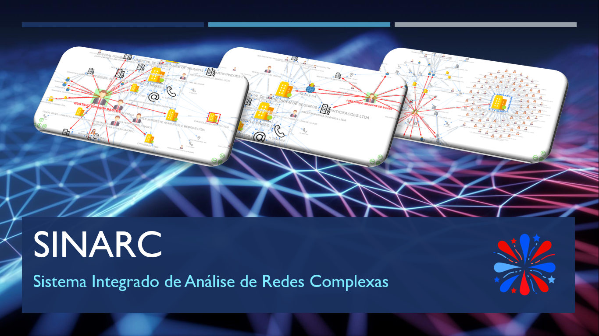

 

  

## O que é o SINARC?

 

O **SINARC – Sistema Integrado de Análise de Redes Complexas** é um programa experimental de análise de dados de fontes abertas desenvolvido pelo Ministério Público de Contas do Estado do Espírito Santo ([MPC-ES](https://www.mpc.es.gov.br/)) sob os princípios da [Ciência Aberta](https://www.unesco.org/en/open-science) (metodologia aberta, código aberto, dados abertos, acesso aberto, revisão por pares aberta e recursos educacionais abertos) e [Licença MIT](https://opensource.org/licenses/MIT) (software livre e gratuito), para uso em computadores com sistema operacional Windows. O sistema foi criado a partir do inspirador projeto [Rede CNPJ](https://github.com/rictom/rede-cnpj), porém utilizando técnicas e ferramentas de programação distintas, o que lhe confere funcionalidades singulares e complementares ao Rede CNPJ.

Como sistema de inteligência para fontes abertas (_Open Source Intelligence - [OSINT](https://www.cia.gov/stories/story/ic-osint-strategy-rollout/))_, o SINARC se propõe a ampliar as perspectivas de análise das conexões existentes entre pessoas físicas, pessoas jurídicas, endereços, telefones e e-mails constantes na [base de dados pública de CNPJ](https://dados.gov.br/dados/conjuntos-dados/cadastro-nacional-da-pessoa-juridica---cnpj) da Receita Federal, formada por 60 milhões de CNPJ, por meio:

1. da criação de uma interface gráfica concebida a partir dos princípios da percepção visual extraídos da Psicologia da [Gestalt](https://medium.com/aela/os-7-princ%C3%ADpios-de-gestalt-e-como-utiliz%C3%A1-los-em-projetos-de-ui-design-46d6d832abf6) ([artigo](https://jamieesterman.com/work/posts/gestalt-principles-and-the-laws-of-ux-a-guide-to-usable-interface-design)), facilitando a identificação visual das estruturas pelo analista; e

2. de um conjunto de ferramentas computacionais que utilizam a [Teoria dos Grafos](https://pt.wikipedia.org/wiki/Teoria_dos_grafos) para analisar a rede de conexões sob a perspectiva de um [Sistema Complexo](https://pt.wikipedia.org/wiki/Sistemas_complexos) e aplicar algoritmos matemáticos para auxiliar na identificação de informações, **padrões** ocultos e **anomalias** relevantes para a produção de conhecimento.

  

## Pen Drive SINARC

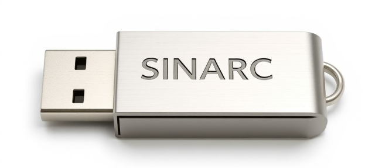

<!--

   

👉 Veja como baixar o SINARC para um pen drive. Sua utilização não requer instalação (clique para expandir)
-->

### Como baixar o SINARC para um pen drive. Sua utilização não requer instalação (plug and play).

<!--### 🚧 Em Construção 🚧-->

 

Devido à sua **portabilidade**, a pasta contendo os programas SINARC, Rede CNPJ e DB Browser, bem como a íntegra do banco de dados com 60 milhões de CNPJ, pode ser baixada e salva em um pen drive ou HD externo (preferencialmente com alta taxa de transferência de dados) para facilitar sua utilização em diferentes computadores que utilizam sistema operacional Windows.

[Clique aqui e baixe a versão compactada da pasta SINARC](https://mega.nz/file/GFEziAoB#oAaIWwPJn3CEYP6ssjn5oYXYGwxzYgJOmM3MuTHtXeo). O arquivo _SINARC.zip_ possui 20 GB. O código SHA-256 de integridade do arquivo é 5df8abd8a007a5925a4b4d2e19061a66b728d46776667e370f9c48a8cbcf32cc. Valide a integridade do arquivo baixado submetendo-o a este [site](https://emn178.github.io/online-tools/sha256_checksum.html) de verificação e comparando a saída com o código SHA-256 fornecido.

**São necessários 90 GB de espaço livre: 20 GB para o arquivo compactado (zip) e 70 para o arquivo descompactado (pasta SINARC)**. Caso não disponha de espaço livre no computador, é possível configurar o navegador para que o download seja realizado diretamente para um pen drive ou HD externo (Procurar no navegador por _Configurações_ -> _Downloads_).

Durante os testes de download, os navegadores Google Chrome e Microsoft Edge armazenaram uma segunda cópia do arquivo zip (20 GB), com nome diferente, nos seguintes endereços, tendo sido necessário apagá-las manualmente para não ocuparem espaço no computador (a parte final, após _File System_, pode variar):

* **Google Chrome:**  _C:\Users\nome_do_usuário\AppData\Local\Google\Chrome\User Data\Default\File System\095\p\00_ 
  
* **Microsoft Edge:** _C:\Users\nome_do_usuário\AppData\Local\Microsoft\Edge\User Data\Default\File System\007\p\00_

O arquivo _SINARC.zip_ desta versão do Pen Drive SINARC contém os programas e a base de dados de CNPJ disponibilizada pela Receita Federal em **08/02/2025**, **prontos para utilização**. A pasta pode ser descompactada e salva em um pen drive, HD externo ou mesmo no computador, **prescindindo de instalação**.

Para usar o Pen Drive SINARC, siga estes passos:

1) Conecte o pen drive ao computador. A pasta SINARC deve estar salva no diretório raiz do pen drive, normalmente reconhecido como Drive D, E ou F; 
  
2) Na pasta SINARC, clique 2 vezes no arquivo **_abre_rede_cnpj.bat_** (o Windows solicitará sua confirmação por se tratar de um arquivo executável _.bat_). Uma instância do Terminal do Rede CNPJ será aberta, exibindo a inicialização do programa. Aguarde alguns segundos até que a interface gráfica do Rede CNPJ seja exibida em uma nova aba do navegador;
  
3) Na sequência, também na pasta SINARC, clique 2 vezes no arquivo **_abre_sinarc.bat_** (o Windows solciitará sua confirmação). Uma instância do Terminal do SINARC será aberta, exibindo a inicialização do programa. Aguarde alguns segundos até que a interface gráfica do SINARC seja exibida em numa nova aba do navegador.

Pronto! Os programas já podem ser utilizados.

Conquanto o SINARC utilize apenas a modelagem de criação e consulta aos bancos de dados do projeto Rede CNPJ, optou-se por disponibilizar também a íntegra deste formidável programa, permitindo ao cidadão explorar os recursos das duas ferramentas e, quem sabe, desenvolver seu próprio sistema de análise de grafos, com funcionalidades ainda mais interessantes, disponibilizando-o igualmente como software livre para inspirar outras pessoas a se engajarem em iniciativas que promovam a transparência e a cidadania a partir de dados abertos.

**ATENÇÃO:** O uso do SINARC com pen drive reduz o desempenho do sistema, em especial com grafos muito grandes. Para desempenho máximo no uso dos programas, salve a pasta SINARC diretamente no computador. Os testes foram realizados usando pen drive de 128 GB, USB 3.2.

Para mais informações sobre a criação do Pen Drive SINARC, consulte [INSTRUÇÕES_PEN_DRIVE_SINARC.txt](https://github.com/controlecidadao/sinarc/blob/main/INSTRU%C3%87%C3%95ES_PEN_DRIVE_SINARC.txt).

  

## O que é uma rede complexa?

 

Uma **Rede Complexa** é um sistema dinâmico formado pelo conjunto de elementos (nós) e das relações existentes entre eles (arestas), cuja complexidade de suas conexões requer para sua compreensão a utilização de ferramentas para modelagem e representação matemática, simplificação e análise computacional. O objeto de estudo dos grafos são as conexões entre seus elementos. 

A complexidade de uma rede está relacionada ao grau de aleatoriedade e ao número de suas conexões. Nesse contexto, o SINARC analisa as conexões existentes em determinado momento entre pessoas físicas (PF), pessoas jurídicas (PJ), endereços (EN), telefones (TE) e e-mails (EM) cadastrados na base de dados pública de CNPJ da Receita Federal. Em termos mais técnicos, pode-se afirmar que **o SINARC é uma implementação computacional** (software) **de um modelo matemático** (Teoria dos Grafos) **que realiza análise estática** (base de dados de CNPJ) **de um sistema complexo e dinâmico** (registros, baixas e atualizações diárias de pessoas jurídicas).

O SINARC captura um instante no tempo (data da disponibilização da base de dados pela Receita Federal), uma fotografia do processo contínuo de evolução de um sistema complexo, dinâmico e real, representado pelos registros, baixas e atualizações diárias de mais de 60 milhões de CNPJ. A expansão controlada do grafo a partir da adição de camadas sucessivas a um ou mais nós iniciais também reproduz o comportamento dinâmico de um sistema complexo.

Características de um sistema complexo, representado pela base de dados de CNPJ da Receita Federal:

* **Diversidade:** Os nós do sistema representam diferentes tipos de entidades (PJ, PF, EN, TE e EM) e de relacionamentos existentes entre eles (sócio, representante, filial etc.);

* **Conectividade:** O sistema complexo possui uma grande quantidade de nós interconectados por arestas, formando uma rede densa e interligada;

* **Escalabilidade:** O sistema aumenta em escala, adicionando novos componentes e aumentando as interconexões entre eles, resultando em uma estrutura de conectividade complexa;

* **Não linearidade:** O crescimento do sistema exibe comportamento não linear e imprevisível;

* **Atualização contínua:** O sistema está em constante atualização, o que implica que novos nós e arestas são adicionados e os existentes podem ser modificados ou removidos ao longo do tempo;

* **Centralidade:** Alguns nós podem desempenhar um papel central na rede, atuando como pontos de ligação entre várias entidades no sistema;

* **Comunidades:** O sistema pode ter agrupamentos de nós que estão mais densamente conectados entre si do que com o restante da rede, formando comunidades ou clusters;

* **Dinâmica temporal:** As conexões entre os nós podem variar ao longo do tempo, refletindo mudanças nas relações entre as entidades representadas;

* **Propriedades emergentes:** O sistema complexo exibe propriedades emergentes onde o comportamento global da rede não pode ser previsto apenas olhando para o comportamento individual dos nós (o todo é diferente da soma das partes). Essas propriedades podem surgir de interações complexas e não lineares entre os elementos da rede.

 

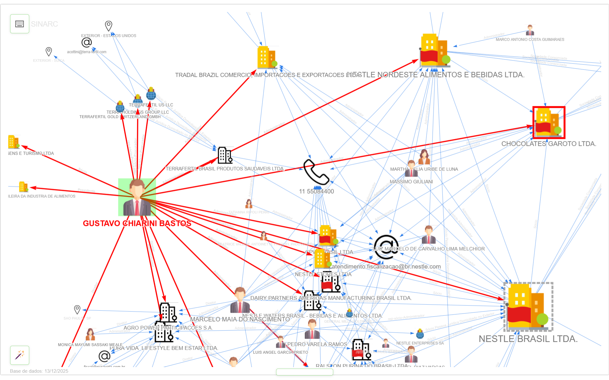

Exemplo de rede complexa de CNPJ sendo explorada pelo SINARC

  

## Qual o objetivo do SINARC?

 

Assim como o projeto Rede CNPJ, o objetivo do SINARC é demonstrar a possibilidade de criação de ferramentas tecnológicas para exploração de dados abertos e incentivar o desenvolvimento de projetos semelhantes pela sociedade, considerando que **"_o verdadeiro progresso é o que põe a tecnologia ao alcance de todos!_"** (Henry Ford), sem exceção.

  

## O SINARC utiliza dados sigilosos?

 

**Não**. Todas as informações reveladas pelo SINARC são de **domínio público**, motivo pelo qual são divulgadas pela Receita Federal independentemente de solicitação, observando a publicidade como preceito geral e o sigilo como exceção, nos moldes preconizados pela [Lei Federal 12.527/2011](https://www.planalto.gov.br/ccivil_03/_ato2011-2014/2011/lei/l12527.htm), Lei de Acesso a Informação, de modo a viabilizar o controle social e a coibir condutas ilícitas no exercício da atividade empresarial.

[Nota Técnica](https://www.gov.br/receitafederal/dados/nota-cocad-rfb-86-2024.pdf/) da Receita Federal especifica quais informações da base de dados de CNPJ não estão protegidas por sigilo fiscal, em consonância com o [Decreto 8.777/2016](https://www.planalto.gov.br/ccivil_03/_ato2015-2018/2016/decreto/d8777.htm#), que instituiu a Política de Dados Abertos do Poder Executivo federal.

Para acessar a fonte primária dos dados usados pelo SINARC, clique [aqui](https://arquivos.receitafederal.gov.br/dados/cnpj/dados_abertos_cnpj/). 
Conheça também o [Dicionário de Dados](https://www.gov.br/receitafederal/dados/cnpj-metadados.pdf) de CNPJ da Receita Federal.

Os exemplos que ilustram o uso do SINARC foram selecionados com base na singularidade de seus padrões de conexão, possuindo caráter meramente demonstrativo e servindo tão somente como referência no contexto educacional da produção de conhecimento a partir de fontes abertas.

Links para sites externos foram incluídos apenas para mostrar a possibilidade de ampliação das funcionalidades da ferramenta.

  

## Para que serve o SINARC?

 

O vídeo a seguir demonstra a aplicação do SINARC no controle da Administração Pública. A partir de [notícia](https://www.radiocacula.com.br/detran-ms-e-investigado-por-suspeita-de-fraude-em-licitacao-de-r-39-milhoes/) publicada na internet sobre supostas irregularidades em licitação promovida pelo Estado do Mato Grosso do Sul (MS) para contratação de serviço de sinalização semafórica, o sistema analisa a existência de vínculos entre as empresas citadas na notícia, cruzando os resultados com os participantes de outra [licitação](https://transparencia.vilavelha.es.gov.br/MostraArquivo.ashx?AnexoLicitacaoId=10676) de mesmo objeto, realizada pelo Município de Vila Velha (ES), para verificar a existência de conexões entre grupos econômicos que atuam em regiões distintas do país:

 

<a href="https://www.youtube.com/watch?v=R73ixbeP0II" target="_blank">
   <!---->
   
</a>

<a href="https://www.youtube.com/watch?v=R73ixbeP0II" target="_blank">
   Vídeo Demonstrativo do SINARC
</a>

 

Confira-se exemplo de uso do SINARC em trabalho técnico desenvolvido pelo Ministério Público de Contas do Estado do Espírito Santo (MPC-ES): [Parecer](https://www.mpc.es.gov.br/wp-content/uploads/2024/10/Processo-784-2020-Parecer-MPC-ES-em-Denuncia-transacao-tributaria-Anchieta-e-Samarco.pdf#page=110) emitido no Processo TC 784/2020 (pág. 110). Para saber mais sobre esta ação de controle do MPC-ES em defesa do meio ambiente, vide a respectiva [notícia](https://www.mpc.es.gov.br/2024/11/lagoa-de-mae-ba-mpc-es-aponta-danos-ambientais-irreversiveis-e-pede-inclusao-da-samarco-vale-e-bhp-em-denuncia/).

Para permitir o compartilhamento, os grafos interativos gerados pelo SINARC são salvos no **_arquivo_sinarc.zip_**, preservando todas as funcionalidades que não dependem de consulta em tempo real ao banco de dados.

  

<a href="https://controlecidadao.github.io/sinarc/exemplo1.html" target="_blank">
   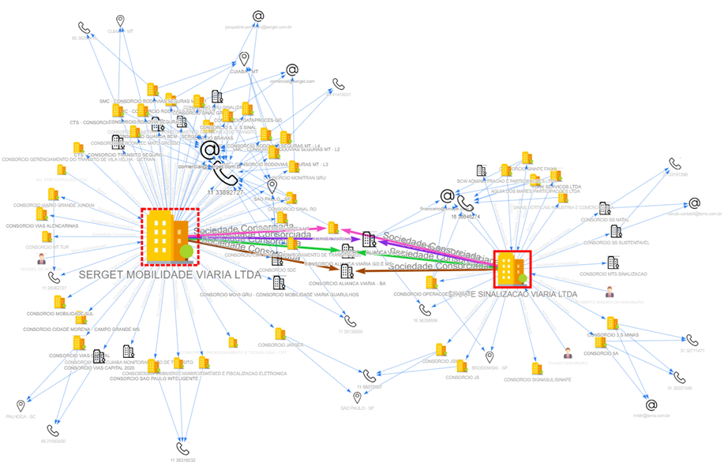
</a>

<a href="https://controlecidadao.github.io/sinarc/exemplo1.html">Exemplo 1</a>: Grafo interativo exibindo vínculos entre duas empresas, identificados pelo SINARC na 1ª camada. Clique no exemplo e interaja com o grafo arrastando os nós com o mouse. 

 

 
 

<a href="https://controlecidadao.github.io/sinarc/exemplo2.html" target="_blank">
   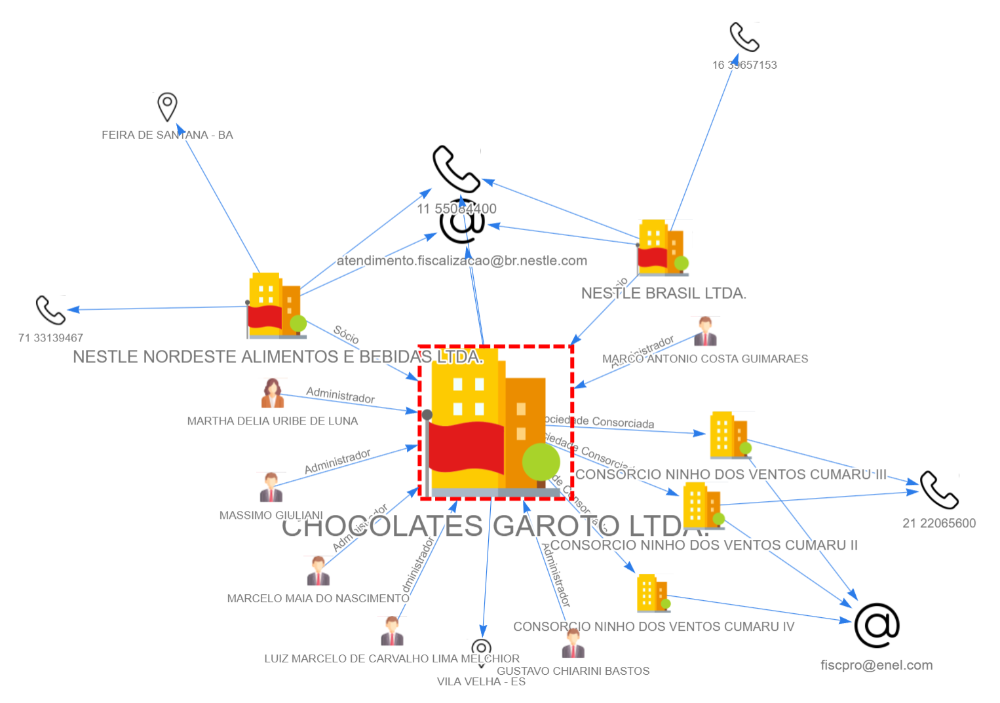
</a>

<a href="https://controlecidadao.github.io/sinarc/exemplo2.html">Exemplo 2</a>: Grafo interativo de grupo econômico aberto em 3 camadas, com 223 nós e 632 arestas. Clique no exemplo e interaja com o grafo pressionando a tecla "n" várias vezes.

 
 

<a href="https://controlecidadao.github.io/sinarc/exemplo3.html" target="_blank">
   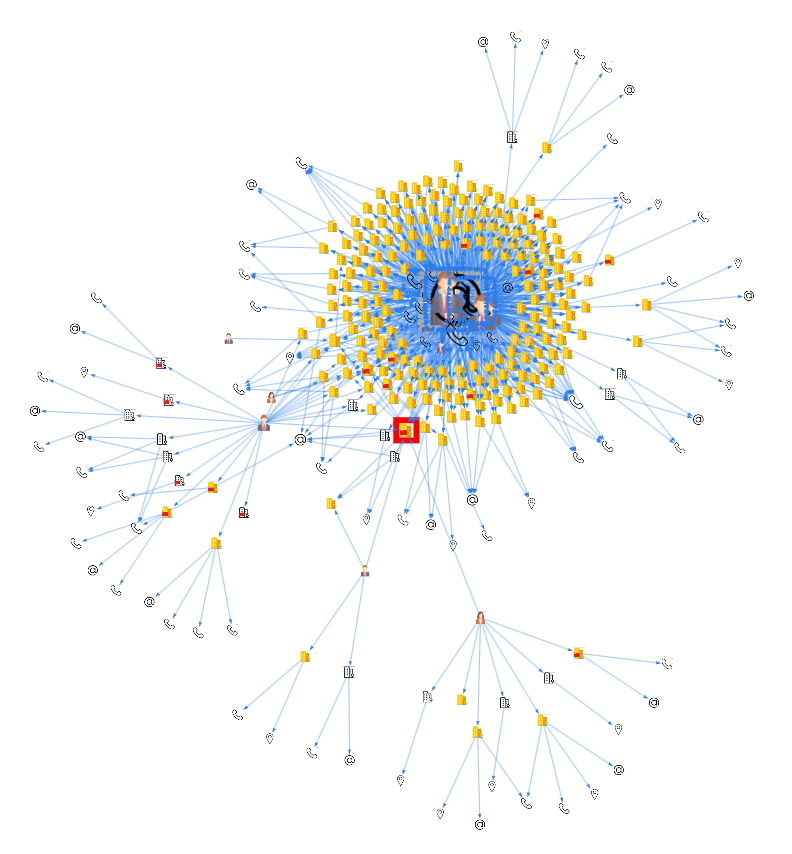
</a>

<a href="https://controlecidadao.github.io/sinarc/exemplo3.html">Exemplo 3</a>: Grafo interativo de grupo econômico aberto em 4 camadas, exibindo 45 nós em layout circular. Clique no exemplo e interaja com o grafo pressionando as teclas "ç", "Delete" e "K" (maiúscula).

 
 

<a href="https://www.youtube.com/watch?v=aP3bkhZEUgY" target="_blank">
   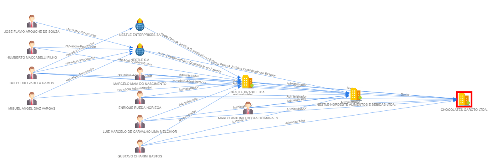
</a>

<a href="https://www.youtube.com/watch?v=aP3bkhZEUgY" target="_blank">Vídeo</a>: Identificando cadeia hierárquica de comando com o SINARC

 
 

<a href="https://controlecidadao.github.io/sinarc/exemplo7.html" target="_blank">
   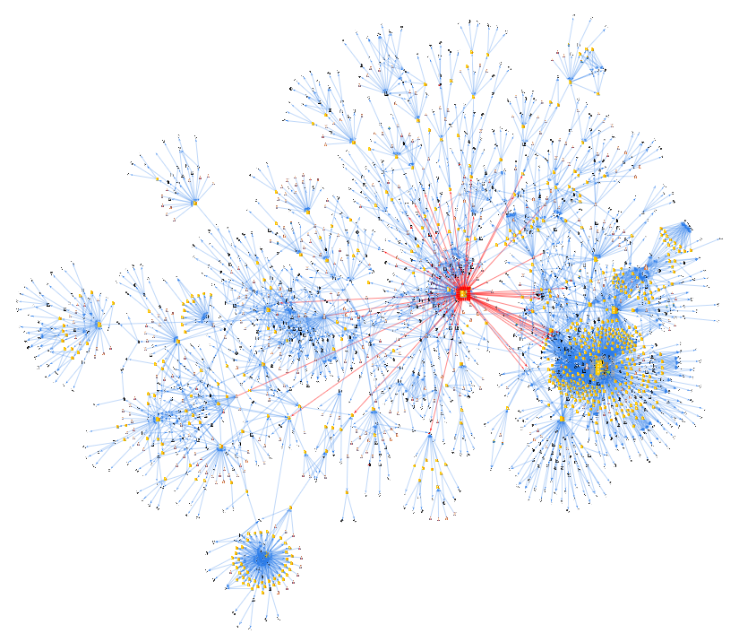
</a>

<a href="https://controlecidadao.github.io/sinarc/exemplo7.html">Exemplo 7</a>: Grafo interativo de grupo econômico aberto em 3 camadas, exibindo 2088 nós e 3964 arestas. Clique no exemplo e interaja com o grafo posicionando o ponteiro do mouse sobre os nós.

  

## Playground SINARC

 

Para testar algumas das funcionalidades dos grafos interativos gerados pelo SINARC:
1) Abra o link a seguir ([Exemplo 5](https://controlecidadao.github.io/sinarc/exemplo5.html)) em uma nova aba do navegador e aguarde o grafo ser exibido (o tamanho dos nós é proporcional ao número de conexões com nós adjacentes). Outros exemplos de grafos disponíveis online para testes: [Exemplo 1](https://controlecidadao.github.io/sinarc/exemplo1.html), [Exemplo 2](https://controlecidadao.github.io/sinarc/exemplo2.html), [Exemplo 3](https://controlecidadao.github.io/sinarc/exemplo3.html), [Exemplo 4](https://controlecidadao.github.io/sinarc/exemplo4.html), [Exemplo 6](https://controlecidadao.github.io/sinarc/exemplo6.html), [Exemplo 7](https://controlecidadao.github.io/sinarc/exemplo7.html). Obs: Caso algum comando não funcione corretamente com os exemplos online, tente abrir o endereço do grafo usando uma aba anônima do navegador;
   
2) Clique na janela do grafo para ativá-la e pressione a **tecla U** (maiúscula, shift + u) para abrir uma janela popup com a distribuição de nós por faixa de tamanho (17 faixas). Observe que o tamnho dos nós varia de 20 a 100 e que cada faixa intermediária possui intervalo de 5 unidades. Feche a janela popup;
   
3) Pressione a **tecla Espaço** 16 vezes, espaçadamente, até que o parâmetro "tamanho", exibido no canto superior direito da tela, reduza de 100 para 25 em intervalos de 5 unidades. Esta função aumenta a massa dos nós situados em cada faixa, de forma proporcional ao tamanho de cada nó (do maior para o menor), melhorando progressivamente a visualização do grafo no layout gravitacional. Ao aumentar a massa dos nós, a força (anti)gravitacional de repulsão mútua existente entre eles também aumenta, reposicionando-os na tela para facilitar a identificação de suas conexões. As arestas atuam como molas que impedem o distanciamento entre os nós localizados em suas extremidades;
   
4) Pressione a **tecla Escape** para encaixar o grafo na janela de visualização;

5) Pressione a **tecla z** (minúscula) para ativar/desativar o modo automático de visualização. Este recurso simula os movimentos de uma câmera percorrendo os nós do grafo em ordem decrescente de grau (tamanho), seguido pela aproximação de cada um de seus nós adjacentes. Pressione a **tecla z** novamente a qualquer momento para sair da função;

6) Após desativar o modo automático de visualização, use o **botão de rolagem do mouse** para aproximar e afastar o grafo. Posicione o mouse sobre o ponto que deseja aproximar ou afastar e gire o botão de rolagem para frente e para trás;

7) **Posicione o ponteiro do mouse por 1,5s sobre qualquer nó** para exibir seus detalhes na tela;

8) Clique sobre um nó de pessoa jurídica (ícone de prédio ou de globo) para selecioná-lo e pressione a **tecla d** (minúscula) para abrir uma janela com mais detalhes sobre a empresa (site externo);

9) Para recarregar a página e retornar o grafo ao seu estado inicial, pressione a **tecla F5**. Em seu estado inicial, os grafos podem apresentar aparente sobreposição de nós em razão da definição do tamanho dos elementos com base em seu número de conexões (quanto maior o número de conexões, maior o nó). Nesses casos, pressione a **tecla e** 2 vezes para uniformizar o tamanho dos nós. Aproxime o grafo para visualizar melhor;

10) Pressione a **tecla e** 1 vez para ocultar os rótulos dos nós e a **tecla l** (ele minúsculo) 1 vez para ocultar os rótulos das arestas;

11) Para a relação completa de comandos e funcionalidades, consulte o item [8 - Uso do Mouse e do Teclado](https://controlecidadao.github.io/sinarc/help.html#uso_do_mouse) do [Manual do SINARC](https://controlecidadao.github.io/sinarc/help.html). Para abrir o manual estando na janela do grafo, pressione a **tecla h** (minúscula).

  

<a href="https://www.youtube.com/watch?v=spIwxVx6AnI" target="_blank">
   <!---->
   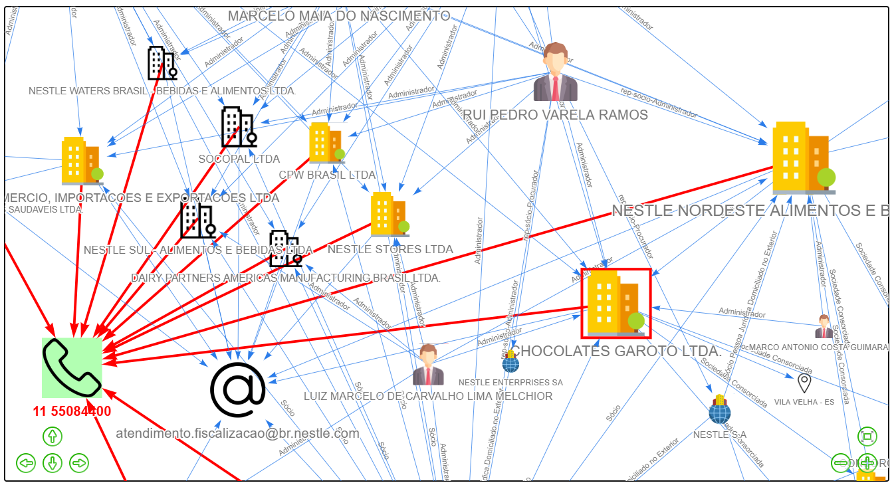
</a>

<a href="https://www.youtube.com/watch?v=spIwxVx6AnI" target="_blank">Vídeo 1</a>: Modo Automático de Visualização do SINARC

  

<a href="https://www.youtube.com/watch?v=7kFEYaev6Lg" target="_blank">
   <!---->
   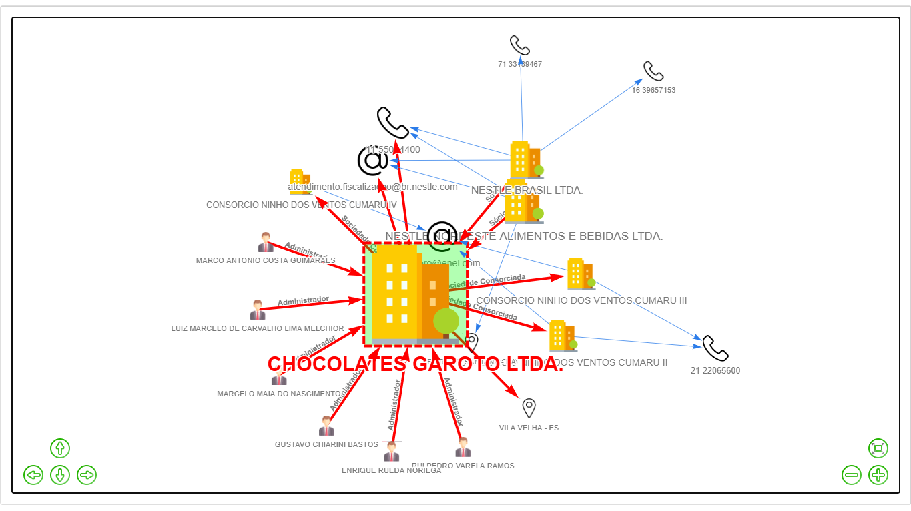
</a>

<a href="https://www.youtube.com/watch?v=7kFEYaev6Lg" target="_blank">Vídeo 2</a>: Modo Automático de Visualização do SINARC

  
## Tutorial interativo do SINARC

<!--

   

👉 Sequência demonstrativa de comandos do SINARC (clique para expandir)
-->

 

<!--### 🚧 Tutorial em Construção 🚧-->

 

O objetivo deste tutorial é demonstrar, de forma prática, passo a passo, o uso dos comandos do SINARC que não dependem de consulta em tempo real ao banco de dados, utilizando grafos disponíveis online. O SINARC possui aproximadamente **80 comandos** acionados pelo mouse e pelo teclado.

Certifique-se de que o teclado esteja no padrão de letras minúsculas (tecla CapsLock desativada). Para executar comandos com letras maiúsculas, pressione Shift + tecla desejada. 

Os comandos listados a seguir estão agrupados em **blocos temáticos** de acordo com suas funcionalidades. Execute-os na sequência indicada. 

A descrição dos comandos acionados com o mouse e com o teclado é exibida no canto superior direito da tela durante 3s.
 
 

### 👉 Primeira sequência de comandos
 
Abra o link a seguir ([Exemplo 4](https://controlecidadao.github.io/sinarc/exemplo4.html)) em uma nova aba do navegador e aguarde o grafo ser exibido. Caso disponha de um segundo monitor, mova para ele a nova aba e pressione a **tecla b** para ajustar a altura da janela de visualização do grafo à altura da tela do monitor.

 

### Ajuste de Tela

* **Tecla F5** --> Recarrega a página, exibindo o grafo em uma posição aleatória, diferente da posição anterior.
* **Tecla F11** --> Ativa/desativa a exibição do grafo em tela cheia (pressione 2 vezes).
* **Tecla b** --> Ajusta a altura da janela de visualização do grafo à altura da janela do navegador.
* **Tecla Escape** --> Enquadra o grafo no centro da tela.

 

### Ajuste de Layout
  
* **Tecla F11** --> Ativa/desativa a exibição do grafo em tela cheia.
* **Tecla k** --> Alterna de forma cíclica entre os layouts gravitacional (padrão), hieráquico a partir das folhas e hierárquico a partir das raízes.  Vide detalhes no canto superior direito da tela.
* **Tecla Escape** --> Enquadra o grafo no centro da tela.
* **Tecla k** --> Alterna entre os layouts gravitacional (padrão), hieráquico a partir das folhas e hierárquico a partir das raízes (pressione 2 vezes).
* **Tecla K** --> Ativa/desativa o layout circular (pressione 2 vezes).

 

### Exibição de informações no grafo sobre nós e arestas

* **Mouse** --> Passe o ponteiro do mouse sobre os nós para destacar em vermelho suas arestas adjacentes.
* **Mouse** --> Permaneça com o ponteiro do mouse sobre um nó ou aresta por 1,5s para exibir suas informações.

 

### Seleção de nós com o mouse

* **Mouse** --> Clique com o mouse sobre um nó para selecioná-lo.
* **Mouse** --> Clique com o mouse sobre o fundo branco para desselecionar o nó selecionado.
* **Tecla Ctrl + Mouse** --> Mantenha a tecla Ctrl pressionada e clique sobre alguns nós para selecioná-los simultaneamente.
* **Mouse** --> Clique com o mouse sobre o fundo branco para desselecionar todos os nós selecionados.
* **Mouse** --> Posicione o ponteiro do mouse sobre uma região do grafo e gire o botão de rolagem para frente e para trás para afastar e aproximar as estruturas.
* **Tecla Escape** --> Enquadra o grafo no centro da tela.
* **Mouse** --> Posicione o ponteiro do mouse sobre o fundo branco, mantenha pressionado o botão esquerdo e arraste o grafo para o lado. Solte o botão ao final do movimento.
* **Tecla Escape** --> Enquadra o grafo no centro da tela.

 

### Ajuste da exibição de nós e arestas

* **Tecla e** --> Alterna de forma cíclica entre os 7 tipos de visualização de cada nó (pressione 7 vezes). Vide detalhes no canto superior direito da tela.
* **Tecla l (ele minúsculo)** --> Alterna de forma cíclica entre os 3 tipos de visualização das arestas (pressione 3 vezes). Vide detalhes no canto superior direito da tela.
* **Tecla Shift + Tecla Seta p/ Direita** --> Aumenta o tamanho das arestas em 30 unidades (pressione algumas vezes). Tamanho padrão das arestas: 300.
* **Tecla Shift + Tecla Seta p/ Esquerda** --> Diminui o tamanho das arestas em 30 unidades (pressione algumas vezes).

  

### 👉 Segunda sequência de comandos

Abra o link a seguir ([Exemplo 5](https://controlecidadao.github.io/sinarc/exemplo5.html)) em uma nova aba do navegador e aguarde o grafo ser exibido. Caso disponha de um segundo monitor, mova para ele a nova aba e pressione a **tecla b** para ajustar a altura da janela de visualização do grafo à altura da tela do monitor. 

 

### Fixação de nós

* **Mouse** --> Mantenha pressionado o botão esquerdo mouse sobre o nó de maior tamanho e arraste-o até um dos cantos da tela. Ao soltar o botão, observe o retorno do grafo ao centro da tela.
* **Tecla p** --> Ativa/desativa os movimentos do grafo, permitindo o reposicionamento manual dos nós. Repita o comando anterior e pressione a tecla p durante o retorno do grafo ao centro da tela. Quando o grafo parar, clique sobre um nó e arraste-o para outra posição (repita esse procedimento com outros nós). Ao final, pressione a tecla p novamente para liberar os movimentos do grafo.
* **Tecla f** --> Ativa/desativa os movimentos apenas dos nós selecionados. Selecione um nó, pressione a tecla f e arraste-o para fixá-lo em um canto da tela. Selecione outro nó, pressione a tecla f novamente e arraste-o para o outro canto da tela. Ao final, selecione os nós fixados e pressione a tecla f para liberá-los.
* **Tecla F5** --> Recarrega a página, exibindo o grafo em uma posição diferente da anterior.

 

### Ajuste da massa dos nós

* **Tecla m** --> Aumenta a massa de todos os nós do grafo em 0,5 unidade, ampliando a força gravitacional de repulsão entre eles (pressione 10 vezes). Massa padrão dos nós: 1.
* **Tecla M** --> Diminui a massa de todos os nós do grafo em 0,5 unidade, reduzindo a força gravitacional de repulsão entre eles (pressione 10 vezes).
* **Tecla U** --> Exibe número de nós para cada faixa de tamanho (faixas 20 a 25, 25 a 29 ... 95 a 99, 100).
* **Tecla n** --> Aumenta a massa dos nós com tamanho maior ou igual ao tamanho de referência (tamanho de referência padrão = 40) (pressione 5 vezes).
* **Tecla N** --> Diminui a massa dos nós com tamanho maior ou igual ao tamanho de referência (tamanho de referência padrão = 40) (pressione 5 vezes).
* **Tecla Shift + Tecla Seta p/ Cima** --> Aumenta valor do tamanho de referência em 5 unidades.
* **Tecla Shift + Tecla Seta p/ Baixo** --> Diminui valor do tamanho de referência em 5 unidades.
* **Tecla ]** --> Aumenta valor do tamanho dos nós selecionados em 5 unidades. Selecione um nó com apenas uma aresta e pressione a tecla ] 2 vezes.
* **Tecla [** --> Diminui valor do tamanho dos nós selecionados em 5 unidades (pressione 2 vezes).
* **Tecla Espaço** --> Aumenta a massa dos nós de forma proporcional ao seu tamanho, iniciando pelo maior (tamanho 100) e indo até o menor (tamanho 20) (pressione 16 vezes).

 

### Seleção de nós com o teclado

* **Tecla A** --> Seleciona todos os nós do grafo simultaneamente.
* **Tecla ,** --> Abre janela contendo os rótulos de todos os nós selecionados, segregados por tipo de nó.
* **Tecla a** --> Seleciona os nós adjacentes aos nós que se encontram selecionados. Selecione um nó com apenas uma aresta e pressione a tecla "a" até que todos os nós sejam desselecionados.
* **Tecla c** --> Aproxima o nó selecionado e enquadra na tela seus nós adjacentes. Selecione um nó do grafo e pressione a tecla c por 2 vezes.
* **Tecla i** --> Alterna entre os nós selecionados, aproximando de cada um deles. Selecione 3 nós no grafo (Ctrl + clique) e pressione a tecla i por 3 vezes.
* **Tecla I (i maiúsculo)** --> Inverte seleção dos nós do grafo. Selecione alguns nós e aperte a tecla I.
* **Tecla ç** --> Alterna seleção dos nós de Endereços (EN), Telefones (TE) e E-mails (EM) com apenas 1 conexão, seguida pelos nós com mais de 1 conexão (pressione 3 vezes).
* **Tecla Ç** --> Alterna seleção dos nós com número crescente de conexões (1, 2, 3 etc.). Pressione até que todos os nós sejam desselecionados.
* **Tecla Q** --> Seleciona nós-alvos (com borda vermelha).
* **Tecla .** --> Alterna seleção entre os 15 tipos de imagens de nós do grafo (pressione 16 vezes).
* **Tecla ;** --> Alterna seleção entre os nós de origem e de destina das arestas do nó selecionado. Selecione o maior nó do grafo e pressione a tecla ";" 3 vezes.
* **Tecla /** --> Seleciona nós acrescidos ao grafo na última consulta ao banco de dados.
* **Tecla j** --> Seleciona nós adjacentes comuns aos nós selecionados. Selecione dois nós e pressione a tecla j, seguido da tecla "," para ver os rótulos dos nós comuns.
* **Tecla J** --> Seleciona nós adjacentes não comuns aos nós selecionados. Selecione dois nós e pressione a tecla J, seguido da tecla "," para ver os rótulos dos nós não comuns.

 

### Pesquisa por nós e arestas no grafo

* **Tecla q** --> Abre popup para pesquisar por rótulos dos nós no grafo. Digite um parâmetro de pesquisa (sem acento) ou pressione a tecla Enter para alternar para a pesquisa por rótulos das arestas.

 

### Ativação dos modos de transparência

* **Tecla t** --> Ativa o modo transparência por tipos de nós, permitindo a visualização alternada dos 15 tipos de imagens de nós do grafo (pressione 17 vezes).
* **Tecla F5** --> Recarrega a página, exibindo o grafo em uma posição diferente da anterior.
* **Tecla T** --> Ativa o modo transparência por conexões. Posicione o ponteiro do mouse sobre os nós para visualizar suas conexões e nós adjacentes.
* **Tecla F5** --> Recarrega a página, exibindo o grafo em uma posição diferente da anterior.

  

### 👉 Terceira sequência de comandos

Abra o link a seguir ([Exemplo 2](https://controlecidadao.github.io/sinarc/exemplo2.html)) em uma nova aba do navegador e aguarde o grafo ser exibido. Caso disponha de um segundo monitor, mova para ele a nova aba e pressione a **tecla b** para ajustar a altura da janela de visualização do grafo à altura da tela do monitor. 

 

### Detecção de comunidades

* **Tecla n** --> Aumenta a massa dos nós com tamanho de referência maior ou igual a 40. Pressione e segure a tecla n até que o "Fator", exibido no canto superior direito da tela, alcance 301.
* **Tecla v** --> Ativa/deastiva destaque de comunidades de nós.
* **Tecla V** --> Alterna exibição de nós por comunidades (grupos).

 

### Adição de cores aos nós

* **Tecla x** --> Adiciona cores alternadas aos nós selecionados em sequência.
* **Tecla X** --> Remove cores adicionadas aos nós.

 

### Deleção de nós

* **Tecla Delete** --> Deleta do grafo os nós selecionados. Selecione nós no grafo e pressione a tecla Delete. O quantitativo de nós selecionados é exibido na tela.
* **Tecla r** --> Exclui todos os nós que não se encontram selecionados.
* **Tecla R** --> Exclui todos os nós que não se encontram interligados por arestas coloridas (vide [Exemplo 1](https://controlecidadao.github.io/sinarc/exemplo1.html)).

 

### Identificação da cadeia hierárquica de comando do nó-alvo

* **Tecla w** --> Adiciona cor para destacar todos os nós que integram a cadeia hierárquica de comando do nó-alvo.
* **Tecla W** --> Exclui nós que não pertencem à cadeia hierárquica de comando do nó-alvo.

 

### Consulta a sites externos e outros recursos
   
* **Tecla d** --> Exibe informações sobre o nó selecionado extraídas de sites externos.
* **Tecla D** --> Realiza pesquisa pelo nó selecionado no DOU, DIO-ES, DOM-ES, Querido Diário OKF, Portal da Transparência CGU e Jusbrasil.
* **Tecla g** --> Realiza pesquisa pelo nó selecionado no Google.
* **Tecla G** --> Realiza pesquisa avançada do nó selecionado nos domínios tc.br, mp.br, jus.br, gov.br, es.gov.br.    
* **Tecla 1** --> Exibe comprovante e inscrição de situação cadastral da pessoa jurídica selecionada.
* **Tecla 2** --> Realiza pesquisa pela pessoa física ou jurídica selecionada na base de dados de sanções da CGU (CEIS, CNEP, CEPIM e CEAF).
* **Tecla 3** --> Tecla não usada.
* **Tecla 4** --> Abre arquivo Excel contendo as tabelas de nós e de conexões retornadas da consulta ao banco de dados (depende de consulta em tempo real ao banco de dados).
* **Tecla 5** --> Abre site Rede CNPJ.
* **Tecla 6** --> Abre sites contendo bases de dados primárias da CGU (Dívida Ativa Geral, Dívia FGTS, Dívida Previdenciária, Sanções, Acordos de Leniência e Pessoas Expostas Politicamente) e da Receita Federal (CNPJ).
* **Tecla 7** --> Exibe dados da pessoa jurídica em formato JSON.
* **Tecla 8** --> Realiza consulta à API de Compras Governamentais do Governo Federal.
* **Tecla 9** --> Tecla não usada.

 

### Medidas de centralidade e distribuição de nós e arestas
    
* **Tecla L** --> Exibe na tela a distribuição de arestas por tipo.
* **Tecla u** --> Exibe na tela as 5 medidas de centralidade do grafo.
* **Tecla U** --> Exibe na tela a distribuição de nós por tamanho.

 

### Consulta ao banco de dados (indisponível com grafos online)

* **Tecla o** --> Abre nós selecionados como alvos em nova aba do navegador.
* **Tecla O** --> Abre filiais da pessoa jurídica selecionada em nova aba do navegador.
* **Tecla s** --> Pesquisa livre por parâmetro (CNPJ, radical do CNPJ, razão social, nome de fantasia, nome da pessoa física, CPF parcial) no banco de dados. Use "@NNN" depois do parâmetro para retornar até NNN ocorrências.
* **Tecla +** --> Inclui nó selecionado na lista de nós-alvos.
* **Tecla -** --> Exclui nó selecionado da lista de nós-alvos.
* **Tecla y** --> Abre nós da lista de nós-alvos em uma nova aba do navegador.

 

### Manual e dicas na tela

* **Tecla ?** --> Exibe/oculta na tela as teclas de atalho do SINARC.
* **Tecla h** --> Abre manual do SINARC em uma janela flututante.

 

### Modo automático de visualização

* **Tecla z** --> Ativa/desativa o modo automático de visualização.

 

### Função de cópia do sistema operacional

* **Tecla |** --> Ativa/desativa a função de cópia (Ctrl + c) do SINARC. Quando ativada, a função Ctrl + c do sistema operacional fica vinculada exclusivamente ao funcionamento do SINARC, tornando-se indisponível para uso com outros programas; quando desativada, copia o id do nó selecionado, permitindo sua tranferência para o programa Rede CNPJ (Ctrl + v).
 

Comandos que dependem de consulta em tempo real ao banco de dados, necessitando que o SINARC e o Rede CNPJ estejam em execução: **Teclas o O s y 4** 

Os camandos que não dependem de nova consulta aos bancos de dados podem ser executados nos arquivos gerados pelo SINARC para compartilhamento (_arquivo_sinarc.zip_).

Para mais detalhes sobre o funcionamento de cada comando, consulte o item 8, [Uso do Mouse e do Teclado](https://controlecidadao.github.io/sinarc/help.html#uso_do_mouse), do Manual do SINARC.

  

## Como criar uma nova instalação do SINARC?

 

Caso opte em não realizar o download da versão compactada do **Pen Drive SINARC**, a qual dispensa instalação, siga as instruções abaixo.

Para gerar uma nova instalação dos sistemas SINARC e Rede CNPJ, incluindo a criação do banco de dados a partir dos arquivos disponibilizados pela Receita Federal, consulte as instruções contidas no arquivo [INSTRUÇÕES.txt](https://github.com/controlecidadao/sinarc/blob/main/INSTRU%C3%87%C3%95ES.txt), disponível na página principal deste repositório. 

Para ampliar a capacidade de pesquisa, baixe e descompacte na pasta SINARC (criada pelo usuário para abrigar o sistema) a versão portátil e gratuita do programa [DB Browser](https://sqlitebrowser.org/dl/) (arquivo "_DB Browser for SQLite - .zip (no installer) for 64-bit Windows_"). Com o auxílio do DB Browser é possível realizar filtros e consultas diretamente nas tabelas dos bancos de dados do sistema, combinando critérios de busca que não estão disponíveis nas interfaces gráficas do SINARC e do Rede CNPJ para chegar aos números de CNPJ que deseja explorar.

O manual de instruções do SINARC pode ser acessado pressionando-se a tecla h (de _help_) durante o uso do sistema. Já o manual do Rede CNPJ encontra-se disponível na página do projeto.

  

## A quem se destina o SINARC?

 

O SINARC se destina a todos que exercem o controle social e institucional da Administração Pública, como auditores, jornalistas, comissões de licitação, procuradorias jurídicas, sistemas de controle interno, ministérios públicos, entre outros órgãos e instituições, além do cidadão interessado em obter informações sobre a estrutura empresarial de grupos econômicos, em especial sobre as pessoas físicas e jurídicas que integram a cadeia hierárquica de comando, a situação jurídica de empresas e as relações existentes entre pessoas físicas e jurídicas cadastradas na base de dados pública de CNPJ da Receita Federal.

**ATENÇÃO:** Antes de utilizar as informações obtidas por meio do SINARC, valide-as mediante consulta direta aos portais de transparência e às bases de dados primárias atualizadas.

  

## Exemplos de utilização do SINARC

 

Confira-se, a seguir, exemplos de exploração de redes complexas com o SINARC:

  

### **CNPJ 33.592.510/0001-54 (Vale S.A.):** 
*	Aberto em 4 camadas com o SINARC 
*	6.602 nós 
*	12.884 arestas (azul) 
* Fonte: [Empresas listadas na B3](https://www.idinheiro.com.br/investimentos/cnpj-empresas-listadas-b3/)
 

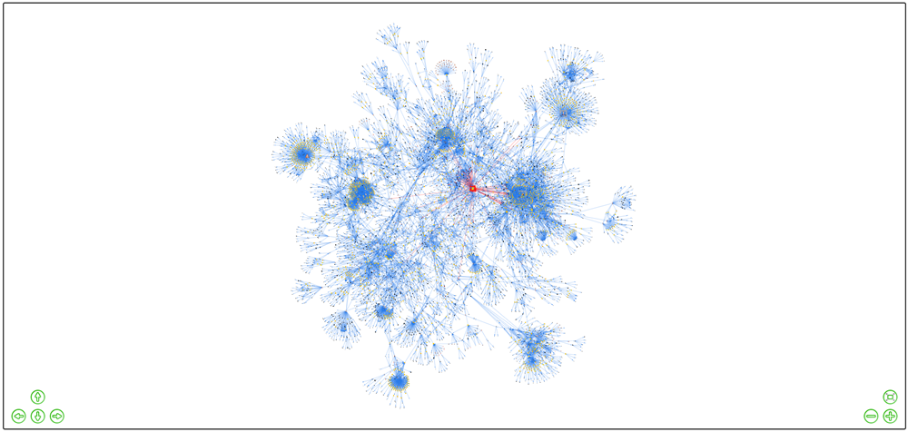

Visão panorâmica da rede complexa gerada pelo SINARC

  

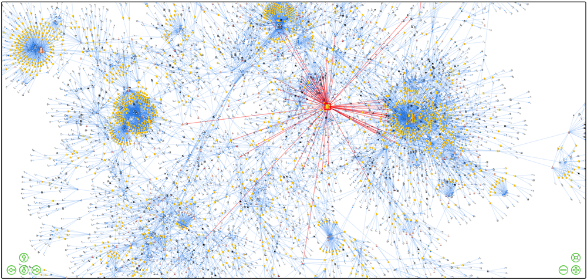

Aproximação da rede complexa gerada pelo SINARC

  

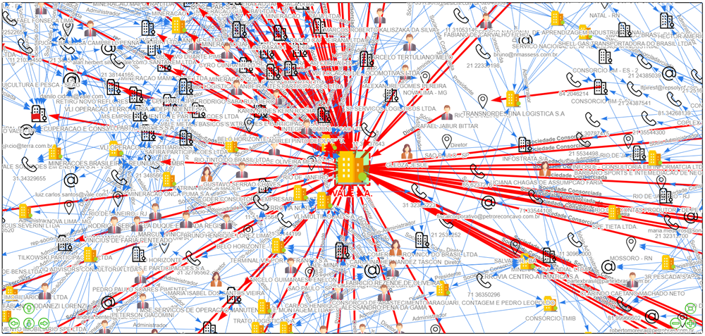

Detalhe da rede complexa gerado pelo SINARC

  

### **CNPJ de empresas listadas na B3 S.A. (Bolsa de Valores):** 
*	Abertos em 2 camadas com o SINARC 
*	31.606 nós 
*	45.268 arestas (azul) 
* Fonte: [Empresas listadas na B3](https://www.idinheiro.com.br/investimentos/cnpj-empresas-listadas-b3/) 
 

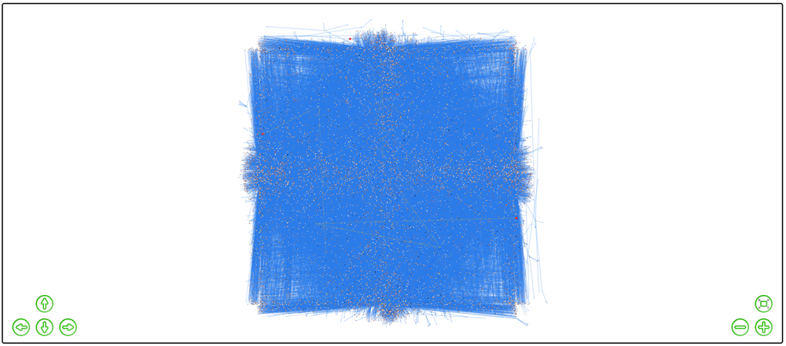

Visão panorâmica da rede complexa gerada pelo SINARC

  

Aproximação da rede complexa gerada pelo SINARC

  

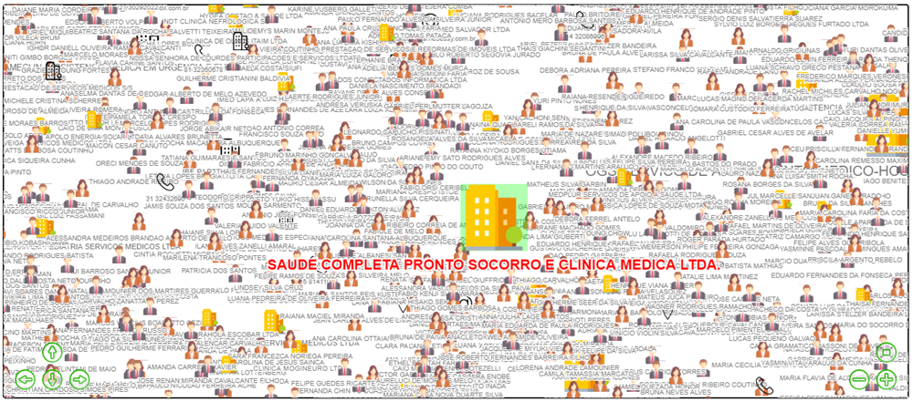

Detalhe da rede complexa gerado pelo SINARC (com ocultação de arestas)

  

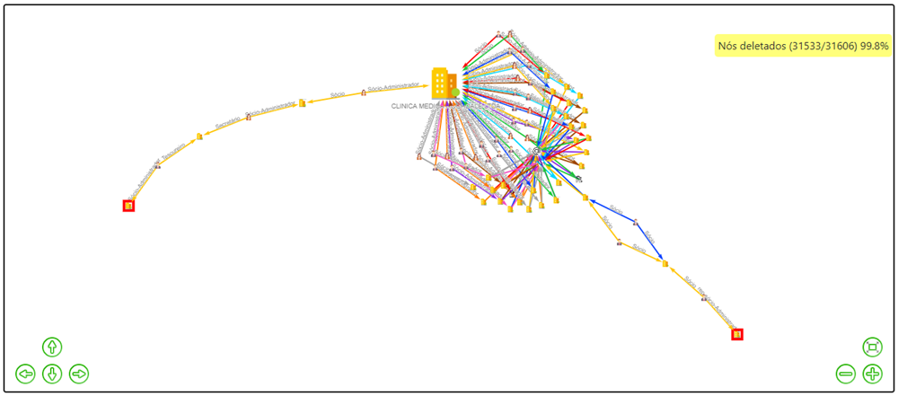

Vínculo existente entre duas empresas, identificado pelo SINARC na 8ª camada

  

## Algumas possibilidades de uso do SINARC

 

✅ Conhecer a estrutura de grupos empresariais com base no CNPJ, razão social, nome de fantasia, nome ou CPF parcial do sócio no formato *\*\*NNNNNN\*\*, entre outros parâmetros.

✅ Identificar vínculos entre pessoas físicas e jurídicas a partir de notícias publicadas na internet ([Vídeo](https://www.youtube.com/watch?v=R73ixbeP0II)).

✅ Representar, por meio de grafos, empresas cujos números de CNPJ no formato 00000000000000 ou 00.000.000/0000-00 se encontram em relatórios técnicos, diários oficiais ou qualquer documento ou tela com texto selecionável.

✅ Identificar vínculos entre licitantes a partir das atas das sessões públicas de procedimentos licitatórios ([Ata Pregão Eletrônico](https://transparencia.vilavelha.es.gov.br/Licitacao.Detalhes.aspx?municipioId=1&LicitacaoId=32772)), bem como das bases de dados disponibilizadas nos portais de transparência da Administração Pública.

✅ Identificar pessoas físicas e jurídicas com posições estratégicas na rede de conexões a partir da aplicação de algoritmos matemáticos de medidas de centralidade de grafos, como Centralidade de Grau (_Degree Centrality_), Centralidade de Intermediação (_Betweenness Centrality_), Centralidade de Proximidade (_Closeness Centrality_), Centralidade de Autovetor (_Eigenvector Centrality_) e Ranking de Página (_PageRank_).

✅ Identificar toda a cadeia hierárquica formada por pessoas físicas e jurídicas que integram os grupos econômicos controladores de determinada empresa.

✅ Gerar grafo contendo todas as empresas que se enquadrem na combinação de determinados critérios (mesmo endereço, rua, CEP, atividade econômica etc.), mediante consulta prévia à base de dados usando o programa gratuito [DB Browser](https://sqlitebrowser.org/).

  

## Explorando conexões com o SINARC

 

Relação de sites e documentos contendo informações (nomes de pessoas físicas, jurídicas e números de CNPJ) para explorar com o SINARC:

* [Relatório Final da Polícia Federal no Caso Marielle Franco e Anderson Gomes](https://static.poder360.com.br/2024/03/relatorio-PF-caso-Marielle-24mar2024.pdf)

* [Relatório Final da Polícia Fedreal sobre a Operação Prato Feito](https://www.estadao.com.br/blogs/blog/wp-content/uploads/sites/41/2018/05/Representacao-Opera%C3%A7%C3%A3o-Prato-Feito.pdf)

* [Relatório Parcial e Representação da Polícia Federal na Operação Encilhamento](https://www.conjur.com.br/dl/re/relatorio-pf-fraude-fundo-pensao.pdf)
  
* [CGU multa empresa em R$ 566 milhões por fraude em contrato com a Petrobras](https://agenciagov.ebc.com.br/noticias/202504/cgu-multa-empresa-566-milhoes-fraude-contra-petrobras)

* [Empresas beneficiadas por renúncias fiscais de tributos federais (Receita Federal)](https://dados.gov.br/dados/conjuntos-dados/renuncias-fiscais-de-tributos-federais). Clique em "Recursos" e localize o item "(Dirbi) Renúncia Fiscal por Regime Especial de Tributação". Clique em "Acessar o recurso" e realize do download do arquivo CSV (568 mil linhas e 675MB). Abra o arquivo com o Excel, formate a coluna "cnpj" como texto e gere uma tabela dinâmica com as colunas "cnpj", "nome" e "valorConsolidado". Aplique filtros usando as demais colunas, selecione os números de CNPJ desejados e pressione Ctrl + c para explorá-los com o SINARC.

* [Empresas beneficiadas por renúncias fiscais de tributos estaduais (Estado do Espírito Santo)](https://transparencia.es.gov.br/Comum/IncentivosFiscais). Referentes ao Programa de Desenvolvimento e Proteção à Economia do Estado do Espírito Santo (Compete-ES) e ao Programa de Incentivo ao Investimento no Estado do Espírito Santo (Invest-ES). Clique nos itens "Lista de Beneficiários do programa Compete" e "Lista de Beneficiários do programa Invest" para realizar o download da lista atual de beneficiários.

* [Reembolsos suspeitos de despesas realizadas pela Câmara dos Deputados (Operação Serenata de Amor)](https://jarbas.serenata.ai/dashboard/chamber_of_deputies/reimbursement/)

* [Notícias recentes sobre fraudes em licitação (Google)](https://www.google.com/search?q=fraude+licita%C3%A7%C3%A3o+ltda&sca_esv=b28375632d0b0304&rlz=1C1GCEU_pt-BRBR1106BR1106&biw=1242&bih=575&tbs=sbd%3A1&tbm=nws&sxsrf=ADLYWIIhiXt6MSk8cPC0shxAMoiwdf1Pyw%3A1731870048554&ei=YD06Z4-9IYWp1sQPs5bvuAw&ved=0ahUKEwiP7anYhuSJAxWFlJUCHTPLG8cQ4dUDCA0&uact=5&oq=fraude+licita%C3%A7%C3%A3o+ltda&gs_lp=Egxnd3Mtd2l6LW5ld3MiF2ZyYXVkZSBsaWNpdGHDp8OjbyBsdGRhMgUQIRigATIFECEYoAEyBRAhGKABMgUQIRigAUj6HlCgEljbG3AAeACQAQCYAcgBoAGhCaoBBTAuNy4xuAEDyAEA-AEBmAIHoALpB8ICBRAhGJ8FmAMAiAYBkgcDMC43oAfYOg&sclient=gws-wiz-news)

* [Atas de sessões públicas de pregões eletrônicos (Google)](https://www.google.com/search?q=ata+sess%C3%A3o+preg%C3%A3o+ltda+filetype%3Apdf&sca_esv=b28375632d0b0304&rlz=1C1GCEU_pt-BRBR1106BR1106&biw=1242&bih=575&sxsrf=ADLYWIK6WykeXV5nAHsyue6o-IjFX4qkhQ%3A1731868416556&ei=ADc6Z53UIYme5OUP7vzCqQk&ved=0ahUKEwid1JDOgOSJAxUJD7kGHW6-MJUQ4dUDCA8&uact=5&oq=ata+sess%C3%A3o+preg%C3%A3o+ltda+filetype%3Apdf&gs_lp=Egxnd3Mtd2l6LXNlcnAiJWF0YSBzZXNzw6NvIHByZWfDo28gbHRkYSBmaWxldHlwZTpwZGZIuidQ8x5YmSRwAngBkAEAmAGGAaAB-QSqAQMwLjW4AQPIAQD4AQGYAgKgAgjCAgoQABiwAxjWBBhHmAMAiAYBkAYIkgcBMqAH4QE&sclient=gws-wiz-serp)
* [Diário Oficial do Estado do Espírito Santo (DIO-ES)](https://ioes.dio.es.gov.br/portal/visualizacoes/diario_oficial)

* [Diário Oficial dos Municípios do Espírito Santo (DOM-ES)](https://ioes.dio.es.gov.br/dom)

* [Bases de dados de licitações, contratos e execução orçamentária do Estado do Espírito Santo](https://dados.es.gov.br/dataset?tags=portal+da+transpar%C3%AAncia)

* [Empresas listadas na B3](https://www.idinheiro.com.br/investimentos/cnpj-empresas-listadas-b3/)

* [Empresas por município](https://cadastroempresa.com.br/)

  
## 📝 Histórico de versões

Versões

  
🗓️ **Versões relevantes do código:**

 

Versão 0.1.2 (26-04-2025):
* Corrigido erro gerado pela ausência do arquivo "wmic.exe" em alguns computadores.
* Disponibilização da versão compactada da pasta SINARC com os programas e o banco de dados completo, dispensando o procedimento de instalação.
 

Versão 0.1.1 (09-04-2025):
* Corrigido o carregamento offline das imagens do grafo.
* Corrigida a portabilidade na geração do arquivo _arquivo_sinarc.zip_.
 

Versão 0.1.0 (14-11-2024):
* Versão beta inicial.
 

<!--## 🚧 Página em Construção...-->

