

<!---->
<!-- Fonte: https://github.com/antonkomarev/github-profile-views-counter-->

<!---->
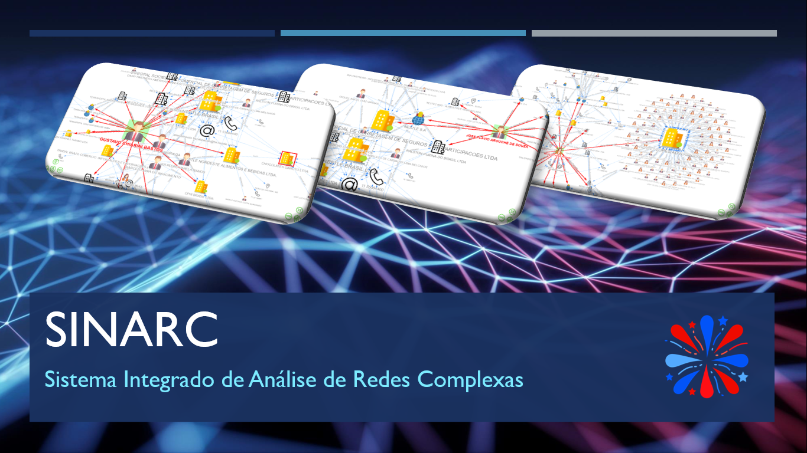

 

  

## Sumário
<!-- * [Sinarc Online](#sinarc-online) -->
* [O que é o SINARC?](#o-que-é-o-sinarc)
* [Como criar o Pen Drive SINARC](#como-criar-o-pen-drive-sinarc)
* [Como instalar o SINARC Client](#como-instalar-o-sinarc-client)
* [O que é uma rede complexa?](#o-que-é-uma-rede-complexa)
* [Qual é o objetivo do SINARC?](#qual-é-o-objetivo-do-sinarc)
* [O SINARC utiliza dados sigilosos?](#o-sinarc-utiliza-dados-sigilosos)
* [Para que serve o SINARC?](#para-que-serve-o-sinarc)
* [A quem se destina o SINARC?](#a-quem-se-destina-o-sinarc)
* [Testando o SINARC](#testando-o-sinarc)
* [Tutorial interativo do SINARC](#tutorial-interativo-do-sinarc)
* [Alfabeto de comandos do SINARC](#alfabeto-de-comandos-do-sinarc)
* [Exemplos de utilização do SINARC](#exemplos-de-utilização-do-sinarc)
* [Possibilidades de uso do SINARC](#possibilidades-de-uso-do-sinarc)
* [Uso responsável do SINARC](#uso-responsável-do-sinarc)
* [Repositório de casos para análise](#repositório-de-casos-para-análise)

<!--* [Histórico de versões](#histórico-de-versões)-->
<!--* [Como criar uma nova instalação do SINARC?](#como-criar-uma-nova-instalação-do-sinarc)-->

  

## O que é o SINARC?

  <a href="#sumário">Sumário</a>

 

O **SINARC – Sistema Integrado de Análise de Redes Complexas** consiste em um **programa experimental** de análise de dados de fontes abertas desenvolvido pelo Ministério Público de Contas do Estado do Espírito Santo ([MPC-ES](https://www.mpc.es.gov.br/)) sob os princípios da [Ciência Aberta](https://www.unesco.org/en/open-science) (metodologia aberta, código aberto, dados abertos, acesso aberto, revisão por pares aberta e recursos educacionais abertos) e [Licença MIT](https://opensource.org/licenses/MIT) (software livre e gratuito), para uso em computadores com Sistema Operacional Windows. 

O sistema foi concebido a partir do inspirador projeto _open source_ [Rede CNPJ](https://github.com/rictom/rede-cnpj), do qual extrai não apenas as premissas metodológicas, mas também a filosofia colaborativa que impulsiona o aprimoramento do controle social sobre a Administração Pública. No entanto, o SINARC utiliza técnicas e ferramentas de programação distintas, o que lhe confere funcionalidades singulares.

Como sistema de inteligência para fontes abertas (_Open Source Intelligence - [OSINT](https://www.cia.gov/stories/story/ic-osint-strategy-rollout/))_ em permanente evolução, alinhado à [Doutrina de Inteligência](https://www.gov.br/abin/pt-br/centrais-de-conteudo/publicacoes/doutrina/Doutrina-da-Atividade-de-Inteligencia-2023) da Agência Brasileira de Inteligência (ABIN) e à [Doutrina de Inteligência](https://www.tcepi.tc.br/wp-content/uploads/2026/04/doutrina-de-inteligencia-de-controleexterno-da-rede-infocontas.pdf) da Rede Nacional de Informações Estratégicas para o Controle Externo (Rede InfoContas), o SINARC se propõe a ampliar as perspectivas de análise das conexões existentes em **informações públicas** sobre **pessoas jurídicas** (PJ e PE), **pessoas físicas** (PF) - sócios e administradores -, **endereços** (EN), **telefones** (TE) e **e-mails** (EM) empresariais constantes na [base de dados pública de CNPJ](https://arquivos.receitafederal.gov.br/index.php/s/YggdBLfdninEJX9) da Receita Federal, formada por **70 milhões de CNPJs**, por meio dos seguintes recursos:

1. **Interface gráfica interativa**, concebida a partir da aplicação dos [Princípios da Gestalt](https://medium.com/aela/os-7-princ%C3%ADpios-de-gestalt-e-como-utiliz%C3%A1-los-em-projetos-de-ui-design-46d6d832abf6) <!--([artigo](https://jamieesterman.com/work/posts/gestalt-principles-and-the-laws-of-ux-a-guide-to-usable-interface-design))--> sobre um **modelo físico-matemático**, facilitando a identificação visual das estruturas sem gerar sobrecarga cognitiva decorrente do excesso de estímulos visuais;

2. Conjunto de **ferramentas computacionais** que utilizam a [Teoria dos Grafos](https://pt.wikipedia.org/wiki/Teoria_dos_grafos) para analisar a rede de conexões entre PF, PJ, EN, TE e EM sob a perspectiva de um [Sistema Complexo](https://pt.wikipedia.org/wiki/Sistemas_complexos) e aplicar algoritmos matemáticos para auxiliar na identificação de **padrões e anomalias** e na produção de conhecimento;
   
3. **Integração com outras bases de dados oficias públicas** e com sistemas de Inteligência Artificial para **produção de conhecimento e insights** sob múltiplas perspectivas.

 

> ### 🔓 _SINARC: Ciência Aberta a Serviço do Controle Social_

  

**Bases de dados integradas ao SINARC:**

| Nº | Fonte           | Base de Dados Pública                                         | Período Abrangido | Data de Extração | Link        |
|----|-----------------|---------------------------------------------------------------|-------------------|------------------|-------------|
|  1 | Receita Federal | CNPJ (usada para gerar o grafo)                               | 13/12/2025        | 01/01/2026       | [Link](https://arquivos.receitafederal.gov.br/index.php/s/YggdBLfdninEJX9)        |
|  2 | Receita Federal | Renúncia de Receita (DIRBI)                                   | 2025              | 18/03/2026       | [Link](https://arquivos.receitafederal.gov.br/index.php/s/7RkNaSMfS7qNXZp?openfile=true)        |
|  3 | CGU             | Cadastro de Empresas Inidôneas e Suspensas (CEIS)             | 27/02/2026        | 27/02/2026       | [Link](https://portaldatransparencia.gov.br/sancoes)        |
|  4 | CGU             | Cadastro Nacional de Empresas Punidas (CNEP)                  | 27/02/2026        | 27/02/2026       | [Link](https://portaldatransparencia.gov.br/sancoes)        |
|  5 | CGU             | Cadastro Nacional de Entidades Privadas Impedidas (CEPIM)     | 26/02/2026        | 26/02/2026       | [Link](https://portaldatransparencia.gov.br/sancoes)        |
|  6 | CGU             | Acordos de Leniência                                          | 27/02/2026        | 27/02/2026       | [Link](https://portaldatransparencia.gov.br/sancoes)        |
|  7 | CGU             | Favorecidos por Emendas PIX da União                          |                   | A INCLUIR        | [Link](https://portaldatransparencia.gov.br/download-de-dados/emendas-parlamentares-documentos)        |
|  8 | PGFN            | Dívida ativa previdenciária (PREV)                            | 12/2025           | 02/03/2026       | [Link](https://www.gov.br/pgfn/pt-br/assuntos/divida-ativa-da-uniao/transparencia-fiscal-1/dados-abertos)        |
|  9 | PGFN            | Dívida ativa com FGTS (FGTS)                                  | 12/2025           | 02/03/2026       | [Link](https://www.gov.br/pgfn/pt-br/assuntos/divida-ativa-da-uniao/transparencia-fiscal-1/dados-abertos)        |
|  10 | PGFN            | Dívida ativa geral (SIDA)                                     | 09/2025           | 02/03/2026       | [Link](https://www.gov.br/pgfn/pt-br/assuntos/divida-ativa-da-uniao/transparencia-fiscal-1/dados-abertos)        |
| 11 | CVM             | Companhias de capital aberto                                  | 2025              | 22/03/2026       | [Link](https://dados.cvm.gov.br/dataset/cia_aberta-cad)        |
| 12 | MTE             | Trabalho análogo ao de escravo                                | 03/02/2026        | 03/02/2026       | [Link](https://dados.gov.br/dados/conjuntos-dados/trabalho-analogo-ao-de-escravo)        |
| 13 | ANAC            | Registro Aeronáutico Brasileiro (RAB)                         | 24/02/2026        | 24/02/2026       | [Link](https://www.gov.br/anac/pt-br/sistemas/rab/dados-abertos-rab)        |
| 14 | IBAMA           | Autos de infração ambiental                                   |                   | A INCLUIR        | [Link](https://dados.gov.br/dados/conjuntos-dados/fiscalizacao-auto-de-infracao)        |
| 15 | TCU             | Licitantes inidôneos                                      |                        | A INCLUIR        | [Link](https://sites.tcu.gov.br/dados-abertos/inidoneos-irregulares)        |
| 16 | TCU             | Responsáveis com contas julgadas irregulares             |                        | A INCLUIR        | [Link](https://sites.tcu.gov.br/dados-abertos/inidoneos-irregulares)        |
| 17 | TCE-ES          | Empresas inidôneas                                            | 11/04/2026        | 11/04/2026       | [Link](https://dados.es.gov.br/dataset/lista-de-responsaveis-consultas-tcees/resource/ca979cb0-7ee5-4d91-af6c-804a353b9ef2)        |
| 18 | TCE-ES          | Proibidos de contratar com a Administração Pública             | 11/04/2026        | 11/04/2026       | [Link](https://dados.es.gov.br/dataset/lista-de-responsaveis-consultas-tcees/resource/2c27a170-e415-4b9d-9679-49a65903979a)        |
| 19 | TCE-ES          | Responsáveis com contas julgadas irregulares                  | 11/04/2026        | 11/04/2026       | [Link](https://dados.es.gov.br/dataset/lista-de-responsaveis-consultas-tcees/resource/d2a18709-9c15-46da-bdbd-fbc3ddbc2202)        |
| 20 | TCE-ES          | Responsáveis inabilitados                                     | 11/04/2026        | 11/04/2026       | [Link](https://dados.es.gov.br/dataset/lista-de-responsaveis-consultas-tcees/resource/4fe9a28d-02b4-438b-851b-ea33904f2344)        |
| 21 | TCE-ES          | Favorecidos por Emendas PIX da União no ES                  | 2020 a 2025       | 13/03/2026       | [Link](https://dados.es.gov.br/dataset/tcees-empenho)        |
| 22 | TCE-ES          | Empenhos emitidos por municípios do ES                        | 2021 a 2025       | 12/03/2026       | [Link](https://dados.es.gov.br/dataset/tcees-empenho)        |
| 23 | SEFAZ-ES        | Empenhos emitidos pelo Estado do Espírito Santo               | 2021 a 2025       | 12/03/2026       | [Link](https://dados.es.gov.br/dataset/portal-da-transparencia-despesas-execucao-orcamentaria-e-financeira)        |
| 24 | SEFAZ-ES        | Renúncia de Receita (COMPETE-ES e INVEST-ES)                  | 03/2026           | 18/03/2026       | [Link](https://transparencia.es.gov.br/Comum/IncentivosFiscais)        |
| 25 | SECONT-ES       | Processos Administrativos de Responsabilização (PAR)          | 06/2025           | 11/03/2026       | [Link](https://dados.es.gov.br/dataset/par)        |
| 26 | SEGER-ES       | Licitantes constantes no sistema SIGA (ItensLotesDisputas)     | 2021 a 2025       | 11/04/2026       | [Link](https://dados.es.gov.br/dataset/portal-da-transparencia-compras-publicas)        |

 

⚠️ **ATENÇÃO:** O SINARC apenas sinaliza com uma bandeira vermelha (🚩) a **presença do CNPJ nas bases de dados oficiais** integradas (arquivos CSV), somando os valores associados ao CNPJ quando disponíveis em coluna específica. Para obter detalhes sobre uma ocorrência, consulte a respectiva **base de dados primária** por meio dos links acima. Recomenda-se armazenar as bases de dados primárias em um HD externo.

O SINARC permite integrar quaisquer bases de dados, inclusive bases criadas pelo próprio usuário, sendo necessário apenas que o arquivo CSV possua uma coluna com o número do CNPJ da PJ.

Padrão de identificação das bases de dados integradas ao SINARC (nome do arquivo CSV):

**FONTE _ BASE-DE-DADOS _ PERÍODO-DE-ABRANGÊNCIA-DOS-DADOS _ PARTE-DO-ARQUIVO** 

Exemplos:
* _TCE-ES_EMPENHOS-MUNICIPIOS_2025_1_
* _TCE-ES_EMPENHOS-MUNICIPIOS_2025_2_
* _CGU_ACORDOS-LENIENCIA_2025-03-12_

 

**Consultas externas públicas (via internet) integradas ao SINARC:**

| Nº | Fonte            | Consulta                                                    |
|----|------------------|-------------------------------------------------------------|
|  1 | [Receita Federal](https://solucoes.receita.fazenda.gov.br/servicos/cnpjreva/cnpjreva_solicitacao.asp)  | Comprovante de Inscrição e Situação Cadastral               |
|  2 | [PNCP](https://pncp.gov.br/app/contratos?pagina=1)             | Contratos, Atas de Registro de Preços e Editais                                    |
|  3 | [CGU](https://portaldatransparencia.gov.br/sancoes/consulta?ordenarPor=nomeSancionado&direcao=asc)              | Sanções e Acordo de Leniência                               |
|  4 | [Minhareceita.org](https://docs.minhareceita.org/) | Dados públicos de CNPJ                                      |
|  5 | [Nominatim](https://nominatim.org/)        | Dados públicos de geocodificação                            |
|  6 | [Google Search ](https://www.bing.com/?scope=web&cc=BR)           | Pesquisa utilizando operadores avançados e Modo IA |
|  7 | [Google Maps ](https://www.bing.com/?scope=web&cc=BR)           | Pesquisa utilizando o Google Street View |

 

<a href="https://controlecidadao.github.io/sinarc/exemplo2.html" target="_blank">
   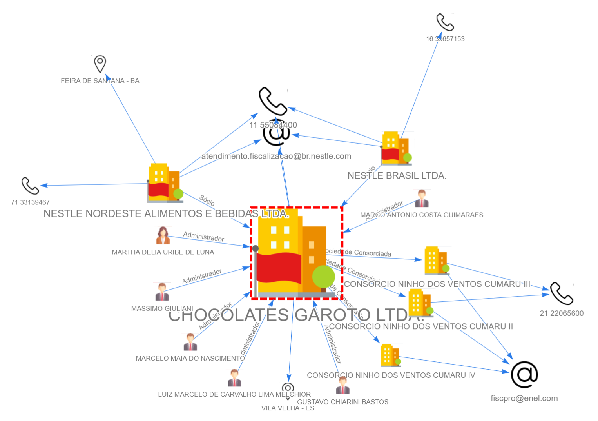
</a>

<a href="https://controlecidadao.github.io/sinarc/exemplo2.html">Grafo interativo</a> de grupo econômico aberto em 1 camada, com 20 nós e 26 arestas.

 

**Conceitos básicos:**

* **Grafos** são diagramas formados por **nós** conectados por **arestas** (setas).
* Nós representam **entidades** (PF, PJ, EN, TE, EM) e arestas representam **vínculos** (Sócio, Administrador etc.).
* O **tamanho** dos nós (de 20 a 100) é proporcional ao número de arestas.
* Nós possuem **massa** (igual a 1) e interagem gravitacionalmente entre si (força de repulsão).
* Arestas atuam como **molas** que impedem os nós de se afastarem.
* A distância entre dois nós é medida pelo número de arestas que os separam (**camadas**).
* Os nós de origem (**nós-alvos**) são destacados por bordas vermelhas.
* **Medidas de centralidade** do grafo são indicadas por nós com bordas tracejadas.
* A expansão do grafo ocorre a partir dos nós de origem e apenas por meio de PF e PJ.
* Apenas PJ possui EN, TE e EM, os quais são incluídos automaticamente no grafo quando compartilhados por mais de uma PJ na base de dados. Se o grafo exibe EN, TE ou EM é porque essa entidade é compartilhada por pelo menos duas PJ.
* Ordem cronológica de montagem do grafo:
  1) Nó-alvo é incluído para dar origem ao grafo
  2) PF e PJ são conectadas ao nó-alvo (expansão para 1 camada)
  3) Outras PF e PJ são conectadas às PF e PJ da camada anterior (expansão para 2 ou mais camadas)
  4) EN, TE e EM compartilhados com outras PJ na base de dados são conectados às PJ presentes no grafo
  5) Medidas de centralidade dos nós são calculadas
* Pessoas estrangeiras (PE) também são exibidas no grafo, porém contendo informações limitadas.
* Arestas coloridas indicam o caminho mais curto entre dois ou mais nós-alvos.
 
 

**Fluxo de produção de conhecimento com o SINARC:**

 

> **➡️ Realidade dinâmica (Sistema Complexo) 
> &nbsp;&nbsp;&nbsp;&nbsp;&nbsp;&nbsp;&nbsp;&nbsp;&nbsp; ➡️ Modelagem físico-matemática (Teoria dos Grafos) 
> &nbsp;&nbsp;&nbsp;&nbsp;&nbsp;&nbsp;&nbsp;&nbsp;&nbsp;&nbsp;&nbsp;&nbsp;&nbsp;&nbsp;&nbsp;&nbsp;&nbsp;&nbsp;&nbsp; ➡️ Representação gráfica interativa (Princípios da Gestalt)**

 

1. Reconhecimento sobre a existência de um **processo dinâmico** de criação e alteração diária de registros na Receita Federal (70 milhões de CNPJs).
2. Disponibilização mensal dos arquivos que integram a **base de dados de CNPJ** pela Receita Federal.
3. Conversão dos arquivos em **bancos de dados** para facilitar a consulta.
4. Utilização dos bancos de dados para criação de um **modelo físico-matemático** dos vínculos existentes entre PF, PJ, EN, TE e EM por meio da Teoria dos Grafos.
5. Utilização do modelo para criação de uma **representação gráfica interativa** da rede de vínculos (grafo com nós e arestas), concebida a partir dos princípios da Gestalt.
6. Aplicação de algoritmos para identificação de **padrões e anomalias** na rede.
7. Integração com **outras bases de dados oficiais** e com ferramentas de **Inteligência Artificial** para geração de insights.
8. Aplicação de **técnicas de OSINT** para cruzamento e validação das informações com fontes externas.

As análises realizadas com o SINARC dependem de **escolhas metodológicas** e de **interpretação humana**, notadamente quando executadas com auxílio de Inteligência Artificial.

   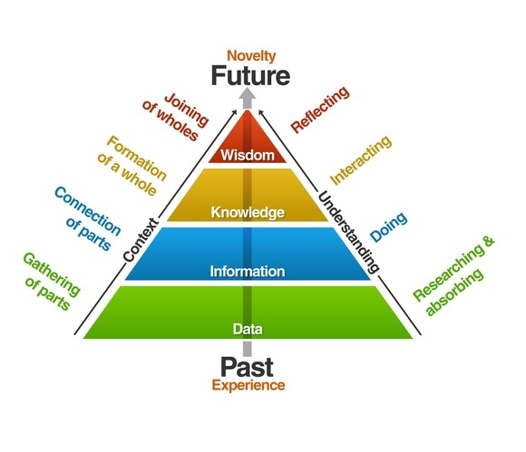

O **Projeto SINARC** integrou o Plano de Metas 2025 da Rede de Informações Estratégicas dos Ministérios Públicos de Contas ([Rede MPContas](https://mp.tcu.gov.br/rede-mpcontas/)):

 

<a href="https://mp.tcu.gov.br/wp-content/uploads/2025/07/PlanoMetas_RedeMPContas.pdf">Plano de Metas 2025 - Rede MPContas</a> 

 

<!--e encontra-se em processo de revisão por parte do [Science Data Bank](https://www.scidb.cn/en) para fins de disponibilização (DOI/CSTR) em seu repositório de bases de dados.-->

 

Os **exemplos ilustrativos** do uso do SINARC, todos extraídos de **informações públicas**, foram selecionados com base na singularidade de seus padrões de conexão, possuindo caráter meramente demonstrativo e servindo tão somente como referência no contexto educacional da produção de conhecimento a partir de fontes abertas.

**QR Codes** permitem a abertura e exploração dos grafos online em aparelhos celulares. Para abrir o teclado do celular e digitar os comandos do SINARC, clique no botão localizado na parte inferior central da tela.

 

<!--https://github.com/user-attachments/assets/f9f215f3-fa2a-4963-a7e3-9fe2c24ea2d3 -->

 

<a href="https://controlecidadao.github.io/sinarc/exemplo1.html" target="_blank">
   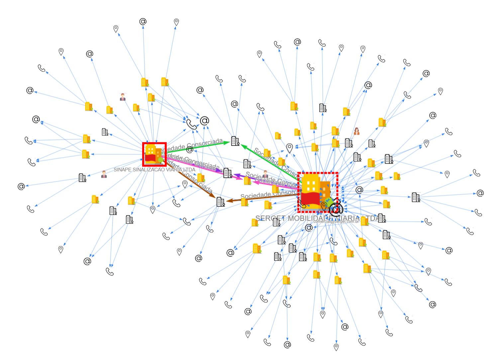
</a>

<a href="https://controlecidadao.github.io/sinarc/exemplo1.html">Grafo interativo</a> exibindo vínculos entre duas empresas.

 

  

Para aprofundar a experiência, sugere-se explorar o [Notebook do SINARC](https://notebooklm.google.com/notebook/0ecb7569-d040-43e2-ad3e-2599f172a1a4/preview) na plataforma **NotebookLM** (necessário estar logado em uma conta do Google). Essa ferramenta, baseada em **Inteligência Artificial**, examina simultaneamente os documentos do SINARC (README do Github, Manual do SINARC e seu código fonte), permitindo a obtenção de respostas detalhadas sobre as funcionalidades do sistema.

  

## Como criar o Pen Drive SINARC

  <a href="#sumário">Sumário</a>

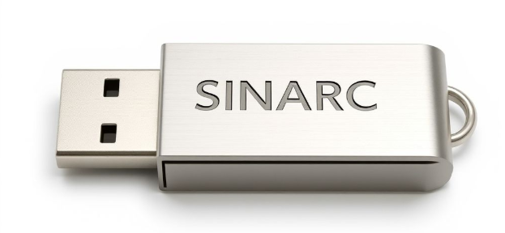

### Baixe o SINARC para um pen drive. Sua utilização não requer instalação (plug and play).

<!--  
### 🚧 Atualizando a Base de Dados 🚧-->
 

Data de extração da base de dados contida no Pen Drive SINARC: &nbsp; [13/12/2025](https://arquivos.receitafederal.gov.br/index.php/s/YggdBLfdninEJX9?dir=/2025-12)

Total de CNPJs: &nbsp; 68.879.494

 

Devido à sua portabilidade, a **pasta SINARC** contendo os programas SINARC e Rede CNPJ para análise de grafos, e [DB Browser](https://sqlitebrowser.org/) para consulta direta aos bancos de dados, pode ser baixada e descompactada para um pen drive ou HD externo, facilitando sua utilização em diferentes computadores.

 

**👉 [Clique aqui e baixe a versão compactada da pasta SINARC](https://drive.usercontent.google.com/download?id=1nbpdUpbAl3hsdf-2Kn-549a5E6uP-C5P)**

 

O arquivo _SINARC.zip_ possui 20 GB ([SHA-256](https://emn178.github.io/online-tools/sha256_checksum.html): _6cb8214ccc540ae8de2dd3b1f9e97bf2d38178555fee0d00bd8c02628ad4212d_).

**São necessários 90 GB de espaço livre: 20 GB para o arquivo compactado (zip) e 70 GB para o arquivo descompactado (pasta SINARC)**. Caso não disponha de espaço suficiente no computador, é possível configurar o navegador para que o download seja realizado diretamente para um pen drive ou HD externo (Procurar no navegador por _Configurações_ -> _Downloads_ -> _Local_).

 

### Abrindo o SINARC

Para usar o Pen Drive SINARC, siga estes passos:

1) Conecte o pen drive ao computador; 

2) Na pasta SINARC, clique duas vezes no arquivo **sinarc.exe** (o Windows solicitará sua confirmação por se tratar de um arquivo executável _.exe_) e aguarde a inicialização dos sistemas. A interface gráfica do SINARC será aberta no navegador:

&nbsp;&nbsp;&nbsp;&nbsp;&nbsp;
   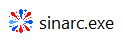

Pronto! Os programas **SINARC**, **Rede CNPJ** (este disponível no endereço local _http://127.0.0.1:5000/rede_) e **DB Browser** já podem ser utilizados.

 

**Procedimento alternativo para abrir o SINARC**

Caso se depare com alguma restrição para executar o arquivo sinarc.exe no computador, utilize o seguinte procedimento:

1) Na pasta SINARC, clique 2 vezes no arquivo **_abre_rede_cnpj.bat_** (o Windows solicitará sua confirmação por se tratar de um arquivo executável _.bat_). Uma instância do Terminal do Rede CNPJ será aberta, indicando a inicialização do programa. Aguarde alguns segundos até que a mensagem _**O SINARC já pode ser inicializado!**_ seja exibida no Terminal;

3) Na sequência, também na pasta SINARC, clique 2 vezes no arquivo **_abre_sinarc.bat_** (o Windows solciitará sua confirmação). Uma instância do Terminal do SINARC será aberta, indicando a inicialização do programa. Aguarde alguns segundos até que a interface gráfica do SINARC seja exibida em numa nova aba do navegador.

**ATENÇÃO:** Para ativar/desativar o **modo de captura do SINARC**, pressione a **tecla \|** (barra vertical) enquanto visualiza um grafo. Uma mensagem será exibida no canto superior esquerdo da tela, indicando a mudança de estado. Quando o modo de captura está ativado, a função de cópia do Windows (CTRL + c) fica vinculada ao SINARC, impedindo seu uso por outros programas.

Conquanto o SINARC utilize apenas a modelagem de criação e de consulta aos bancos de dados desenvolvida pelo projeto _open source_ Rede CNPJ, optou-se por disponibilizar também a íntegra  deste formidável programa (em sua versão de fork) como etapa prévia à abertura do SINARC, permitindo ao cidadão explorar simultaneamente os recursos das duas ferramentas e, quem sabe, desenvolver seu próprio sistema de análise de grafos, com funcionalidades ainda mais interessantes, disponibilizando-o igualmente como **software livre para inspirar outras pessoas a se engajarem em iniciativas que promovam a transparência e a cidadania a partir de dados abertos**.

Os testes de portabilidade foram realizados usando um pen drive de 128 GB, USB 3.2. Recomenda-se deixar pelo menos 20% do espaço total do pen drive livre para não prejudicar o desempenho do sistema.

 

### Atualizando a base de dados de CNPJ

Para atualizar a base de dados de CNPJ usada pelo SINARC e pelo Rede CNPJ, o procedimento é bem simples.

Os **4 bancos de dados** a serem substituídos estão localizados na pasta **"SINARC\bases"**. São eles:

1) _**cnpj.db**_
2) _**rede_search.db**_
3) _**cnpj_links_ete.db**_
4) _**rede.db**_

Esses bancos são gerados a partir de **37 arquivos CSV compactados** (formato ZIP), disponibilizados mensalmente no [site da Receita Federal](https://arquivos.receitafederal.gov.br/index.php/s/YggdBLfdninEJX9), com início em **05/2023**.

Com a pasta SINARC baixada e salva no computador (a geração dos bancos de dados deve ser realizada com a pasta no computador e não em mídia externa):

1) Mova os quatro bancos de dados SQLite (**_cnpj.db_**, **_rede_search.db_**, **_cnpj_links_ete.db_** e **_rede.db_**) da pasta **"SINARC\bases"** para outro local. Recomenda-se armazená-los temporariamente para eventual restituição, caso não consiga concluir com sucesso a geração dos novos arquivos  
2) No [site](https://arquivos.receitafederal.gov.br/index.php/s/YggdBLfdninEJX9) da Receita Federal, escolha o mês desejado e clique na respectiva pasta. Na página seguinte, selecione todos os arquivos e clique no botão Baixar. Após o download, descompacte os 37 arquivos ZIP para a pasta **"SINARC\rede-cnpj-master\rede_cria_tabelas\dados-publicos-zip"**;  
3) Na pasta **"SINARC\rede-cnpj-master\rede_cria_tabelas"**, execute o arquivo _**cria_bancos_de_dados.bat**_ a partir do Terminal do Windows para permitir a visualização de eventuais erros. Esse arquivo .bat executará sequencialmente todas as rotinas contidas nos arquivos Python e gerará os 4 bancos de dados na pasta **"SINARC\rede-cnpj-master\rede_cria_tabelas\dados-publicos"**. 
O processo de criação dos bancos de dados leva aproximadamente **6 horas**. Em caso de erro, tente repetir o procedimento. 
Ao final do processo, será exibida no Terminal a mensagem _**Todos os scripts foram executados com sucesso!**_.  
4) Após a criação dos 4 bancos de dados, mova-os da pasta **"SINARC\rede-cnpj-master\rede_cria_tabelas\dados-publicos"** para a pasta **"SINARC\bases"**, substituindo os quatro arquivos lá existentes (movidos/deletados no início do processo). Os demais arquivos devem permanecer na pasta **"SINARC\bases"**.

Pronto! O SINARC e o Rede CNPJ podem ser executados com a nova base de dados de CNPJ.

  

### Bases de dados prontas para uso

Encontram-se disponíveis para download as seguintes bases de dados de CNPJ, com intervalo de extração de 6 meses, prontas para serem inseridas no SINARC:

 

| Nº | Arquivo ZIP               | Tamanho    | Data de Extração |
|----|---------------------------|------------|------------------|
|  1 | [bases_20250614.zip](https://drive.usercontent.google.com/download?id=1pRd5VMj_hJIv57lPhu_aDn5BeYDaIprE)        | 19 GB      | 14/06/2025       |
|  2 | [bases_20241214.zip](https://drive.usercontent.google.com/download?id=1TBdbrsF6VkmxN10fV1xcOk1VtverasND)        | 18 GB      | 14/12/2024       |
|  3 | [bases_20230610.zip](https://drive.usercontent.google.com/download?id=1UQOr05lzDYCZqarayy1ar8uRPIDXchrT)        | 17 GB      | 10/06/2023       |

 

O procedimento de substituição das bases de dados de CNPJ consiste em:

1) Remover os 4 arquivos de bancos de dados da pasta _**SINARC\bases**_ (os demais arquivos devem permanecer na pasta):
* _**cnpj.db**_
* _**rede_search.db**_
* _**cnpj_links_ete.db**_
* _**rede.db**_

Recomenda-se salvá-los em um HD externo para uso posterior.
  
2) Clicar no link da base de dados com a data de extração desejada para baixar o arquivo ZIP para o computador ou mídia externa;

3) Descompactar o arquivo ZIP diretamente para a pasta _**SINARC\bases**_.

Após esse procedimento, o SINARC utilizará a nova base de dados de CNPJ com a data de extração escolhida.

**ATENÇÃO:** As demais bases de dados integradas ao SINARC (CGU, PGFN etc.), as quais geram a sinalização por meio de uma bandeira vermelha, não serão afetadas. O banco de dados dessas bases (_**banco.db**_) encontra-se na pasta _**SINARC/bases_externas**_.

Para utilização de uma base de dados de CNPJ com data de extração em um mês específico que não conste nessa tabela, siga o procedimento descrito no tópico anterior.

<!--🚧 (Em construção)-->

  

## Como instalar o SINARC Client

  <a href="#sumário">Sumário</a>

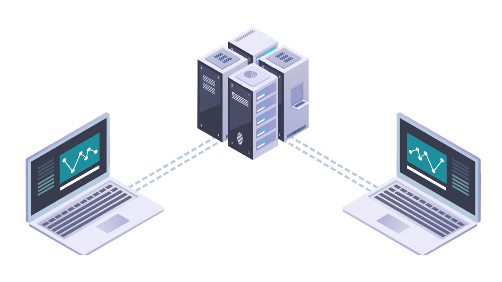

É possível **acessar remotamente o SINARC** instalado em um computador (C1) a partir de outro computador (C2) conectado à mesma rede interna. Para tanto, basta baixar para C2 o arquivo [**SINARC-Client.zip**](https://drive.usercontent.google.com/download?id=1766AOVBa3c0RxuTJuzcbevoHPDyKiwP3) (SHA-256 _156f2778897ca443b4a0a62f7cfa50ba56a6cc72ae06d36e7c61084198fc180e_), uma versão reduzida do SINARC (460 MB), sem os bancos de dados, mas que permite utilizar todas as funcionalidades da ferramenta.

<!--

<a href="https://mayank-blogs.hashnode.dev/web-sockets-part-1">mayank-blogs.hashnode.dev</a>

-->

Após baixar e descompactar a **pasta SINARC-Client** para o segundo computador (C2), abra o arquivo _**endereco_ip.txt**_ e inclua em uma nova linha, após o final do texto, o **"Endereço IPv4"** do computador onde se encontra a versão completa do SINARC (C1). As instruções de como obter este endereço encontram-se no próprio arquivo TXT.

Certifique-se de utilizar um **endereço IPv4 estático** (fixo).

Por fim, salve (CTRL + s) e feche o arquivo _endereco_ip.txt_.

Para abrir o SINARC no segundo computador (C2), clique duas vezes sobre o arquivo _**abre_sinarc.bat**_ na **pasta SINARC-Client**. Assim como a versão completa do SINARC, esta pasta também pode ser salva em um pen drive para permitir seu uso em outros computadores conectados à mesma rede.

Para utilizar o SINARC Client é necessário que o programa Rede CNPJ esteja em execução no computador que está funcionando como servidor (C1). Para executar o programa Rede CNPJ no computador que contém os bancos de dados (C1), clique duas vezes sobre o arquivo  _**abre_rede_cnpj.bat**_ na pasta SINARC. **ATENÇÃO: Não é necessário abrir o SINARC (_abre_sinarc.bat_) em C1!**

Quando a mensagem _**O SINARC já pode ser inicializado!**_ for exibida no Terminal, o sistema está pronto para ser acessado a partir de C2.

A versão atual do SINARC Client não permite consultas simultâneas (C2 e C3 consultando C1 ao mesmo tempo).

  

## O que é uma rede complexa?

  <a href="#sumário">Sumário</a>

 

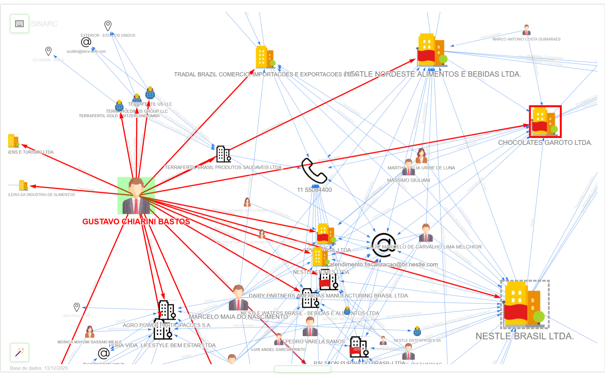

Exemplo de rede complexa de CNPJ sendo analisada pelo SINARC

 

**Rede Complexa** é um sistema dinâmico formado pelo conjunto de elementos (nós) e das relações existentes entre eles (arestas), cuja complexidade de suas conexões requer para sua compreensão a utilização de ferramentas para modelagem matemática, análise computacional e representação gráfica. O objeto de estudo dos grafos são as conexões entre seus elementos, enquanto a complexidade de uma rede está diretamente relacionada ao grau de aleatoriedade e ao número de suas conexões. 

Nesse contexto, o SINARC analisa as conexões existentes em determinado momento entre pessoas físicas (PF), pessoas jurídicas (PJ), endereços (EN), telefones (TE) e e-mails (EM) cadastrados na base de dados pública de CNPJ da Receita Federal. Em termos mais técnicos, pode-se afirmar que **o SINARC consiste em uma implementação computacional** (software) **de um modelo físico-matemático** (Gravitação e Teoria dos Grafos) **que realiza a análise estática** (base de dados pública de CNPJ) **de um sistema complexo e dinâmico** (registros, baixas e atualizações diárias de pessoas jurídicas).

O SINARC captura um instante no tempo (data da disponibilização da base de dados pela Receita Federal), uma fotografia do processo contínuo de evolução de um sistema complexo, dinâmico e real, representado pelos registros, baixas e atualizações diárias de milhões de CNPJs. A expansão controlada do grafo a partir da adição de camadas sucessivas a um ou mais nós iniciais também reproduz o comportamento dinâmico de um sistema complexo.

Características de um sistema complexo representado pela base de dados de CNPJ da Receita Federal:

* **Diversidade:** Os nós do sistema representam diferentes tipos de entidades (PJ, PF, EN, TE e EM) e de relacionamentos existentes entre eles (sócio, filial etc.);

* **Conectividade:** O sistema complexo possui uma grande quantidade de nós interconectados por arestas, formando uma rede densa e interligada;

* **Escalabilidade:** O sistema aumenta em escala, adicionando novos componentes e aumentando as interconexões entre eles, resultando em uma estrutura de conectividade complexa;

* **Não linearidade:** O crescimento do sistema exibe comportamento não linear e imprevisível;

* **Atualização contínua:** O sistema está em constante atualização, o que implica que novos nós e arestas são adicionados e os existentes podem ser modificados ou removidos ao longo do tempo;

* **Centralidade:** Alguns nós podem desempenhar um papel central na rede, atuando como pontos de ligação entre várias entidades no sistema;

* **Comunidades:** O sistema pode ter agrupamentos de nós que estão mais densamente conectados entre si do que com o restante da rede, formando comunidades ou clusters;

* **Dinâmica temporal:** As conexões entre os nós podem variar ao longo do tempo, refletindo mudanças nas relações entre as entidades representadas;

* **Propriedades emergentes:** O sistema complexo exibe propriedades emergentes onde o comportamento global da rede não pode ser previsto apenas olhando para o comportamento individual dos nós (o todo é diferente da soma das partes). Essas propriedades podem surgir de interações complexas e não lineares entre os elementos da rede.

  

## Qual é o objetivo do SINARC?

  <a href="#sumário">Sumário</a>

 

Assim como o projeto Rede CNPJ, o objetivo do SINARC é demonstrar a possibilidade de criação de ferramentas tecnológicas para exploração de dados abertos e incentivar o desenvolvimento de projetos semelhantes pela sociedade, considerando que **"_o verdadeiro progresso é o que põe a tecnologia ao alcance de todos!_"** (Henry Ford), sem exceção.

  

## O SINARC utiliza dados sigilosos?

  <a href="#sumário">Sumário</a>

 

Por se tratar de ferramenta de OSINT desenvolvida para assegurar ao cidadão o direito fundamental de acesso a informação, **todas as informações reveladas pelo SINARC são públicas e de interesse público**, motivo pelo qual são divulgadas pela pela Receita Federal e por outros órgãos oficiais independentemente de solicitação, observando a publicidade como preceito geral e o sigilo como exceção, conforme diretrizes contidas no [art. 3º da Lei nº 12.527/2011](https://www.planalto.gov.br/ccivil_03/_ato2011-2014/2011/lei/l12527.htm#art3), Lei de Acesso a Informação, de modo a viabilizar o controle social da Administração Pública e a coibir condutas ilícitas no exercício da atividade empresarial.

Ao ampliar o acesso e promover a integração de dados públicos, o SINARC confere ao cidadão o poder legítimo para exercer com responsabilidade o controle social da Administração Pública.

 

**Compatibilidade com a LAI e com a LGPD**

O SINARC foi concebido em estrita observância às normas brasileiras de transparência pública e de proteção de dados pessoais, notadamente a Lei nº 12.527/2011 (Lei de Acesso a Informação – LAI) e a [Lei nº 13.709/2018](https://www.planalto.gov.br/ccivil_03/_ato2015-2018/2018/lei/L13709compilado.htm) (Lei Geral de Proteção de Dados Pessoais – LGPD).

Todos os dados utilizados pelo SINARC são extraídos exclusivamente de bases oficiais públicas, disponibilizadas por órgãos governamentais no contexto de políticas de transparência ativa e dados abertos, como Receita Federal (RFB), Controladoria-Geral da União (CGU) e Tribunal de Contas do Estado do Espírito Santo (TCE-ES). Tais bases já são previamente estruturadas e divulgadas em conformidade com os parâmetros legais de publicidade, observando as restrições aplicáveis à proteção de dados pessoais. A ferramenta atua, portanto, apenas como um meio de agregação e análise de dados públicos, e não como fonte primária de informações. Sua utilização amplia a capacidade de análise de dados públicos, promovendo maior transparência e facilitando a fiscalização cidadã.

A base de dados pública de CNPJ da Receita Federal é composta por mais de **70 milhões de CNPJs**.

[Nota Técnica RFB/Cocad 47/2024](https://www.gov.br/receitafederal/dados/nota-cocad-rfb-86-2024.pdf/), emitida pela Receita Federal, especifica quais informações da base de dados de CNPJ não estão protegidas por sigilo fiscal, em consonância com o [Decreto 8.777/2016](https://www.planalto.gov.br/ccivil_03/_ato2015-2018/2016/decreto/d8777.htm#), que instituiu a Política de Dados Abertos do Poder Executivo federal.

Por sua vez, a [Instrução Normativa RFB 2.119/2022](https://normasinternet2.receita.fazenda.gov.br/#/consulta/externa/127567) dispõe sobre o Cadastro Nacional da Pessoa Jurídica (CNPJ). Conheça também o [Dicionário de Dados](https://www.gov.br/receitafederal/dados/cnpj-metadados.pdf) de CNPJ da Receita Federal.

Para acessar a fonte primária dos dados usados pelo SINARC e conferir a fundamentação legal que assegura sua divulgação, consulte os links das respectivas bases. 

  

## Para que serve o SINARC?

  <a href="#sumário">Sumário</a>

 

O SINARC é utilizado como **ferramenta inicial nas análises de inteligência com fontes abertas (OSINT)** realizadas pelo controle externo da Administração Pública, permitindo que se obtenha rapidamente uma visão abrangente da estrutura de grupos econômicos. A partir da identificação de vínculos societários, o sistema proporciona **insights preliminares** valiosos sobre as conexões existentes entre pessoas físicas, pessoas jurídicas, endereços, telefones e e-mails constantes na base de dados pública de CNPJ da Receita Federal, viabilizando o cruzamento com outras bases de dados oficiais públicas. Essa **etapa exploratória prévia** mostra-se fundamental para guiar análises mais aprofundadas e para identificar padrões que, de outra forma, não seriam percebidos.

O vídeo a seguir, disponibilizado no site MPC-ES, demonstra a aplicação do SINARC (versão inicial) no controle externo da Administração Pública. A partir de [notícia](https://www.radiocacula.com.br/detran-ms-e-investigado-por-suspeita-de-fraude-em-licitacao-de-r-39-milhoes/) publicada na internet sobre supostas irregularidades em licitação promovida pelo Estado do Mato Grosso do Sul (MS) para contratação de serviço de sinalização semafórica, o sistema analisa a existência de vínculos entre as empresas citadas na notícia, cruzando os resultados com os participantes de outra [licitação](https://transparencia.vilavelha.es.gov.br/MostraArquivo.ashx?AnexoLicitacaoId=10676) de mesmo objeto, realizada pelo Município de Vila Velha (ES), para verificar a existência de conexões entre grupos econômicos que atuam em regiões distintas do país:

 

<a href="https://www.youtube.com/watch?v=R73ixbeP0II" target="_blank">
   Vídeo Demonstrativo do SINARC
</a>

 

Em outro vídeo, um caso de repercussão nacional é analisado com a ferramenta (versão inicial):

 

<a href="https://www.youtube.com/watch?v=R4IMKdKB2pg" target="_blank">
   Vídeo Demonstrativo do SINARC
</a>

 

Confira um exemplo de uso do SINARC em [Parecer do MPC-ES](https://www.mpc.es.gov.br/wp-content/uploads/2024/10/Processo-784-2020-Parecer-MPC-ES-em-Denuncia-transacao-tributaria-Anchieta-e-Samarco.pdf#page=110), emitido no Processo TC 784/2020 (pág. 110). Para saber mais sobre essa ação do MPC-ES em defesa do meio ambiente, vide a respectiva [notícia](https://www.mpc.es.gov.br/2024/11/lagoa-de-mae-ba-mpc-es-aponta-danos-ambientais-irreversiveis-e-pede-inclusao-da-samarco-vale-e-bhp-em-denuncia/).

Para permitir o compartilhamento e a portabilidade dos resultados das análises, os grafos interativos gerados pelo SINARC são salvos no **_SINARC\sinarc-main\arquivo_sinarc.zip_**, preservando todas as funcionalidades de exploração que não dependem de consulta em tempo real aos bancos de dados.

 

### Exemplos de grafos interativos gerados com o SINARC

  

<a href="https://controlecidadao.github.io/sinarc/exemplo3.html" target="_blank">
   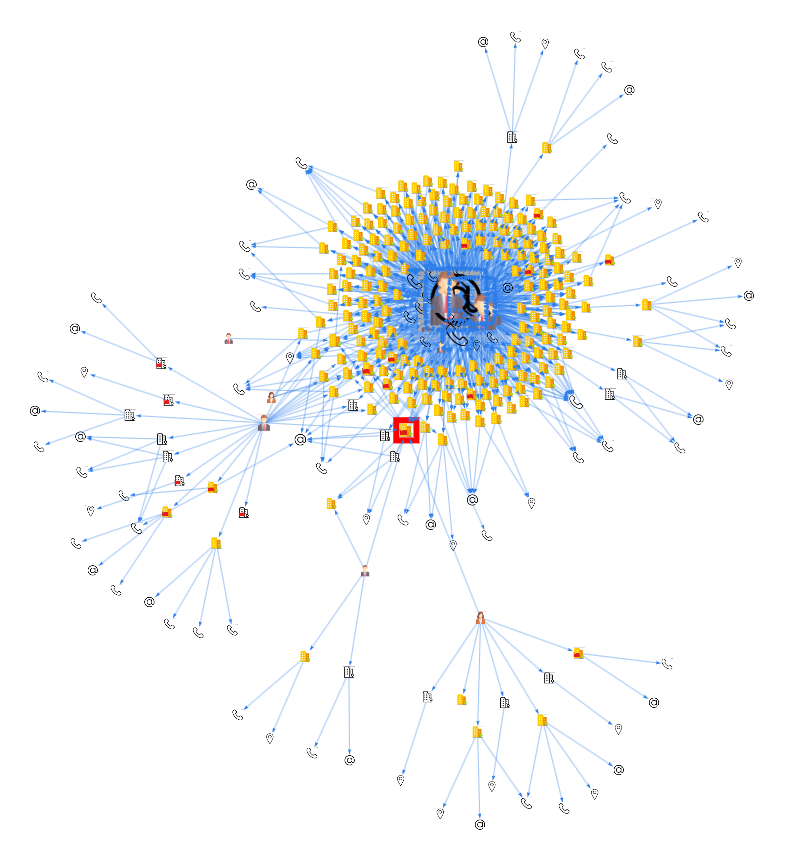
</a>

<a href="https://controlecidadao.github.io/sinarc/exemplo3.html">Grafo interativo</a> com 2 camadas e 321 nós. Abra o link em uma nova guia do navegador e <b>clique no botão 🪄</b> para ajustar a posição dos nós automaticamente. 

  

<a href="https://controlecidadao.github.io/sinarc/exemplo4.html" target="_blank">
   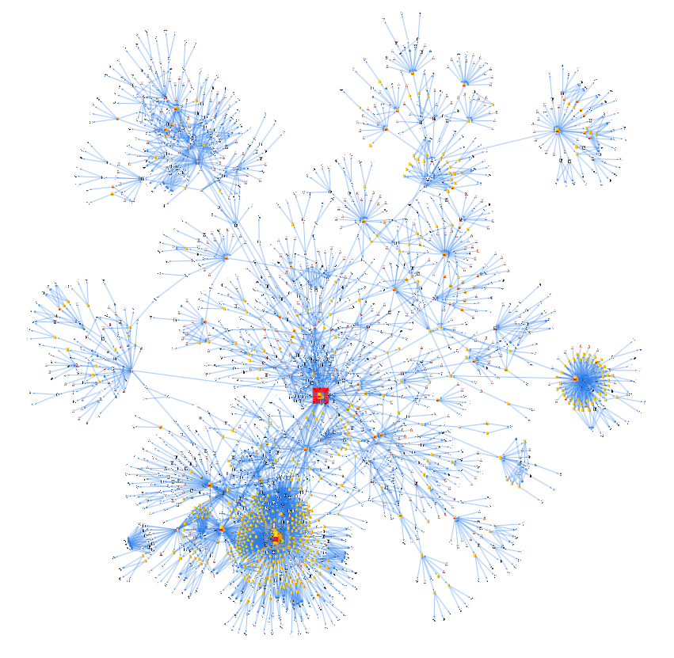
</a>

<a href="https://controlecidadao.github.io/sinarc/exemplo4.html">Grafo interativo</a> com 3 camadas e 2138 nós. Abra o link em uma nova guia do navegador e <b>clique no botão 🪄</b> para ajustar a posição dos nós automaticamente.

 
 

<a href="https://controlecidadao.github.io/sinarc/exemplo5.html" target="_blank">
   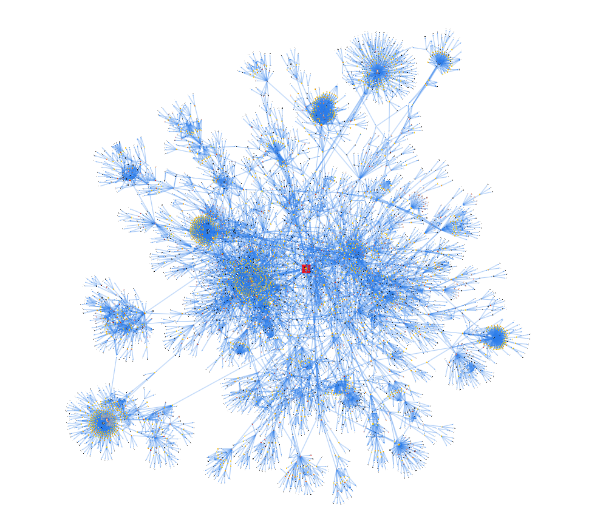
</a>

<a href="https://controlecidadao.github.io/sinarc/exemplo5.html">Grafo interativo</a> com 4 camadas e 7109 nós. Abra o link em uma nova guia do navegador e <b>clique no botão 🪄</b> para ajustar a posição dos nós automaticamente.

 
 

<a href="https://www.youtube.com/watch?v=aP3bkhZEUgY" target="_blank">
   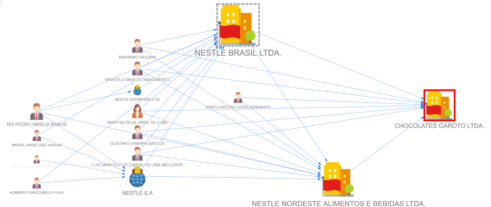
</a>

<a href="https://www.youtube.com/watch?v=aP3bkhZEUgY" target="_blank">Vídeo</a>: Identificando cadeia hierárquica de comando com o SINARC

  

## A quem se destina o SINARC?

  <a href="#sumário">Sumário</a>

 

   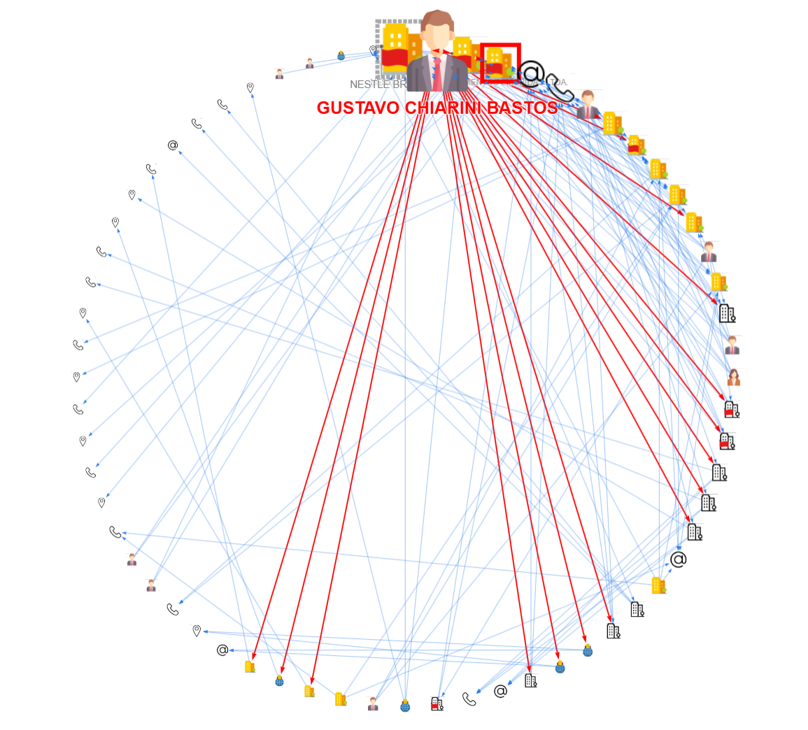
</a>

Grafo em layout circular.

 

O SINARC se destina a todos que exercem o controle social e institucional da Administração Pública, como auditores, jornalistas, comissões e agentes de contratação, procuradorias jurídicas, sistemas de controle interno, ministérios públicos, entre outros órgãos e instituições, além do cidadão interessado em obter informações sobre a estrutura empresarial de grupos econômicos - em especial sobre as pessoas físicas e jurídicas que integram a cadeia hierárquica de comando -, a situação jurídica de empresas e as relações existentes entre pessoas físicas e jurídicas cadastradas na base de dados pública de CNPJ da Receita Federal.

**ATENÇÃO:** As informações geradas pelo SINARC baseiam-se em dados públicos que podem estar desatualizados, incompletos ou sujeitos a inconsistências. Diferenças podem ocorrer em função do intervalo entre a data de atualização das bases integradas e a data da consulta. As relações identificadas pela ferramenta possuem caráter exploratório, podendo incluir falsos positivos ou interpretações equivocadas quando analisadas fora de contexto. Não constituem evidência conclusiva de irregularidades e dependem de análise humana qualificada para sua adequada contextualização. Recomenda-se validar os resultados por meio de consulta direta às fontes primárias e análise crítica criteriosa antes de qualquer tomada de decisão.

  

## Testando o SINARC

  <a href="#sumário">Sumário</a>

 

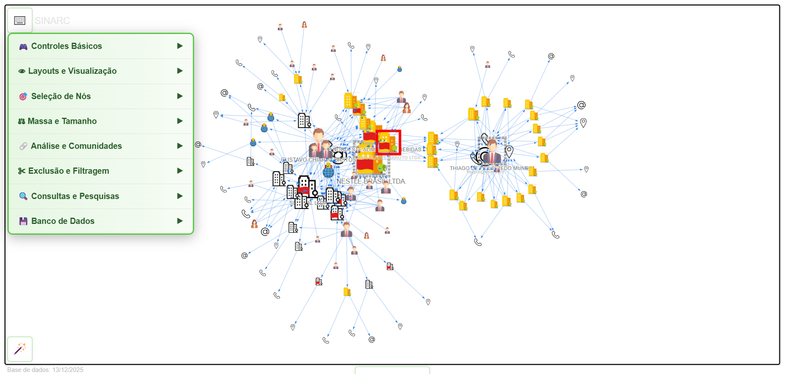

Tela do SINARC exibindo o menu suspenso.

 

A tela do SINARC possui 3 botões:
* Botão do menu suspenso (⌨️), localizado no canto superior esquerdo, por meio do qual é possível acessar todos os comandos da ferramenta;
* Botão de otimização (🪄), localizado no canto inferior esquerdo e usado para ajustar a posição dos nós no grafo automaticamente;
* Botão para abrir o teclado no celular, localizado de forma discreta na parte inferior central da tela.

 

Para testar algumas das funcionalidades dos grafos interativos gerados pelo SINARC, realize os seguintes passos:

1) Abra este [link](https://controlecidadao.github.io/sinarc/exemplo1.html) em uma nova aba do navegador e aguarde o grafo ser exibido;

2) Na janela do grafo, pressione a **tecla ç** uma vez para selecionar os nós de EN, TE e EM que possuem apenas uma conexão;

3) Pressione a tecla **DELETE** ou **BACKSPACE** para apagar os nós selecionados (EN, TE e EM que interligam duas ou mais PJ são mantidos no grafo);

4) Pressione a **tecla U** (maiúscula, shift + u) para abrir uma janela popup com a distribuição de nós por faixa de tamanho (17 faixas). Observe que o tamnho dos nós varia de 20 a 100 e que cada faixa intermediária possui intervalo de 5 unidades. Feche a janela popup;
   
5) Pressione a **tecla Espaço** 16 vezes, espaçadamente, até que o parâmetro "tamanho", exibido no canto superior direito da tela, reduza de 100 para 25 em intervalos de 5 unidades. Esta função aumenta a massa dos nós situados em cada faixa, de forma proporcional ao tamanho de cada nó (do maior para o menor), melhorando progressivamente a visualização do grafo no layout gravitacional. Ao aumentar a massa dos nós, a força antigravitacional de repulsão mútua existente entre eles também aumenta, reposicionando-os na tela para facilitar a identificação visual de suas conexões. As arestas atuam como molas que prendem os nós localizados em suas extremidades;
   
6) Pressione a **tecla Escape** para encaixar o grafo na tela;

7) Use o **botão de rolagem do mouse** para aproximar e afastar o grafo. Posicione o ponteiro do mouse sobre o ponto que deseja aproximar ou afastar e gire o botão de rolagem para frente e para trás;

8) Posicione o ponteiro do mouse por 2 segundos sobre os nós para abrir um popup com informações. O link abre uma consulta na internet sobre o nó, usando inteligência artificial com um prompt criado para o SINARC. Os botões para abrir o nó em camadas estão desabilitados neste grafo;

9) Clique duas vezes sobre qualquer PJ para abrir informações detalhadas constantes na base de dados de CNPJ da Receita Federal;

10) Pressione a **tecla F5** para recarregar o grafo;

11) Clique no **botão do menu suspenso** (⌨️), localizdo no canto superior esquerdo, depois em **Controles Básicos** e por fim na opção **Seleciona todos os nós**;

12) Clique na opção **Abre relatório nós selecionados**. Será aberto uma página HTML com informações extraídas do grafo e links para novas funcionalidades (alguns links funcionam apenas com o programa SINARC aberto);

13) De volta ao menu suspenso, clique novamente na opção **Seleciona todos os nós** e depois em **Abre no mapa endereços PJ**. Uma página HTML será aberta com a posição no mapa de cada endereço (o processo de geocodificação pode demorar um pouco);

14) Pressione **F5** mais uma vez para recarregar o grafo;

15) Clique no **botão de otimização** (🪄), localizado no canto inferior esquerdo. Os EN, TE e EM serão deletados e a posição dos nós será ajustada automaticamente;

16) Pressione a **tecla z** para ativar o modo automático de visualização. Este recurso simula os movimentos de uma câmera percorrendo os nós do grafo em ordem decrescente de tamanho, seguido pela aproximação de cada um de seus nós adjacentes. Pressione a **tecla z** novamente a qualquer momento para sair da função;

Para conhecer a relação completa de comandos e funcionalidades, consulte o [Manual do SINARC](https://controlecidadao.github.io/sinarc/help.html) clicando na **tecla h** ou percorrendo os tópicos seguintes.

  

<a href="https://www.youtube.com/watch?v=spIwxVx6AnI" target="_blank">
   <!--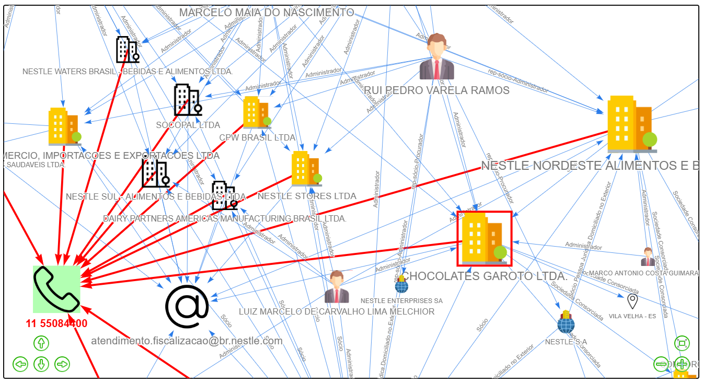-->
   
</a>

<a href="https://www.youtube.com/watch?v=spIwxVx6AnI" target="_blank">Vídeo 1</a>: Modo Automático de Visualização do SINARC

  

<a href="https://www.youtube.com/watch?v=7kFEYaev6Lg" target="_blank">
   <!---->
   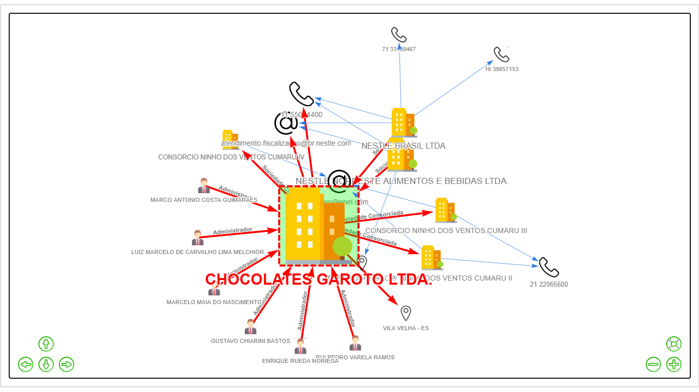
</a>

<a href="https://www.youtube.com/watch?v=7kFEYaev6Lg" target="_blank">Vídeo 2</a>: Modo Automático de Visualização do SINARC

  
## Tutorial interativo do SINARC

  <a href="#sumário">Sumário</a>

  

👉 Clique para expandir o tutorial

 

O objetivo deste tutorial é demonstrar, de forma prática, passo a passo, o uso dos comandos do SINARC que não dependem de consulta em tempo real ao banco de dados, utilizando grafos disponíveis online. O SINARC possui aproximadamente **80 comandos básicos** acionados pelo mouse e pelo teclado, cuja combinação permite a visualização dos grafos sob **múltiplas perspectivas**, ampliando as possibilidades de análise e enriquecendo a interpretação dos dados.

Certifique-se de que o teclado esteja no padrão de letras minúsculas (tecla CapsLock desativada). Para executar comandos com letras maiúsculas, pressione Shift + tecla desejada. 

Os **nós** do grafo possuem as seguintes propriedades:

* **Massa:** propriedade que define a posição dos nós na tela, no layout gravitacional. Inicia com valor 1 (mínimo), sendo ajustável pelo usuário ou automaticamente para controlar a intensidade da força de repulsão (afastamento).
* **Tamanho:** propriedade dos nós definida automaticamente pelo sistema entre 20 (mínimo) e 100 (máximo), com base no número de conexões do nó (arestas).
* **Grupo:** propriedade definida automaticamente pelo sistema para indicar o número da comunidade a que pertence o nó no grafo. Os nós pertencentes a uma mesma comunidade são mais densamente conectados entre si do que com nós de outras comunidades.

O SINARC exibe no grafo apenas telefones, endereços e e-mails que sejam comuns a duas ou mais pessoas jurídicas na base de dados.

**Dica de Visualização:** Para evidenciar **padrões** e **anomalias** nas conexões do grafo, aumenta-se a massa dos nós de maior tamanho, isto é, dos nós que possuem o maior número de conexões (maior centralidade de grau). Este procedimento fará surgir agrupamentos de nós que exibem o mesmo padrão de conexões, bem como nós isolados que divergem dos padrões de agrupamento, gerando estruturas simétricas que facilitam a identificação visual.

Por sua vez, as propriedades das **arestas** são as seguintes:

* **Elasticidade:** propriedade que faz com que as arestas se comportem como **molas de retenção**, limitando o afastamento dos nós ligados a suas extremidades e gerando movimentos no grafo.
* **Comprimento:** propriedade que define o tamanho das arestas. Pode ser ajustado manualmente, aumentando de forma proporcional ao aumento da massa dos nós localizados em suas extremidades (aumento da força de repulsão).

A descrição dos comandos acionados com o mouse e com o teclado, bem como a massa, o tamanho e o grupo de cada nó, são exibidos no canto superior direito da tela.

Os comandos listados a seguir estão agrupados em **blocos temáticos** de acordo com suas funcionalidades. Execute-os na sequência indicada.

  

### 1️⃣ Primeira sequência de comandos
 
Abra este [link](https://controlecidadao.github.io/sinarc/exemplo2.html)) em uma nova aba do navegador e aguarde o grafo ser exibido. Caso disponha de um segundo monitor, mova para ele essa nova aba.

**Atenção:** Observe a diferença entre as letras maiúsculas e minúsculas.

 

### Ajuste de Tela

* **Tecla F5** --> Recarrega a página, exibindo o grafo em uma posição aleatória, diferente da posição anterior (pressione algumas vezes para visualizar seu funcionamento). Equivalente ao botão recarregar página do navegador. Quando a página é recarregada, todos os parâmetros do grafo voltam ao seu estado inicial.
* **Tecla F11** --> Ativa/desativa a exibição do grafo em tela cheia.
* **Tecla b** --> Ajusta a altura da janela de visualização do grafo à altura da janela do navegador, eliminando a barra de rolagem vertical. Atualmente o SINARC realiza esse ajuste automaticamente.
* **Tecla Escape** --> Enquadra o grafo no centro da tela. Equivalente a **dois cliques** com botão esquerdo do mouse no fundo da tela ou **dois toques** no fundo da tela no celular.

 

### Ajuste de Layout
  
* **Tecla k** --> Alterna de forma cíclica entre os layouts gravitacional (padrão), hieráquico a partir das folhas e hierárquico a partir das raízes (pressione 3 vezes).  Vide detalhes no canto superior direito da tela.
* **Tecla K** --> Ativa/desativa o layout circular (pressione 2 vezes).

 

### Exibição de informações no grafo sobre nós

* **Mouse** --> Passe o ponteiro do mouse sobre os nós para destacar em vermelho suas arestas adjacentes.
* **Mouse** --> Permaneça com o ponteiro do mouse sobre um nó ou aresta por 2s para exibir suas informações em um popup.
Este popup permite:
1) abrir o nó em mais camadas (botões azuis);
2) realizar consulta na internet sobre o nó usando inteligência artificial (link azul);
3) Identificar a presença do nó, quando PJ, nas bases de dados integradas ao SINARC (bandeira vermelha);
4) Visualizar a relação de nós adjacentes e o tipo de vínculo.

 

### Seleção de nós com o mouse

* **Mouse** --> Clique com o mouse sobre um nó para selecioná-lo e exibir suas propriedades no canto superior direito da tela.
* **Mouse** --> Clique com o mouse sobre o fundo branco para desselecionar os nós selecionados e exibir o número total de nós e de camadas.
* **Tecla Ctrl + Mouse** --> Mantenha a tecla Ctrl pressionada e clique sobre alguns nós para selecioná-los simultaneamente.
* **Tecla Shift + Tecla Ctrl + Mouse** --> Mantenha pressionadas as teclas Shift + Ctrl. Pressione também o botão esquerdo do mouse e selecione uma região retangular no grafo que contenha nós para selecioná-los.
* **Mouse** --> Clique com o mouse sobre o fundo branco para desselecionar todos os nós selecionados.
* **Mouse** --> Posicione o ponteiro do mouse sobre uma região do grafo e gire o botão de rolagem para frente e para trás para afastar e aproximar as estruturas.
* **Tecla Escape** --> Enquadra o grafo no centro da tela.
* **Mouse** --> Posicione o ponteiro do mouse sobre o fundo branco, mantenha pressionado o botão esquerdo e arraste o grafo para o lado. Solte o botão ao final do movimento.
* **Tecla Escape** --> Enquadra o grafo no centro da tela.

 

### Ajuste da exibição de nós e arestas

Antes de executar estes comandos, aproxime o grafo para visualizar os rótulos dos nós e das arestas.

* **Tecla e** --> Alterna de forma cíclica entre os 7 tipos de visualização de cada nó (pressione 7 vezes). Vide detalhes no canto superior direito da tela.
* **Tecla l (ele minúsculo)** --> Alterna de forma cíclica entre os 3 tipos de visualização das arestas (pressione 3 vezes).
* **Tecla Shift + Tecla Seta p/ Direita** --> Aumenta o tamanho das arestas em 30 unidades (pressione algumas vezes). Monitore a variação do tamanho no canto superior direito da tela. Tamanho padrão das arestas: 300.
* **Tecla Shift + Tecla Seta p/ Esquerda** --> Diminui o tamanho das arestas em 30 unidades (pressione algumas vezes).

  

### 2️⃣ Segunda sequência de comandos

Abra este [link](https://controlecidadao.github.io/sinarc/exemplo2.html)) em uma nova aba do navegador e aguarde o grafo ser exibido. Caso disponha de um segundo monitor, mova para ele essa nova aba. 

 

### Fixação de nós

* **Mouse** --> Mantenha pressionado o botão esquerdo do mouse sobre o nó de maior tamanho e arraste-o até um dos cantos da tela. Ao soltar o botão, observe o retorno do grafo ao centro da tela. Repita o procedimento com outros nós.
* **Tecla p** --> Ativa/desativa os movimentos do grafo, permitindo o reposicionamento manual dos nós, além de ativar o zoom dinâmico sobre os nós. Repita o comando anterior e pressione a tecla p durante o retorno do grafo ao centro da tela. Quando o grafo parar, clique sobre um nó e arraste-o para outra posição (repita esse procedimento com outros nós). Ao final, pressione a tecla p novamente para liberar os movimentos do grafo.
* **Tecla f** --> Ativa/desativa os movimentos apenas dos nós selecionados. Selecione um nó, pressione a tecla f e arraste-o para fixá-lo em um canto da tela. Selecione outro nó, pressione a tecla f novamente e arraste-o para o outro canto da tela. Ao final, selecione os nós fixados e pressione a tecla f para liberá-los.

 

### Ajuste da massa dos nós

* **Tecla F5** --> Recarrega a página, exibindo o grafo em uma posição diferente da anterior.
* **Tecla m** --> Aumenta a massa de todos os nós do grafo em 0,5 unidade, ampliando a força gravitacional de repulsão entre eles (pressione 10 vezes). Massa padrão dos nós: 1.
* **Tecla M** --> Diminui a massa de todos os nós do grafo em 0,5 unidade, reduzindo a força gravitacional de repulsão entre eles (pressione 10 vezes).
* **Tecla U** --> Exibe número de nós para cada uma das 17 faixas de tamanho (tamanho 20 a 24, tamanho 25 a 29, ..., tamanho 95 a 99, tamanho 100). Feche o popup ao final.
* **Tecla n** --> Aumenta a massa dos nós com tamanho maior ou igual ao tamanho de referência (tamanho de referência padrão: 40) (pressione 5 vezes).
* **Tecla N** --> Diminui a massa dos nós com tamanho maior ou igual ao tamanho de referência (tamanho de referência padrão: 40) (pressione 5 vezes).
* **Tecla Shift + Tecla Seta p/ Cima** --> Aumenta valor do tamanho de referência em 5 unidades. Ajuste utilizado em combinação com as teclas n e N.
* **Tecla Shift + Tecla Seta p/ Baixo** --> Diminui valor do tamanho de referência em 5 unidades. Ajuste utilizado em combinação com as teclas n e N.
* **Tecla ]** --> Aumenta a massa dos nós selecionados em 5 unidades. Selecione um nó com apenas uma aresta e pressione a tecla ] 5 vezes.
* **Tecla [** --> Diminui a massa dos nós selecionados em 5 unidades (pressione 5 vezes).
* **Tecla Espaço** --> Aumenta de forma cíclica a massa dos nós de forma proporcional ao seu tamanho, iniciando pelo maior (tamanho 100) e indo até o menor (tamanho 20) (pressione 17 vezes). Ao chegar à faixa de tamanho entre 20 e 24,99, todos os nós retornam a sua massa inicial: 1 unidade.

 

### Seleção de nós com o teclado

* **Tecla A** --> Seleciona todos os nós do grafo simultaneamente.
* **Tecla a** --> Seleciona os nós adjacentes ao nó que se encontra selecionado. Selecione um nó com apenas uma aresta e pressione a tecla "a" até que todos os nós do grafo sejam selecionados. Ao final, todos os nós são desselecionados.
* **Tecla c** --> Alterna de forma cíclica entre a aproximação do nó selecionado, o enquadramento na tela de seus nós adjacentes e o enquadramento de todo o grafo na tela. Selecione um nó do grafo com uma aresta e pressione a tecla c por 3 vezes. Quando dois ou mais nós são selecionados, alterna entre o enquadramento na tela de seus nós adjacentes e o enquadramento do grafo. Quando não há nó selecionado, enquadra o grafo no centro da tela (mesma função da tecla Escape).
* **Tecla i** --> Alterna de forma cíclica entre os nós selecionados, aproximando de cada um deles na sequência em que foram selecionados. Selecione 3 nós no grafo (Ctrl + clique) e pressione a tecla i por 3 vezes.
* **Tecla I (i maiúsculo)** --> Inverte seleção dos nós do grafo. Selecione alguns nós e aperte a tecla I.
* **Tecla ç** --> Alterna de forma cíclica entre seleção dos nós de Endereços (EN), Telefones (TE) e E-mails (EM) com apenas 1 conexão, seguida pela seleção de todos os EN, TE e EM, e por fim desseleciona todos os nós (pressione 3 vezes).
* **Tecla Ç** --> Alterna de forma cíclica entre seleção dos nós com número crescente de conexões (1, 2, 3 etc.). Pressione até que todos os nós sejam desselecionados.
* **Tecla Q** --> Seleciona nós-alvos (nós com borda vermelha).
* **Tecla .** --> Alterna de forma cíclica a seleção entre os 15 tipos de imagens de nós do grafo (pressione 16 vezes).
* **Tecla ;** --> Alterna de forma cíclica a seleção entre os nós de origem e de destino das arestas do nó selecionado. Selecione o maior nó do grafo e pressione a tecla ";" 3 vezes.
* **Tecla /** --> Seleciona nós acrescidos ao grafo na última consulta ao banco de dados (necessário ter sido realizada uma consulta anterior ao banco de dados).
* **Tecla j** --> Seleciona nós adjacentes comuns aos nós selecionados. Selecione dois nós e pressione a tecla j para selecionar os nós comuns.
* **Tecla J** --> Seleciona nós adjacentes não comuns aos nós selecionados. Selecione dois nós e pressione a tecla J para selecionar os nós não comuns.

 

### Pesquisa por rótulos de nós e de arestas no grafo

* **Tecla q** --> Abre popup para pesquisar por rótulos dos nós e das arestas no grafo. Após pressionar a tecla q, digite um parâmetro de pesquisa ou pressione a tecla Enter para alternar para a pesquisa por rótulos das arestas. Não utilize acentos na pesquisa.

 

### Ativação dos modos de transparência

* **Tecla t** --> Ativa o modo transparência por tipos de nós, permitindo a visualização alternada dos 15 tipos de imagens de nós do grafo (pressione 17 vezes).
* **Tecla F5** --> Recarrega a página, exibindo o grafo em uma posição diferente da anterior.
* **Tecla T** --> Ativa o modo transparência por conexões. Posicione o ponteiro do mouse sobre os nós para visualizar suas conexões e nós adjacentes.
* **Tecla F5** --> Recarrega a página, exibindo o grafo em uma posição diferente da anterior.

  

### 3️⃣ Terceira sequência de comandos

Abra este [link](https://controlecidadao.github.io/sinarc/exemplo1.html)) em uma nova aba do navegador e aguarde o grafo ser exibido. Caso disponha de um segundo monitor, mova para ele essa nova aba. 

 

### Detecção de comunidades

* **Tecla v** --> Ativa/deastiva destaque de comunidades de nós (pressione 2 vezes).
* **Tecla V** --> Alterna exibição de nós por comunidades (grupos).
* **Tela F5** --> Recarrega o grafo em uma posição aleatória diferente da posição anterior.

 

### Adição de cores aos nós

* **Tecla x** --> Adiciona cores alternadas aos nós selecionados em sequência (verde, amerelo, azul e lilás).
* **Tecla X** --> Remove cores adicionadas aos nós (não é necessário selecionar os nós).

 

### Deleção de nós

A deleção de nós no grafo exibido no navegador ocorre de forma permanente. Portanto, para retornar ao grafo original, pressione a **tecla F5** para recarregar a página.
Quando nós são deletados, uma mensagem é exibida no canto inferior direito da tela.

* **Tecla Delete** --> Deleta do grafo os nós selecionados. Selecione nós no grafo e pressione a tecla Delete.
* **Tecla Backspace** --> Possui funcionalidade idêntica à da tecla Delete. Útil para usar com o teclado dos aparelhos celulares.
* **Tecla r** --> Exclui todos os nós que não se encontram selecionados.
* **Tecla R** --> Exclui todos os nós que não se encontram interligados por arestas coloridas.

  

### 4️⃣ Quarta sequência de comandos

Abra este [link](https://controlecidadao.github.io/sinarc/exemplo6.html)) em uma nova aba do navegador e aguarde o grafo ser exibido. Caso disponha de um segundo monitor, mova para ele essa nova aba. 

 

### Identificação da cadeia hierárquica de comando do nó-alvo

* **Tecla Espaço** --> Pressione a tecla Espaço 10 vezes para reposicionar os nós.
* **Tecla Escape** --> Pressione a tecla Escape para centralizar o grafo na tela.
* **Tecla w** --> Adiciona/remove cor para destacar todos os nós que integram a cadeia hierárquica de comando do nó-alvo (pressione 2 vezes).
* **Tecla W** --> Exclui nós que não pertencem à cadeia hierárquica de comando do nó-alvo.
* **Tecla k** --> Posiciona o grafo no layout hierárquico para permitir a visualização da cadeia de comando.

 

### Consulta a sites externos e outros recursos
   
* **Tecla D** --> Realiza pesquisa simultânea pelo rótulo do nó selecionado (exceto EN, TE e EM) no DOU, DIO-ES, DOM-ES, Querido Diário OKF, Portal da Transparência da CGU e Jusbrasil. Nessário habilitar popups no navegador.
* **Tecla g** --> Realiza pesquisa pelo nó selecionado no Google (exceto TE).
* **Tecla G** --> Realiza pesquisa avançada do nó selecionado nos domínios tc.br, mp.br, jus.br, gov.br, es.gov.br (exceto EN, TE e EM).    
* **Tecla 1** --> Exibe Comprovante de Inscrição e de Situação Cadastral da PJ selecionada, extraído do site da Receita Federal.
* **Tecla 2** --> Realiza pesquisa pela pessoa jurídica selecionada na base de dados da CGU sobre sanções (CEIS, CNEP, CEPIM e CEAF) e Acordo de Leniência.
* **Tecla 3** --> Tecla não usada.
* **Tecla 4** --> Abre arquivo Excel contendo as tabelas de nós e de conexões retornadas da consulta ao banco de dados (depende de consulta em tempo real ao banco de dados).
* **Tecla 5** --> Abre site Rede CNPJ.
* **Tecla 6** --> Abre sites contendo bases de dados primárias da PGFN (dívida Ativa geral, previdenciária e com FGTS), da CGU (sanções, Acordos de Leniência e PEP) e da Receita Federal (CNPJ).
* **Tecla 7** --> Exibe dados da pessoa jurídica em formato JSON.
* **Tecla 8** --> Realiza consulta à API de Compras Governamentais do Governo Federal (apenas pessoa jurídica).
* **Tecla 9** --> Tecla não usada.

 

### Medidas de centralidade e distribuição de nós e arestas
    
* **Tecla L** --> Exibe na tela a distribuição de arestas por tipo.
* **Tecla u** --> Exibe na tela as 5 medidas de centralidade do grafo.
* **Tecla U** --> Exibe na tela a distribuição de nós por tamanho.

 

### Consulta ao banco de dados (indisponível com grafos online)

* **Tecla o** --> Abre nós selecionados como alvos em nova aba do navegador.
* **Tecla O** --> Abre matriz e filiais da pessoa jurídica selecionada em nova aba do navegador.
* **Tecla s** --> Pesquisa livre por parâmetro (CNPJ, radical do CNPJ, razão social, nome de fantasia, nome da pessoa física, CPF parcial) no banco de dados. Use "@NNN" depois do parâmetro para retornar até NNN ocorrências.
* **Tecla S** --> Abre nós selecionados em 1 camada sem incluir bordas vermelhas ou arestas coloridas.
* **Tecla +** --> Inclui nó selecionado na lista de nós-alvos.
* **Tecla -** --> Exclui nó selecionado da lista de nós-alvos.
* **Tecla y** --> Abre nós da lista de nós-alvos em uma nova aba do navegador.

 

### Manual e dicas na tela

* **Tecla ?** --> Exibe/oculta na tela as teclas de atalho do SINARC.
* **Tecla h** --> Abre manual do SINARC em uma janela flututante.

 

### Modo automático de visualização

* **Tecla z** --> Ativa/desativa o modo automático de visualização.

 

### Modo de captura (CTRL + c)

* **Tecla |** --> Ativa/desativa a função de captura do SINARC. Quando ativada, a função Ctrl + c do sistema operacional fica vinculada exclusivamente ao funcionamento do SINARC, tornando-se indisponível para uso com outros programas; quando desativada, copia o id do nó selecionado, permitindo, por exemplo, sua tranferência para o programa Rede CNPJ (Ctrl + v).
 

Comandos que dependem de consulta em tempo real ao banco de dados, necessitando que o SINARC e o Rede CNPJ estejam em execução: **Teclas o, O, s, S, y, e 4** 

Os camandos que não dependem de nova consulta aos bancos de dados podem ser executados nos arquivos gerados pelo SINARC para compartilhamento (_arquivo_sinarc.zip_).

Para mais detalhes sobre o funcionamento de cada comando, consulte o [Manual do SINARC](https://controlecidadao.github.io/sinarc/help.html#uso_do_mouse).

  

## Alfabeto de comandos do SINARC

  <a href="#sumário">Sumário</a>

  

👉 Clique para expandir o alfabeto de comandos

 

### Comandos básicos da interface SINARC:

 

Abra este [link](https://controlecidadao.github.io/sinarc/exemplo2.html)) em uma nova aba do navegador e aguarde o grafo ser exibido. Caso disponha de um segundo monitor, mova para ele essa nova aba.

* **Tecla F5** --> Recarrega página do grafo (arquivo HTML)
* **Tecla h** --> Abre manual de instruções do SINARC
* **Imagens dos nós** --> PF, PJ, EN, TE e EM
* **Tamanho dos nós** --> Proporcional ao número de arestas
* **Imagem das conexões** --> Setas unidirecionais
* **Feedback de interação** --> Mensagem exibida no canto superior direito da tela
* **Clique na área do grafo** --> Desseleciona todos os nós e mostra o total de nós do grafo e o número de camadas.
* **Duplo clique na área do grafo** --> Centraliza grafo na tela.
* **Tecla ESC** --> Centraliza grafo na tela.
* **Mouse passando sobre nó** --> Destaca conexões adjacentes
* **Mouse parado sobre nó** --> Destaca conexões adjacentes e exibe propriedades do nó e de suas conexões.
* **Clique sobre o nó** --> Seleciona o nó clicado.
* **Duplo clique sobre o nó PJ** --> Abre detalhes sobre a PJ em nova janela.
* **CTRL + clique sobre os nós** --> Seleciona os nós clicados
* **Botão de rolagem do mouse** --> Aproxima e afasta o grafo na posição do ponteiro do mouse.
* **Clique sobre o nó, arraste e solte** --> Exibe comportamento físico do grafo: interação gravitacional entre os nós (força de repulsão), comportamento de mola das arestas e força gravitacional central (força de atração do grafo para o centro da tela)

 

### Teclas:

Para detalhes sobre o funcionamento de cada tecla, vide manual do SINARC. Teclas sem descrição ainda não possuem comandos associados.

**a** --> Amplia seleção de nós para a próxima camada. 
**A** --> Seleciona todos os nós. 
**b** --> Ajusta a altura da janela de visualização do grafo à altura da tela do monitor. A versão atual do SINARC já ajusta automaticamente a altura da jenala. 
**B** -->  
**c** --> Alterna entre a centralização do nó selecionado, de seus nós adjacentes e do grafo. Centraliza o grafo quando não há nós selecionados. 
**C** -->  
**ç** --> Seleciona EN, TE e EM com base no número de conexões. 
**Ç** --> Seleciona nós com base no número de conexões. 
**d** --> Abre relatório com dados da PJ selecionada. 
**D** --> Exibe resultado da busca pelo nó selecionado (apenas PF e PJ) no DOU, DIO-ES, DOM-ES, Querido Diário, Portal da Transparência e JusBrasil. 
**e** --> Alterna entre alteração do tamanho dos nós e exibição dos rótulos. 
**E** -->  
**f** --> Fixa na tela os nós selecionados. 
**F** -->  
**g** --> Realiza pesquisa geral pelo nó selecionado no Google (exceto TE). 
**G** --> Realiza pesquisa avançada pelo nó selecionado no Google usando os domínios TC.BR, MP.BR, JUS.BR, GOV.BR e ES.GOV.BR (apenas PF e PJ). 
**h** --> Abre manual do SINARC em janela flutuante do navegador. 
**H** -->  
**i** --> Aproxima, centraliza e alterna entre nós selecionados. 
**I** --> Inverte seleção de nós selecionados no grafo. 
**j** --> Seleciona nós adjacentes comuns a 2 ou mais nós selecionados. 
**J** --> Seleciona nós adjacentes que não são comuns a 2 ou mais nós selecionados. 
**k** --> Alterna entre as 3 opções de layout disponíveis: layout gravitacional, layout hierárquico a partir das folhas e layout hierárquico a partir das raízes. 
**K** --> Ativa/desativa o layout circular. 
**l** --> Alterna entre exibição e ocultação das arestas e de seus rótulos. 
**L** --> Exibe distribuição dos tipos de conexões das arestas do grafo. 
**m** --> Aumenta a massa de todos os nós em 0,5 unidade. 
**M** --> Diminui a massa de todos os nós em 0,5 unidade. 
**n** --> Aumenta em 5 unidades a massa dos nós que possuem tamanho maior ou igual ao tamanho referencial (tamanho padrão: 40). 
**N** --> Diminui em 5 unidades a massa dos nós que possuem tamanho maior ou igual ao tamanho referencial. 
**o** --> Abre os nós-alvos selecionados em nova aba do navegador com o número de camadas fornecido pelo usuário. 
**O** --> Abre matriz e filiais do nó selecionado (apenas PJ). 
**p** --> Pausa a interação gravitacional entre os nós e ativa zoom dinâmico sobre os nós. 
**P** -->  
**q** --> Localiza nós e arestas no grafo com base no texto de seus rótulos. Aperte ENTER com a caixa de diálogo de localização dos nós vazia para abrir a caixa de diálogo de localização das arestas. 
**Q** --> Seleciona apenas os nós-alvos do grafo (bordas vermelhas). 
**r** --> Exibe na tela apenas os nós selecionados, deletando todos os demais. 
**R** --> Exibe na tela apenas os nós que interconectam os nós-alvos (caminhos mais curtos) quando a opção de destacar arestas tiver sido selecionada pelo usuário, deletando todos os demais nós. 
**s** --> Consulta livre na base de dados por nome de pessoa física, razão social, nome de fantasia, CPF com a máscara /*/*/*NNNNNN/*/*, radical do CNPJ (8 primeiros dígitos) ou número completo do CNPJ (00.000.000/0000-00 ou 00000000000000). 
**S** --> Abre nós selecionados em 1 camada sem incluir bordas vermelhas ou arestas coloridas. Esta opção permite expandir nós por meio de EN, TE e EM. 
**t** --> Ativa o modo transparência por tipos de nós: Quando a tecla t é pressionada, exibe de forma alternada os nós com imagens iguais. Para recarregar a página do grafo, pressione F5. 
**T** --> Ativa o modo transparência por conexões: Posicionando o ponteiro do mouse sobre o nó, este e os nós adjacentes são exibidos temporariamente. Ao clicar sobre o nó, este e os nós adjacentes são exibidos de forma permanente. Para recarregar a página do grafo, pressione F5. 
**u** --> Exibe informações sobre os nós centrais do grafo (Betweenness Centrality, Closeness Centrality, Eigenvector Centrality, Degree Centrality e PageRank). 
**U** --> Exibe informações sobre a distribuição dos nós por tamanho. 
**v** --> Alterna entre exibição e ocultação de cores para destacar as comunidades de nós identificadas. Ao clicar sobre um nó, o número da comunidade (grupo) a que ele pertence e o total de comunidades do grafo são exibidos. 
**V** --> Alterna entre exibição apenas dos nós que integram as comunidades identificadas. 
**w** --> Ativa e desativa destaque em azul translúcido de todos os nós da cadeia hierárquica de comando do nó-alvo (destacado em vermelho) quando o grafo possuir nó-alvo único. 
**W** --> Deleta todos os nós que não deram origem ao nó-alvo, deixando apenas os nós da cadeia hierárquica de comando. 
**x** --> Adiciona uma cor ao fundo dos nós selecionados. A cada nova seleção de um ou mais nós, a cor usada para colorir muda de forma cíclica na seguinte sequência: verde, amarelo, azul e lilás. 
**X** --> Remove a cor de fundo de todos os nós coloridos com a tecla x. 
**y** --> Abre os nós armazenados na lista de nós-alvos em uma nova aba do navegador. 
**Y** -->  
**z** --> Alterna entre ativação e desativação do modo automático de visualização. 
**Z** -->  
**.** --> Alterna a seleção de nós que possuem a mesma imagem. 
**,** --> Abre popup contendo os rótulos dos nós selecionados. 
**;** --> Alterna entre seleção dos nós adjacentes ao nó selecionado na seguinte ordem: destino das arestas, origem das arestas e nó inicial. 
**/** --> Seleciona nós adicionados ao grafo na última requisição. 
**]** --> Aumenta a massa dos nós selecionados em 5 unidades. 
**[** --> Diminui a massa dos nós selecionados em 5 unidades. 
**|** --> Alterna entre ativação e desativação do modo de captura do SINARC. 
**?** --> Alterna entre exibição e ocultação dos atalhos para as funções do mouse e do teclado. 
**!** --> Gera novo arquivo HTML (grafo_final_atualizado.html), com eventuais exclusões e alterações de massa dos nós. 
**+** --> Inclui nós selecionados na lista de nós-alvos. 
**-** --> Exclui o último nó incluído na lista de nós-alvos. 
**1** --> Abre página do Comprovante de Inscrição no CNPJ do nó selecionado (apenas PJ). 
**2** --> Abre Portal da Transparência do Governo Federal para validar dados do nó selecionado (apenas PJ) no CEIS, CNEP, CEPIM e Acordo de Leniência. 
**3** -->  
**4** --> Gera arquivo Excel contendo nós e arestas do último grafo criado pelo SINARC. 
**5** --> Abre página do Rede CNPJ na internet. 
**6** --> Abre as páginas contendo as bases de dados públicas para download da Receita Federal (CNPJ), da CGU (CEIS, CNEP, CEPIM, CEAF, Acordo de Leniência e PEP) e da PGFN (dívida ativa geral, previdenciária e de FGTS). 
**7** --> Exibe detalhes do CNPJ da pessoa jurídica do nó selecionado no formato JSON (CNPJ.ws). 
**8** --> Verifica se o nó selecionado está cadastrado como fornecedor da União e se está habilitado a licitar (apenas PJ). 
**9** --> Baixa arquivos "nodes.json" e "edges.json" com as exclusões e alterações de massa dos nós. 
**ESC** --> Encaixa o grafo no centro da tela. 
**ESPAÇO** --> Aumenta a massa dos nós com tamanho dentro de faixas específicas, iniciando pelo nó com maior tamanho (100) e prosseguindo para as faixas de valores seguintes (5 unidades) até o menor tamanho (20). 
**DEL** --> Deleta os nós selecionados. 
**BACKSPACE** --> Possui funcionalidade idêntica à da tecla DEL. Útil em teclados de aparelhos celulares.
**F5** --> Recarrega a página do grafo. 
**F11** --> Alterna entre ativação e desativação do modo tela cheia do navegador. 
**SHIFT + SETA P/ DIREITA** --> Aumenta o comprimento das arestas do grafo em 30 unidades (comprimento padrão: 300). 
**SHIFT + SETA P/ ESQUERDA** --> Diminui o comprimento das arestas do grafo em 30 unidades. 
**SHIFT + SETA PARA CIMA ou >** --> Aumenta o tamanho referencial dos nós em 5 pixels (tamanho referencial padrão: 40). 
**SHIFT + SETA PARA BAIXO ou <** --> Diminui o tamanho referencial dos nós em 5 pixels. 
**>** --> Aumenta o tamanho referencial dos nós em 5 pixels (tamanho referencial padrão: 40). Para uso em teclado de aparelhos celulares. 
**<** --> Diminui o tamanho referencial dos nós em 5 pixels. Para uso em teclados de aparelhos celulares. 

<!--
  

## Como criar uma nova instalação do SINARC?

  <a href="#sumário">Sumário</a>

 

Caso opte em não realizar o download da versão compactada do **Pen Drive SINARC**, a qual dispensa instalação, siga as instruções abaixo.

Para gerar uma nova instalação dos sistemas SINARC e Rede CNPJ, incluindo a criação do banco de dados a partir dos arquivos CSV disponibilizados pela Receita Federal, consulte as instruções contidas no arquivo [INSTRUÇÕES.txt](https://github.com/controlecidadao/sinarc/blob/main/INSTRU%C3%87%C3%95ES.txt), disponível na página principal deste repositório. 

Para ampliar a capacidade de pesquisa, baixe e descompacte na pasta SINARC (criada pelo usuário para abrigar o sistema) a versão portátil e gratuita do programa [DB Browser](https://sqlitebrowser.org/dl/) (arquivo "_DB Browser for SQLite - .zip (no installer) for 64-bit Windows_"). Com o auxílio do DB Browser é possível realizar filtros e consultas diretamente nas tabelas dos bancos de dados do sistema, combinando critérios de busca que não estão disponíveis nas interfaces gráficas do SINARC e do Rede CNPJ para chegar aos números de CNPJ que deseja explorar.

O manual de instruções do SINARC pode ser acessado pressionando-se a tecla h (de _help_) durante o uso do sistema. Já o manual do Rede CNPJ encontra-se disponível na página do projeto.
-->

  

## Exemplos de utilização do SINARC

  <a href="#sumário">Sumário</a>

 

Confira-se, a seguir, exemplos de exploração de redes complexas com o SINARC:

  

### **CNPJ 33.592.510/0001-54 (Vale S.A.):** 
*	Aberto em 4 camadas com o SINARC (versão inicial) 
*	6.602 nós 
*	12.884 arestas (azul) 
* Fonte: [Empresas listadas na B3](https://www.idinheiro.com.br/investimentos/cnpj-empresas-listadas-b3/)
 

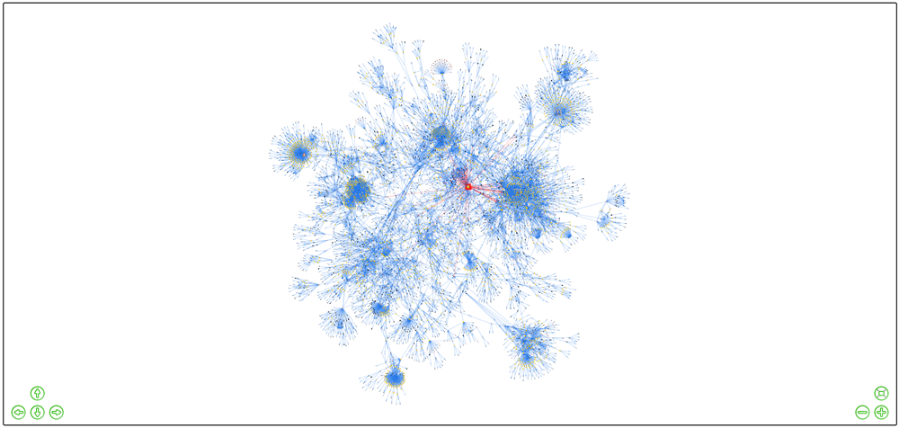

Visão panorâmica da rede complexa gerada pelo SINARC

  

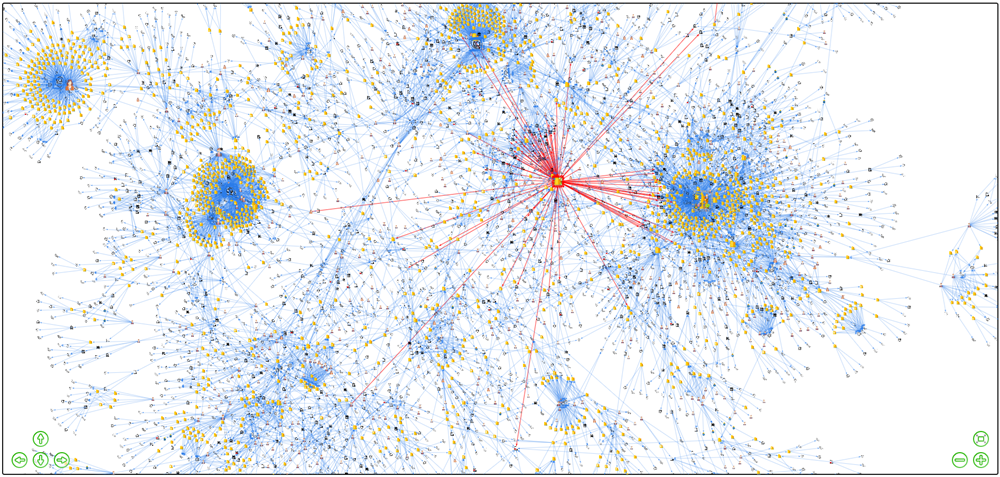

Aproximação da rede complexa gerada pelo SINARC

  

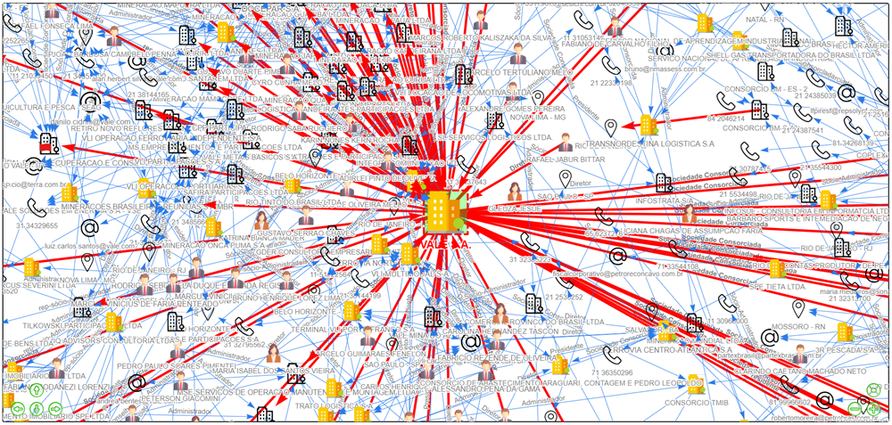

Detalhe da rede complexa gerado pelo SINARC

  

### **CNPJ de empresas listadas na B3 S.A. (Bolsa de Valores):** 
*	Abertos em 2 camadas com o SINARC (versão inicial) 
*	31.606 nós 
*	45.268 arestas (azul) 
* Fonte: [Empresas listadas na B3](https://www.idinheiro.com.br/investimentos/cnpj-empresas-listadas-b3/) 
 

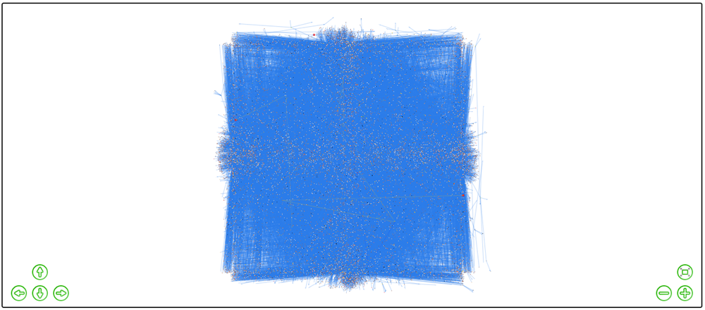

Visão panorâmica da rede complexa gerada pelo SINARC

  

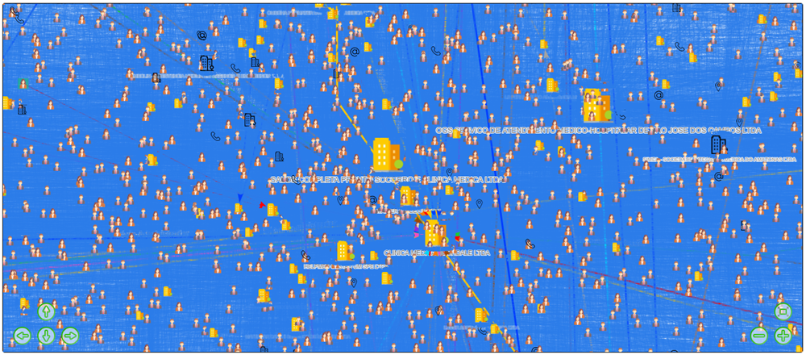

Aproximação da rede complexa gerada pelo SINARC

  

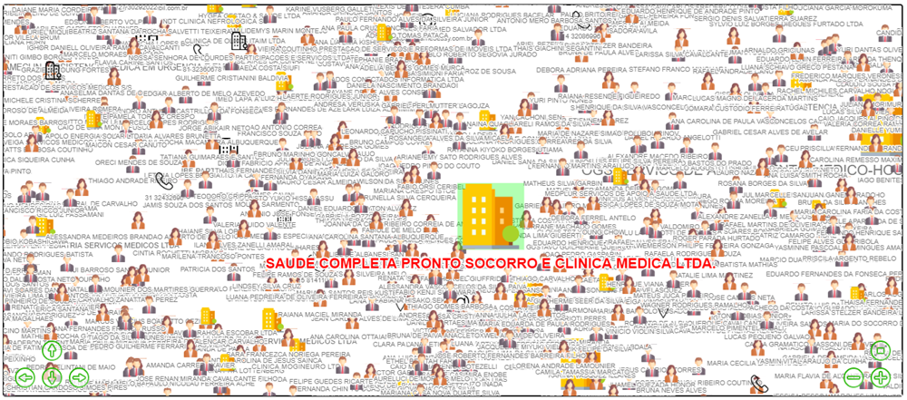

Detalhe da rede complexa gerado pelo SINARC (com ocultação de arestas)

  

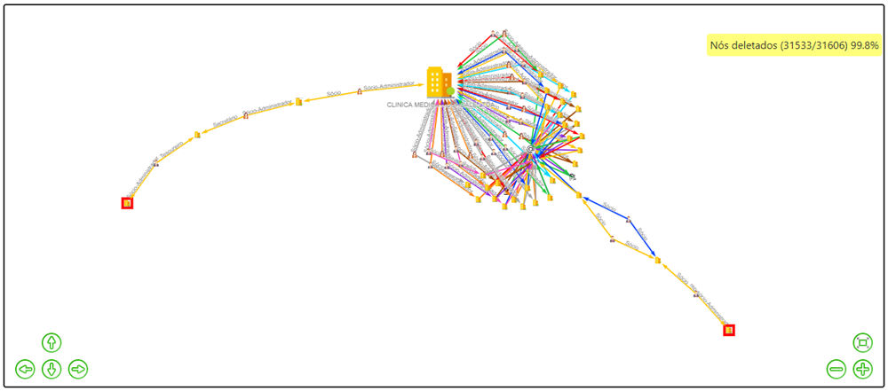

Vínculo existente entre duas empresas, identificado pelo SINARC na 8ª camada

  

## Possibilidades de uso do SINARC

  <a href="#sumário">Sumário</a>

 

✅ Conhecer a estrutura de grupos empresariais com base no CNPJ, razão social, nome de fantasia, nome ou CPF parcial da PF no formato *\*\*NNNNNN\*\*, entre outros parâmetros.

✅ Identificar vínculos entre PF e PJ a partir de notícias publicadas na internet ([Vídeo](https://www.youtube.com/watch?v=R73ixbeP0II)).

✅ Gerar grafos de relação de empresas cujos números de CNPJ (no formato 00000000000000 ou 00.000.000/0000-00) se encontram em relatórios técnicos, planilhas, diários oficiais ou qualquer documento ou tela com texto selecionável.

✅ Identificar vínculos entre licitantes a partir das atas das sessões públicas de procedimentos licitatórios ([Ata Pregão Eletrônico](https://transparencia.vilavelha.es.gov.br/Licitacao.Detalhes.aspx?municipioId=1&LicitacaoId=32772)), bem como das bases de dados disponibilizadas nos portais de transparência da Administração Pública.

✅ Identificar PF e PJ com posições estratégicas na rede de conexões a partir da aplicação de algoritmos matemáticos de medidas de centralidade de grafos, como Centralidade de Grau (_Degree Centrality_), Centralidade de Intermediação (_Betweenness Centrality_), Centralidade de Proximidade (_Closeness Centrality_), Centralidade de Autovetor (_Eigenvector Centrality_) e Ranking de Página (_PageRank_).

✅ Identificar toda a cadeia hierárquica formada por PF e PJ que integram os grupos econômicos controladores de determinada empresa.

✅ Gerar grafo contendo todas as empresas que se enquadrem na combinação de determinados critérios (mesmo endereço, rua, CEP, atividade econômica etc.), mediante consulta direta à base de dados usando o programa gratuito [DB Browser](https://sqlitebrowser.org/), disponibilizado com o SINARC.

  

## Uso responsável do SINARC

  <a href="#sumário">Sumário</a>

 

O SINARC é uma ferramenta de análise exploratória baseada em dados públicos, desenvolvida para apoiar análises, estudos e atividades de controle. Seu uso requer responsabilidade, senso crítico e atenção às implicações éticas envolvidas.

As relações identificadas por meio da ferramenta representam padrões derivados de dados públicos disponíveis, não devendo ser interpretadas como prova de irregularidade, ilícito ou conduta indevida. Conexões entre entidades podem refletir situações legítimas e demandam análise contextual cuidadosa.

É fundamental considerar que os resultados estão sujeitos a limitações dos dados utilizados, incluindo possíveis desatualizações, inconsistências ou lacunas. Além disso, a interpretação dos grafos depende de julgamento humano, podendo variar conforme o contexto, a metodologia adotada e a experiência do analista.

O uso inadequado das informações — especialmente sua divulgação sem verificação ou fora de contexto — pode gerar conclusões equivocadas ou interpretações indevidas. Por isso, recomenda-se:

* validar as informações nas fontes primárias oficiais sempre que possível;
* evitar o uso dos resultados como evidência conclusiva isolada;
* contextualizar adequadamente qualquer análise antes de sua utilização.

Ao utilizar o SINARC, o usuário reconhece essas limitações e se compromete a empregar a ferramenta de forma ética, responsável e alinhada às normas legais e institucionais aplicáveis.

  

## Repositório de casos para análise

  <a href="#sumário">Sumário</a>

 

Relação de sites e documentos públicos contendo informações para explorar com o SINARC:

* [Portal Nacional de Contratações Públicas (PNCP) - Contratos](https://pncp.gov.br/app/contratos?pagina=1). Permite consultar contratos, atas de registro de preços (ARP) e editais de licitação publicados em todo o Brasil.

* [Relatório Final da Polícia Federal no Caso Marielle Franco e Anderson Gomes](https://static.poder360.com.br/2024/03/relatorio-PF-caso-Marielle-24mar2024.pdf). Relatório contendo dezenas de empresas com CNPJ para análise.

* [Relatório Final da Polícia Federal na Operação Prato Feito](https://www.estadao.com.br/blogs/blog/wp-content/uploads/sites/41/2018/05/Representacao-Opera%C3%A7%C3%A3o-Prato-Feito.pdf).

* [Relatório Parcial e Representação da Polícia Federal na Operação Encilhamento](https://www.conjur.com.br/dl/re/relatorio-pf-fraude-fundo-pensao.pdf)

* [Operação Desumano da Polícia Federal](https://g1.globo.com/pe/pernambuco/noticia/2020/09/16/policia-federal-cumpre-mandado-na-prefeitura-do-recife.ghtml)

* [Relatório Final da Controladoria-Geral da União sobre a Operação Carne Fraca](https://basedeconhecimento.cgu.gov.br/server/api/core/bitstreams/0662da4b-b821-4531-bb1b-bf9b57773551/content)
  
* [CGU multa empresa em R$ 566 milhões por fraude em contrato com a Petrobras](https://agenciagov.ebc.com.br/noticias/202504/cgu-multa-empresa-566-milhoes-fraude-contra-petrobras)

<!--* [Reembolsos suspeitos de despesas realizadas pela Câmara dos Deputados (Operação Serenata de Amor)](https://jarbas.serenata.ai/dashboard/chamber_of_deputies/reimbursement/).-->

* [Notícias recentes sobre fraudes em licitação (Google)](https://www.google.com/search?q=fraude+licita%C3%A7%C3%A3o+ltda&sca_esv=b28375632d0b0304&rlz=1C1GCEU_pt-BRBR1106BR1106&biw=1242&bih=575&tbs=sbd%3A1&tbm=nws&sxsrf=ADLYWIIhiXt6MSk8cPC0shxAMoiwdf1Pyw%3A1731870048554&ei=YD06Z4-9IYWp1sQPs5bvuAw&ved=0ahUKEwiP7anYhuSJAxWFlJUCHTPLG8cQ4dUDCA0&uact=5&oq=fraude+licita%C3%A7%C3%A3o+ltda&gs_lp=Egxnd3Mtd2l6LW5ld3MiF2ZyYXVkZSBsaWNpdGHDp8OjbyBsdGRhMgUQIRigATIFECEYoAEyBRAhGKABMgUQIRigAUj6HlCgEljbG3AAeACQAQCYAcgBoAGhCaoBBTAuNy4xuAEDyAEA-AEBmAIHoALpB8ICBRAhGJ8FmAMAiAYBkgcDMC43oAfYOg&sclient=gws-wiz-news)

* [Atas de sessões públicas de pregões eletrônicos (Google)](https://www.google.com/search?q=ata+sess%C3%A3o+preg%C3%A3o+ltda+filetype%3Apdf&sca_esv=b28375632d0b0304&rlz=1C1GCEU_pt-BRBR1106BR1106&biw=1242&bih=575&sxsrf=ADLYWIK6WykeXV5nAHsyue6o-IjFX4qkhQ%3A1731868416556&ei=ADc6Z53UIYme5OUP7vzCqQk&ved=0ahUKEwid1JDOgOSJAxUJD7kGHW6-MJUQ4dUDCA8&uact=5&oq=ata+sess%C3%A3o+preg%C3%A3o+ltda+filetype%3Apdf&gs_lp=Egxnd3Mtd2l6LXNlcnAiJWF0YSBzZXNzw6NvIHByZWfDo28gbHRkYSBmaWxldHlwZTpwZGZIuidQ8x5YmSRwAngBkAEAmAGGAaAB-QSqAQMwLjW4AQPIAQD4AQGYAgKgAgjCAgoQABiwAxjWBBhHmAMAiAYBkAYIkgcBMqAH4QE&sclient=gws-wiz-serp)
* [Diário Oficial do Estado do Espírito Santo (DIO-ES)](https://ioes.dio.es.gov.br/portal/visualizacoes/diario_oficial)

* [Diário Oficial dos Municípios do Espírito Santo (DOM-ES)](https://ioes.dio.es.gov.br/dom)

* [Bases de dados de licitações, contratos e execução orçamentária do Estado do Espírito Santo](https://dados.es.gov.br/dataset?tags=portal+da+transpar%C3%AAncia)

* [Empresas listadas na B3](https://www.idinheiro.com.br/investimentos/cnpj-empresas-listadas-b3/)

<!--
  
## Histórico de versões

  <a href="#sumário">Sumário</a>

Versões relevantes do código (clique para expandir)

  

<b>Versão 0.5.0 (13-04-2026):</b>
 
<ul>
  <li>Inclusão de menu suspenso.</li>
</ul>
 

<b>Versão 0.4.0 (-11-2026):</b>
 
<ul>
  <li>Inclusão de menu suspenso.</li>
</ul>
 

<b>Versão 0.3.0 (08-11-2025):</b>
 
<ul>
  <li>Inclusão de menu suspenso.</li>
</ul>
 

<b>Versão 0.2.0 (13-07-2025):</b>
 
<ul>
  <li>Ajuste do gênero das imagens das pessoas físicas (homem e mulher) com base no seu primeiro nome.</li>
  <li>Inclusão da tecla BACKSPACE com função idêntica à da tecla DELETE para permitir a exclusão de nós ao usar o teclado de aparelhos celulares.</li>
</ul>
 

<b>Versão 0.1.2 (26-04-2025):</b>
 
<ul>
  <li>Corrigido erro gerado pela ausência do arquivo "wmic.exe" em alguns computadores.</li>
  <li>Disponibilização da versão compactada da pasta SINARC com os programas e o banco de dados completo, dispensando o procedimento de instalação.</li>
</ul>
 

<b>Versão 0.1.1 (09-04-2025):</b>
 
<ul>
  <li>Corrigido o carregamento offline das imagens do grafo.</li>
  <li>Corrigida a portabilidade na geração do arquivo arquivo_sinarc.zip.</li>
</ul>
 

<b>Versão 0.1.0 (14-11-2024):</b>
 
<ul>
  <li>Versão beta inicial.</li>
</ul>
 

-->

<!--## 🚧 Em fase de teste...-->

 

<!--#### 🚧 Em fase de teste 🚧

[Grafo para teste em aparelhos celulares](https://controlecidadao.github.io/sinarc/grafo_final2.html)-->

